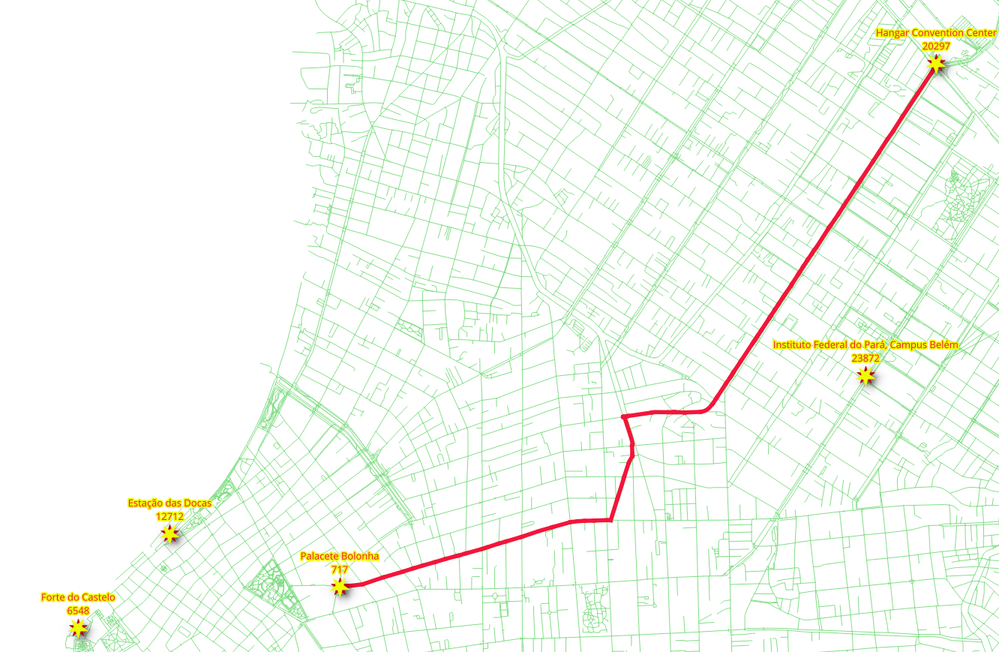
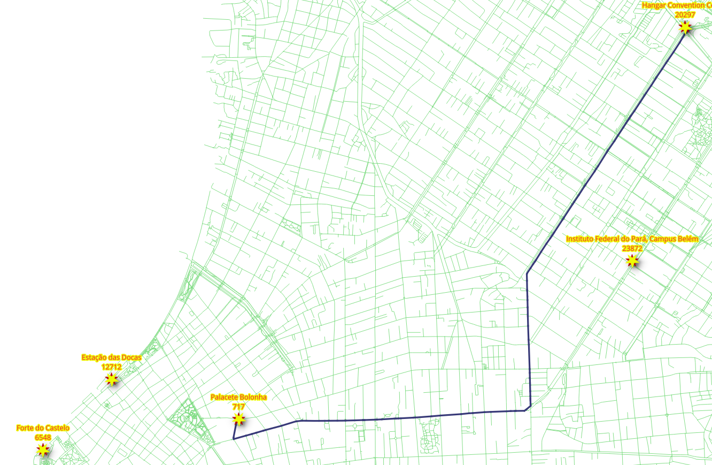

..
  ****************************************************************************
  pgRouting Workshop Manual
  Copyright(c) pgRouting Contributors

  This documentation is licensed under a Creative Commons Attribution-Share
  Alike 3.0 License: http://creativecommons.org/licenses/by-sa/3.0/
  ****************************************************************************

Advanced routing queries
===============================================================================

Routing, is not limited to pedestrians and most of the time is used for routing vehicles.

.. contents:: Chapter Contents

Routing for vehicles
-------------------------------------------------------------------------------

A query for vehicle routing generally differs from routing for pedestrians:

* The road segments are considered `directed`
* Costs can be:

  * Distance
  * Time
  * Euros
  * Pesos
  * Dollars
  * CO\ :sub:`2`\  emissions
  * Wear and tear on the vehicle, etc.

* The ``reverse_cost`` attribute must be taken into account on two way streets.

  * The costs should have the same units as the ``cost`` attribute
  * ``cost`` and ``reverse_cost`` values can be different

    * Due to the fact that there are roads that are **one way**

Depending on the geometry, the valid way:

* (``source, target``) segment ``IF cost >= 0 AND reverse_cost < 0``
* (``target, source``) segment ``IF cost < 0 AND reverse_cost >= 0``

A **wrong way** is indicated with a **negative value** and is not inserted in the
graph for processing.

**Two way** roads - ``IF cost >= 0 AND reverse_cost >= 0`` and their values can
be different. For example, it is faster going down hill on a sloped road.
In general, ``cost`` and ``reverse_cost`` do not need to be length; they can be
almost anything, for example - time, slope, surface, road type, etc., or they can
be a combination of multiple parameters.

.. rubric:: The following queries indicate the number of road segments, where a "one way" rule applies:

#. Number of (``source, target``) segments with ``cost < 0`` (line **3**).

   .. literalinclude:: ../scripts/chapter_6/section-6.1.sql
       :start-after: 6.1-1
       :end-before:  6.1-2
       :language: sql
       :linenos:
       :emphasize-lines: 3

   .. literalinclude:: ../scripts/chapter_6/section-6.1-1.txt
       :linenos:

#. Number of (``target, source``) segments with ``reverse_cost < 0`` (line **3**).

   .. literalinclude:: ../scripts/chapter_6/section-6.1.sql
       :start-after: 6.1-2
       :end-before:  6.1.1
       :language: sql
       :linenos:
       :emphasize-lines: 3

   .. literalinclude:: ../scripts/chapter_6/section-6.1-2.txt
       :linenos:

Exercise 1: Vehicle routing - going
...............................................................................

.. rubric:: Problem:

* From the "|place_3|" to the "|place_1|" by car.

.. rubric:: Solution:

* The vehicle is going from vertex |id_3| (line **10**) to |id_1| (line **11**).
* Use ``cost`` (line **6**) and ``reverse_cost`` (line **7**) columns, which are in unit ``degrees``.

.. literalinclude:: ../scripts/chapter_6/section-6.1.sql
  :start-after: 6.1.1
  :end-before: 6.1.2
  :language: sql
  :linenos:
  :emphasize-lines: 6-11

:ref:`Query results for chapter 6 exercise 1`

Exercise 2: Vehicle routing - returning
...............................................................................

.. rubric:: Problem:

* From "|place_1|" to the "|place_3|" by car.

.. image:: images/chapter6/ad8.png
  :scale: 25%
  :alt: From |place_1| to the |place_3| by car.

.. rubric:: Solution:

* The vehicle is going from vertex |id_1| (line **10**) to |id_3| (line **11**).
* Use ``cost`` (line **6**) and ``reverse_cost`` (line **7**) columns, which are in unit ``degrees``.

.. literalinclude:: ../scripts/chapter_6/section-6.1.sql
  :start-after: 6.1.2
  :end-before: 6.1.3
  :language: sql
  :linenos:
  :emphasize-lines: 6-11

:ref:`Query results for chapter 6 exercise 2`

.. note:: On a directed graph, going and coming back routes, most of the time are different.

Exercise 3: Vehicle routing when time is money
...............................................................................

.. rubric:: Problem:

* From "|place_1|" to the "|place_3|" by taxi.

.. image:: images/chapter6/ad8.png
  :width: 300pt
  :alt: From |place_1| to |place_3| by taxi.

.. rubric:: Solution:

* The vehicle is going from vertex |id_1| (line **10**) to |id_3| (line **11**).
* The cost is ``$100 per hour``.
* Use ``cost_s`` (line **6**) and ``reverse_cost_s`` (line **7**) columns, which are in unit ``seconds``.
* The duration in hours is ``cost / 3600``.
* The cost in ``$`` is ``cost / 3600 * 100``.

.. literalinclude:: ../scripts/chapter_6/section-6.1.sql
  :start-after: 6.1.3
  :end-before: 6.2-1
  :language: sql
  :linenos:
  :emphasize-lines: 6-11

:ref:`Query results for chapter 6 exercise 3`

.. note::
  Comparing with :ref:`Exercise 2: Vehicle routing - returning`:

  * The total number of records are identical.
  * The node sequence is identical.
  * The edge sequence is identical.
  * The cost and agg_cost results are directly proportional.

.. _modify:

Cost manipulations
-------------------------------------------------------------------------------

When dealing with data, being aware of what kind of data is being used can improve results.

* Vehicles can not circulate on pedestrian ways

.. image:: images/chapter6/pedestrian-only-roads.png
  :scale: 25%
  :alt:

|

Penalizing or removal of pedestrian ways will make the results closer to reality.

When converting data from OSM format using the `osm2pgrouting` tool, there is an
additional table: ``configuration``.

.. rubric:: The ``configuration`` table structure can be obtained with the following command.

.. literalinclude:: ../scripts/chapter_6/section-6.1.sql
  :start-after: 6.2-1
  :end-before: 6.2-2
  :linenos:

.. literalinclude:: ../scripts/chapter_6/section-6.2-1.txt
  :linenos:

.. image:: images/chapter6/detailofroute9.png
  :scale: 25%
  :alt: tag_id values

|

In the image above there is a detail of the ``tag_id`` of the roads.

.. rubric:: The ``OSM way`` types:

.. literalinclude:: ../scripts/chapter_6/section-6.1.sql
  :start-after: 6.2-2
  :end-before: 6.2-3
  :language: sql
  :linenos:

.. literalinclude:: ../scripts/chapter_6/section-6.2-2.txt
  :linenos:

Also, on the ``ways`` table there is a column that can be used to ``JOIN`` with the ``configuration`` table.

.. rubric:: The ``ways`` types:

.. literalinclude:: ../scripts/chapter_6/section-6.1.sql
  :start-after: 6.2-3
  :end-before: 6.2.1
  :language: sql
  :linenos:

.. literalinclude:: ../scripts/chapter_6/section-6.2-3.txt
  :linenos:

In this workshop, costs are going to be manipulated using the ``configuration`` table.

Exercise 4: Vehicle routing without penalization
...............................................................................

.. rubric:: Problem:

* From the "|place_3|" to "|place_1|"

.. rubric:: Solution:

* The vehicle is going from vertex |id_3| (line **17**) to vertex |id_1| (line **18**).
* The vehicle's cost in this case will be in seconds.
* All roads have a ``penalty`` of ``1`` (line **3**).
* Costs (in seconds) are to be multiplied by :code:`penalty` (lines **12** and **13**).
* Costs wont change (times 1 leaves the value unchanged).
* The :code:`configuration` table is linked with the :code:`ways` table by the
  :code:`tag_id` field using a ``JOIN`` (lines **14** and **15**).

.. literalinclude:: ../scripts/chapter_6/section-6.1.sql
  :start-after: 6.2.1
  :end-before: 6.2.2-1
  :language: sql
  :linenos:
  :emphasize-lines: 3-18

:ref:`Query results for chapter 6 exercise 4`

Exercise 5: Vehicle routing with penalization
...............................................................................

.. rubric:: Concept:

* Change the cost values for the :code:`configuration` table, in such a way, that the

  * Pedestrian roads are not used.
  * Using residential roads is not encouraged.
  * Using "faster" roads is highly encouraged.
  * The ``penalty`` values can be changed with ``UPDATE`` queries.

.. note:: These values are an exaggeration.

.. literalinclude:: ../scripts/chapter_6/section-6.1.sql
  :start-after: 6.2.2-1
  :end-before: 6.2.2-2
  :language: sql
  :linenos:

.. rubric:: Problem:

* From the "|place_3|" to "|place_1|" with penalization.

.. rubric:: Solution:

* The vehicle is going from vertex |id_3| (line **11**) to vertex |id_1| (line **12**).
* Use ``cost_s`` (line **6**) and ``reverse_cost_s`` (line **7**) columns, which are in unit ``seconds``.
* Costs are to be multiplied by :code:`penalty` (lines **6** and **7**).
* The :code:`configuration` table is linked with the :code:`ways` table by the
  :code:`tag_id` field using a ``JOIN`` (lines **8** and **9**).

.. literalinclude:: ../scripts/chapter_6/section-6.1.sql
  :start-after: 6.2.2-2
  :language: sql
  :linenos:
  :emphasize-lines: 6-12

:ref:`Query results for chapter 6 exercise 5`

.. note::
  Comparing with :ref:`Exercise 3: Vehicle routing when time is money`:

  * The total number of records changed.
  * The node sequence changed.
  * The edge sequence changed.
  * The route is avoiding the residential roads that have ``tag_id = 110``.

