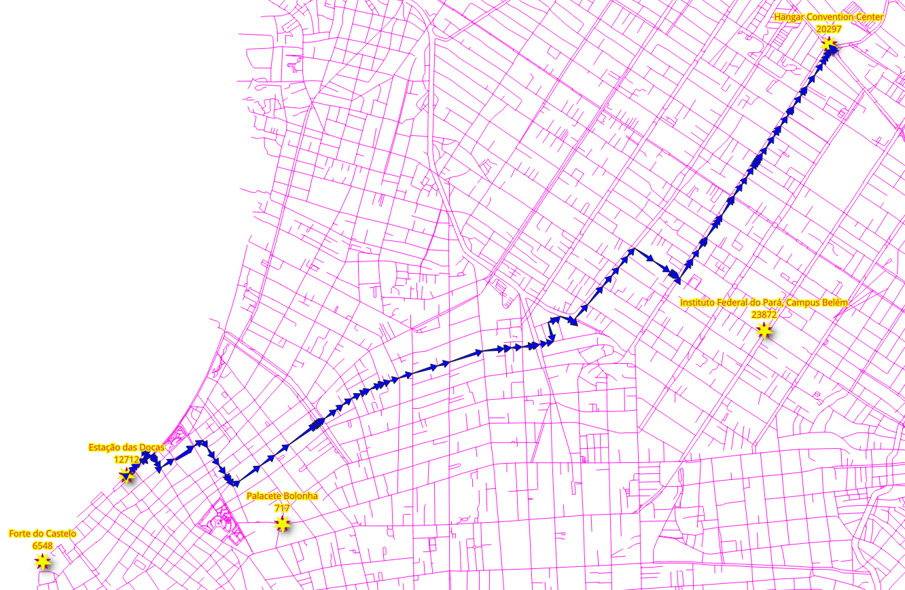
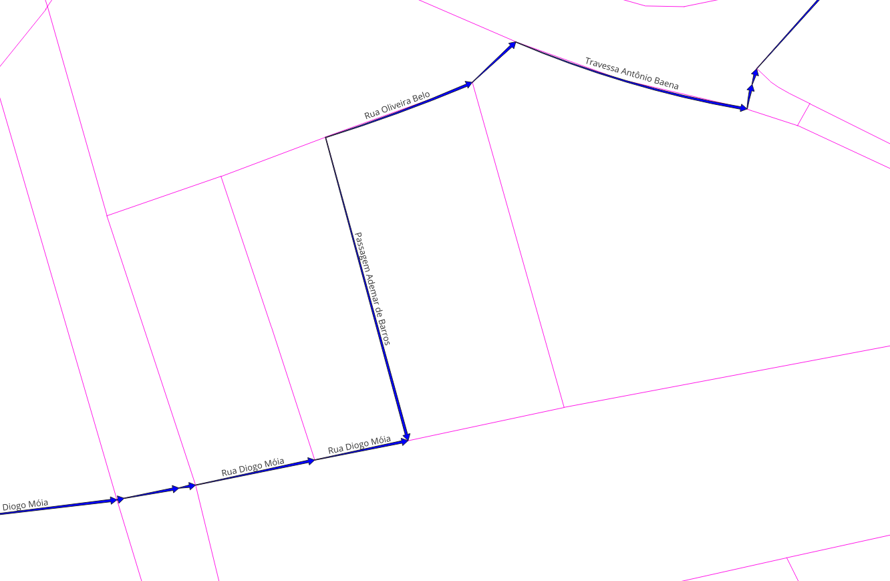
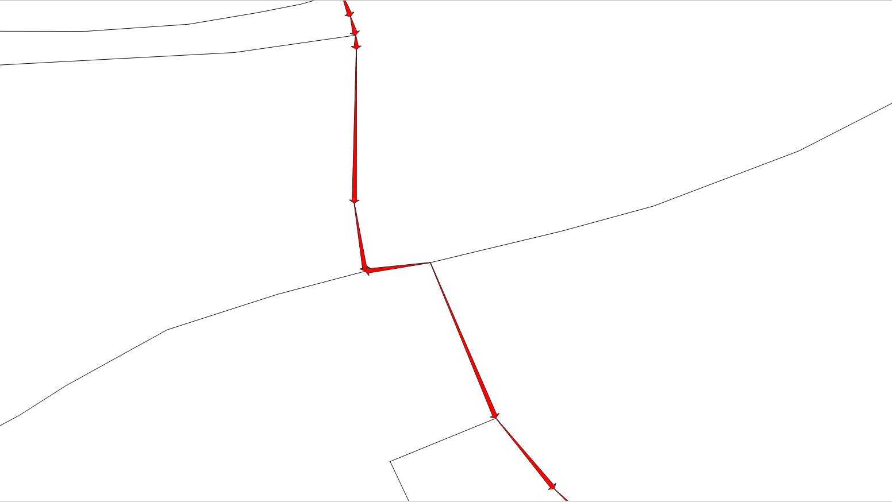

..
  ****************************************************************************
  pgRouting Workshop Manual
  Copyright(c) pgRouting Contributors

  This documentation is licensed under a Creative Commons Attribution-Share
  Alike 3.0 License: http://creativecommons.org/licenses/by-sa/3.0/
  ****************************************************************************

###############################################################################
Writing a SQL Stored Procedure
###############################################################################

.. image:: images/chapter5/route.png
  :scale: 25%
  :align: center

.. contents:: Chapter Contents

pgRouting functions provide `low level` interface.

When developing for a `higher level` application,
the requirements need to be represented in the SQL queries.
As these SQL queries get more complex, it is desirable to store them in postgreSQL
stored procedures or functions.
Stored procedures or functions are an effective way to wrap application logic, in this case,
related to routing logic and requirements.

The application requirements
===============================================================================

In these chapter there are three requirements that follow the same logic. It consits on 2
types of vehicles and the pedestrian routing:

- Particular vehicle:

  - Circulate on the whole @PGR_WORKSHOP_CITY@ area.
    - Do not use `steps`, `footway`, `path`.
  - Speed is the default speed from OSM information.

- Taxi vehicle:

  - Circulate on a smaller area near "|place_4|".

    - Bounding box: ``(@PGR_WORKSHOP_LITTLE_NET_BBOX@)``
    - Do not use `steps`, `footway`, `path`

  - Speed is 10%  slower than the Particular vehicles.

- Pedestrians:

  - Walk on the whole @PGR_WORKSHOP_CITY@ area.
  - Can not circulate on `motorways` and on `primary` segments.
  - The speed is ``2 mts/sec``.

A front end needs the following routing information:
  - seq - A unique identifier of the rows
  - gid - The segment's identifier
  - name - The segment's name
  - length - The segment's length
  - seconds - Number of seconds to traverse the segment
  - azimuth - The azimuth of the segment
  - route_geom - The routing geometry
  - route_readable - The geometry in human readable form.

and it nees to work based on the graph, and the OSM identifiers of the vertices.

.. rubric:: Design of the function

The function to be created ``wrk_dijkstra`` with the following input parameters and
output columns:

.. rubric:: Input parameters

============= ========= =================
Name          Type      Description
============= ========= =================
edges_subset  REGCLASS  The table/view that is going to be used for processing
source_osm    BIGINT    The OSM identifier of the `departure` location.
target_osm    BIGINT    The OSM identifier of the `destination` location.
============= ========= =================

.. rubric:: output columns

=============== ========= =================
Name            Type      Description
=============== ========= =================
seq             INTEGER   A unique number for each result row.
id              BIGINT    The edge identifier.
name            TEXT      The name of the segment.
seconds         FLOAT     The number of seconds it takes to traverse the segment.
azimuth         FLOAT     The azimuth of the segment.
length_m        FLOAT     The leng in meters of the segment.
route_readable  TEXT      The geometry in human readable form.
route_geom      geometry  The geometry of the segment in the correct direction.
=============== ========= =================

Preparing processing graphs
===============================================================================

Exercise 1: Creating a view for routing
-------------------------------------------------------------------------------

.. image:: images/chapter7/ch7-e1.png
  :scale: 25%
  :alt: View of roads for vehicles

.. rubric:: Problem

- Create a view with minimal amount of information for processing the particular vehicles.
- Routing `cost` and `reverse_cost` will be on seconds for routing calculations.
- Exclude `steps`, `footway`, `path` segments.
- Data needed in the view for further prossesing.

  - `length_m` The length in meters.
  - `the_geom` The geometry.

- Verify the number of edges was reduced.

.. rubric:: Solution

- Creating the view:

  - The `source` and `target` requirements for the function are to be with OSM
    identifiers. (line **6**)

  - The ``cost`` and ``reverse_cost`` are in terms of seconds. (line **7**)
  - The additional parameters `length_m` and `the_geom`. (line **8**)
  - ``JOIN`` with the `configuration`:

    - Exclude `steps`, `footway`, `path`. (line **11**)

  - If you need to reconstruct the view, first drop it using the command on line **1**.

  .. literalinclude:: ../scripts/basic/chapter_7/all_sections.sql
    :language: sql
    :linenos:
    :emphasize-lines: 6-8,11
    :start-after: exercise_7_1.txt
    :end-before: Verification1

- Verification:

  - Count the rows on the original ``ways`` (line **1**)
  - Count the rows on the view ``vehicle_net`` (line **2**)

  .. literalinclude:: ../scripts/basic/chapter_7/all_sections.sql
    :language: sql
    :linenos:
    :start-after: Verification1
    :end-before: exercise_7_2.txt

|

:ref:`Query results for chapter 7 exercise 1`

Exercise 2: Limiting the road network within an area
-------------------------------------------------------------------------------

.. image:: images/chapter7/ch7-e2.png
  :scale: 25%
  :alt: View of smaller set of roads for vehicles

.. rubric:: Problem

* Create a view ``taxi_net`` for the `taxi`:

  * The taxi can only circulate inside this Bounding Box: ``(@PGR_WORKSHOP_LITTLE_NET_BBOX@)``
  * The taxi speed is 10% slower than the particular vehicle.

* Verify the reduced number of road segments.

.. rubric:: Solution

* Creating the view:

  * The graph for the taxi is a subset of the ``vehicle_net`` graph. (line **9**)
  * Can only circulate inside the bounding box: ``(@PGR_WORKSHOP_LITTLE_NET_BBOX@)``. (line **10**)
  * Adjust the taxi's ``cost`` and ``reverse_cost`` to be 90% of the particular vehicle. (line **7**)

  .. literalinclude:: ../scripts/basic/chapter_7/all_sections.sql
    :language: sql
    :linenos:
    :emphasize-lines: 7,9,10
    :start-after: 7_2
    :end-before: Verification2

- Verification:

  - Count the rows on the original ``taxi_net``

  .. literalinclude:: ../scripts/basic/chapter_7/all_sections.sql
    :language: sql
    :linenos:
    :start-after: Verification2
    :end-before: 7_3

|

:ref:`Query results for chapter 7 exercise 2`

Exercise 3: Creating a materialized view for routing
-------------------------------------------------------------------------------

.. image:: images/chapter7/ch7-e1.png
  :scale: 25%
  :alt: View of roads for vehicles

.. rubric:: Problem

- Create a materialized view with minimal amount of information for processing pedestrians.
- Routing `cost` and `reverse_cost` will be on seconds for routing calculations.

  - The speed is ``2 mts/sec``.

- Exclude `motorway` and `primary` segments.
- Data needed in the view for further prossesing.

  - `length_m` The length in meters.
  - `the_geom` The geometry.

- Verify the number of edges was reduced.

.. rubric:: Solution

- Creating the view:

  - Similar to :ref:`Exercise 1: Creating a view for routing`:

    - The ``cost`` and ``reverse_cost`` are in terms of seconds with speed of ``2 mts/sec``. (line **7**)
    - Exclude `motorway`, `primary`. (line **11**)

  .. literalinclude:: ../scripts/basic/chapter_7/all_sections.sql
    :language: sql
    :linenos:
    :emphasize-lines: 7, 11
    :start-after: 7_3
    :end-before: Verification3

- Verification:

  - Count the rows on the original ``ways`` (line **1**)
  - Count the rows on the view ``vehicle_net`` (line **2**)

  .. literalinclude:: ../scripts/basic/chapter_7/all_sections.sql
    :language: sql
    :linenos:
    :start-after: Verification3
    :end-before: 7_4

|

:ref:`Query results for chapter 7 exercise 3`

Exercise 4: Testing the views for routing
-------------------------------------------------------------------------------

.. image:: images/chapter7/ch7-e3.png
  :scale: 25%
  :alt:   From the Venue to the hotel using the osm_id.

.. rubric:: Problem

* Test the created views

In particular:

* From the "|place_3|" to the |place_1| using the OSM identifier
* the views to be tested are:

  * ``vehicles_net``
  * ``taxi_net``
  * ``walk_net``

* Only show the following results, as the other columns are to be ignored on the function.

  * ``seq``
  * ``edge`` with the name ``id``
  * ``cost`` with the name: ``seconds``

.. rubric:: Solution

* In general

  * The departure is "|place_3|" with OSM identifier |osmid_3|.
  * The destination is "|place_1|" with OSM identifier |osmid_1|.

* For ``vehicles_net``:

  * ``vehicle_net`` is used.
  * Selection of the columns with the corresponding names are on line **1**.
  * The view is prepared with the column names that pgRouting use.

    * There is no need to rename columns. (line **3**)

  * The OSM identifiers of the departure and destination are used. (line **4**)

  .. literalinclude:: ../scripts/basic/chapter_7/all_sections.sql
    :language: sql
    :linenos:
    :emphasize-lines: 1,3,4
    :start-after: exercise_7_4.txt
    :end-before: For taxi_net

* For ``taxi_net``:

  * Similar as the previous one but with ``taxi_net``. (line **3**)
  * The results give the same route as with ``vehicle_net`` but ``cost`` is higher

  .. literalinclude:: ../scripts/basic/chapter_7/all_sections.sql
    :language: sql
    :linenos:
    :emphasize-lines: 3
    :start-after: For taxi_net
    :end-before: For walk_net

* For ``walk_net``:

  * Similar as the previous one but with ``walk_net``. (line **3**)
  * The results give a different route than of the vehicles.

  .. literalinclude:: ../scripts/basic/chapter_7/all_sections.sql
    :language: sql
    :linenos:
    :emphasize-lines: 3
    :start-after: For walk_net
    :end-before: exercise_7_5.txt

.. note:: From these queries, it can be deduced that what we design for one view will work
  for the other views. On the following exercises only ``vehicles_net`` will be used, but
  you can test the queries with the other views.

|

:ref:`Query results for chapter 7 exercise 4`

Exercise 5: Get additional information
-------------------------------------------------------------------------------

.. image:: images/chapter7/ch7-e4.png
  :width: 300pt
  :alt:  Route showing names

.. rubric:: Problem

* From the |place_3| to the |place_1|, using OSM identifiers.
* additionally to the :ref:`Exercise 4: Testing the views for routing`
  results also get information found on the edges subset:

  * ``name``
  * ``length_m``

.. rubric:: Solution

* The query from :ref:`Exercise 4: Testing the views for routing` used as a
  subquery named ``results``  (not highlighted lines **5** to **9**)
* The ``SELECT`` clause contains

  * All the columns of ``results``. (line **2**)
  * The ``name`` and the ``length_m`` values. (line **3**)

* A ``LEFT JOIN`` with ``vehicles_net`` is needed to get the additional information. (line **10**)

  * Has to be ``LEFT`` because there is a row with ``id = -1`` that does not exist on ``vehicles_net``

.. literalinclude:: ../scripts/basic/chapter_7/all_sections.sql
  :language: sql
  :linenos:
  :emphasize-lines: 2, 3,10
  :start-after: 7_5
  :end-before: 7_6

|

:ref:`Query results for chapter 7 exercise 5`

Geometry handling
===============================================================================

Exercise 6: Route geometry (human readable)
-------------------------------------------------------------------------------

.. image:: images/chapter7/ch7-e5.png
  :width: 300pt
  :alt: From the Venue to the Brewry

.. rubric:: Problem

* From the "|place_3|" to the "|place_1|", additionally get the geometry in human readable form.

  * Additionally to the :ref:`Exercise 4: Testing the views for routing`
    results also get information found on the edges subset of:

    * ``the_geom`` in human readable form named as  ``route_readable``

.. tip::
  ``WITH`` provides a way to write auxiliary statements in larger queries.
  It can be thought of as defining temporary tables that exist just for one query.

.. rubric:: Solution

* The query from :ref:`Exercise 4: Testing the views for routing` used as a
  subquery named ``results`` this time in a WITH clause. (not highlighted lines **2** to **6**)
* The ``SELECT`` clause contains:

  * All the columns of ``results``. (line **8**)
  * The ``the_geom`` processed with ``ST_AsText`` to get the human readable form. (line **9**)

    * Renames the result to  ``route_readable``

* Like before ``LEFT JOIN`` with ``vehicles_net``. (line **11**)

.. literalinclude:: ../scripts/basic/chapter_7/all_sections.sql
  :language: sql
  :linenos:
  :emphasize-lines: 8,9,11
  :start-after: 7_6
  :end-before: 7_7

|

:ref:`Query results for chapter 7 exercise 6`

Exercise 7: Route geometry (binary format)
-------------------------------------------------------------------------------

.. rubric:: Problem

* From the "|place_3|" to the "|place_1|", the geometry in binary format.

  * Additionally to the :ref:`Exercise 4: Testing the views for routing`
    results also get information found on the edges subset of:

    * ``the_geom`` in binary format  with the name ``route_geom``

.. rubric:: Solution

* The query from :ref:`Exercise 6: Route geometry (human readable)` used;

* The ``SELECT`` clause additionaly contains:

  * The ``the_geom`` including the renaming (line **10**)

.. literalinclude:: ../scripts/basic/chapter_7/all_sections.sql
  :language: sql
  :linenos:
  :emphasize-lines: 10
  :start-after: 7_7
  :end-before: 7_8

|

:ref:`Query results for chapter 7 exercise 7`

Exercise 8: Route geometry directionality
-------------------------------------------------------------------------------

|

Inspecting the detail image of :ref:`Exercise 7: Route geometry (binary format)` there are
arrows that do not match the directionality of the route.

|

Inspecting the a detail of the results of :ref:`Exercise 6: Route geometry (human readable)`

* To have correct directionality, the ending point of a geometry must match the starting point of the next geometry
* Lines **2** and **3** do not match that criteria

.. literalinclude:: ../scripts/basic/chapter_7/exercise_7_6.txt
  :language: sql
  :linenos:
  :start-after: 1 |
  :end-before: 5 |

.. rubric:: Problem

* From the "|place_3|" to the "|place_1|",

  * Additionally to the :ref:`Exercise 4: Testing the views for routing`
    results also get information found on the edges subset of:

    * ``the_geom`` in human readable form named as  ``route_readable``
    * ``the_geom`` in binary format  with the name ``route_geom``
    * Both columns must have the geometry fixed for directionality.

.. rubric:: Solution

* To get the correct direction some geometries need to be reversed:

  * Reversing a geometry will depend on the ``node`` colum of the query to dijkstra (line **3**)

    * That ``node`` is not needed on the ouput of the query, so explicitly naming required columns at line **9**.
  * A conditional ``CASE`` statement that returns the geometry in human readable form:

    * Of the geometry when ``node`` is the ``source`` column. (line **11**)
    * Of the reversed geometry when ``node`` is not the ``source`` column. (line **12**)

  * A conditional ``CASE`` statement that returns:

    * The reversed geometry when ``node`` is not the ``source`` column. (line **16**)
    * The geometry when ``node`` is the ``source`` column. (line **17**)

.. literalinclude:: ../scripts/basic/chapter_7/all_sections.sql
  :language: sql
  :linenos:
  :emphasize-lines: 3,9,11,12,16,17
  :start-after: exercise_7_8.txt
  :end-before: exercise_7_9.txt

|

:ref:`Query results for chapter 7 exercise 8`

Exercise 9: Using the geometry
-------------------------------------------------------------------------------

.. image:: images/chapter7/ch7-e7.png
  :width: 300pt
  :alt: From |place_3| to the |place_1| show azimuth

There are many geometry functions in PostGIS, the workshop already covered some of them like
``ST_AsText``, ``ST_Reverse``, ``ST_EndPoint``, etc.
This exercise will make use an additional function ``ST_Azimuth``.

.. rubric:: Problem

* Modify the query from :ref:`Exercise 8: Route geometry directionality`.
* Aditionally obtain the azimuth of the correct geometry.
* keep the output small:

  * Even that other columns are calculated only output:

    * ``seq``, ``id``, ``seconds`` and the ``azimuth``

* Because ``vehicle_net`` is a subgraph of ``ways``, do the ``JOIN`` with ``ways``.

.. rubric:: Solution

* Moving the query that gets the additional information into the ``WITH`` statement.

  * Naming it ``additional``. (line **9**)

* Final ``SELECT`` statements gets:

  * The requested information. (line **25**)
  * Calculates the azimuth of ``route_geom``. (line **26**)

.. literalinclude:: ../scripts/basic/chapter_7/all_sections.sql
  :language: sql
  :linenos:
  :emphasize-lines: 9,25,26
  :start-after: exercise_7_9.txt
  :end-before: exercise_7_10.txt

|

:ref:`Query results for chapter 7 exercise 9`

Creating the Function
===============================================================================

The following function simplifies (and sets default values) when it calls the
shortest path Dijkstra function.

.. warning::
  pgRouting uses heavely function overloading:

  * Avoid creating functions with a name of a pgRouting routing function
  * Avoid the name of a function to start with `pgr_`, `_pgr` or `ST_`

Exercise 10: Function for an application
-------------------------------------------------------------------------------

.. rubric:: Problem

Putting all together in a SQL function

* function name ``wrk_dijkstra``
* Should work for any given view.

  * Allow a view as a parameter

    * A table can be used if the columns have the correct names.

* ``source`` and ``target`` are in terms of ``osm_id``.
* The result should meet the requirements indicated at the begining of the chapter

.. rubric:: Solution

* The signature of the function:

  * The input parameters are from line **4** to **6**.
  * The output columns are from line **7** to **14** (not highlited).
  * The function returns a set. (line **16**)

.. literalinclude:: ../scripts/basic/chapter_7/all_sections.sql
  :linenos:
  :emphasize-lines: 4-6,16
  :start-after: exercise_7_10.txt
  :end-before: BODY

* The body of the function:

  * Appending the view name on line **7** in the ``SELECT`` query to ``pgr_dijkstra``.
  * Using the data to get the routei from ``source`` to ``target``. (line **8**)
  * The ``JOIN`` with ``ways`` is necesary, as the views are subset of ``ways`` (line **25**)

.. literalinclude:: ../scripts/basic/chapter_7/all_sections.sql
  :linenos:
  :emphasize-lines: 7,8,25
  :start-after: RETURNS SETOF
  :end-before: exercise_7_11.txt

:ref:`Query results for chapter 7 exercise 10`

.. _exercise-ch7-e10:

Exercise 11: Using the function
-------------------------------------------------------------------------------

.. rubric:: Problem

* Test the function with the three views
* From the "|place_3|" to the |place_1| using the OSM identifier

.. rubric:: Solution

* Use the function on the ``SELECT`` statement
* The first parameter changes based on the view to be tested

.. literalinclude:: ../scripts/basic/chapter_7/all_sections.sql
  :language: sql
  :linenos:
  :start-after: exercise_7_11.txt

:ref:`Query results for chapter 7 exercise 11`

.. rubric:: For youy to try

* Try the function with a combination of the interesting places:

  * |osmid_1| |place_1|
  * |osmid_2| |place_2|
  * |osmid_3| |place_3|
  * |osmid_4| |place_4|
  * |osmid_5| |place_5|

