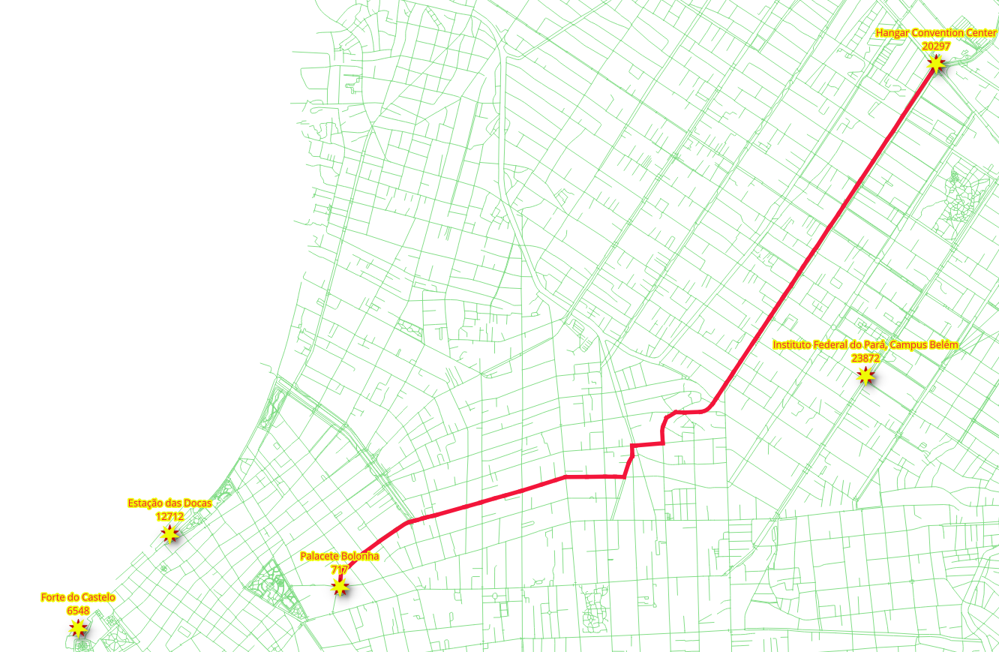
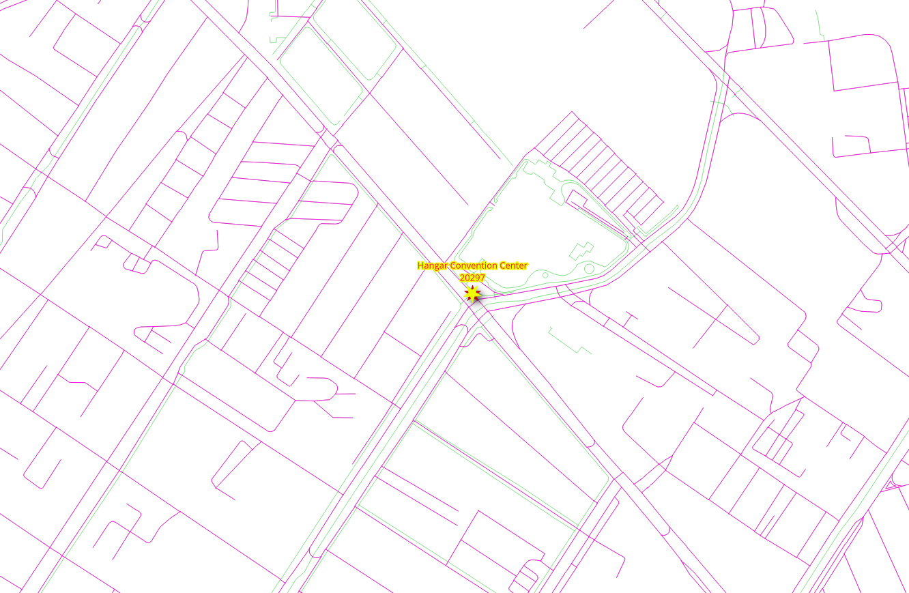
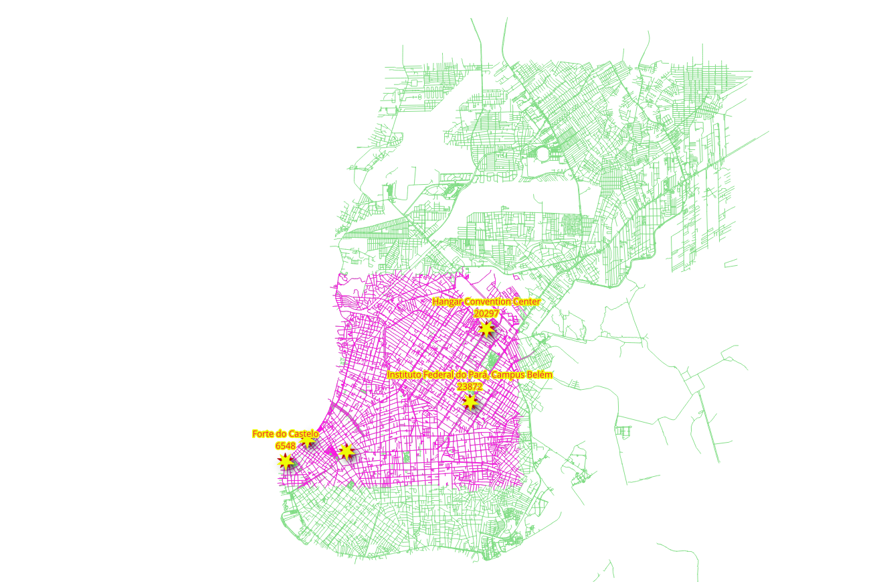
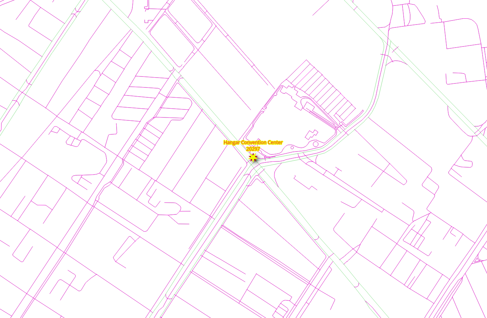

..
  ****************************************************************************
  pgRouting Workshop Manual
  Copyright(c) pgRouting Contributors

  This documentation is licensed under a Creative Commons Attribution-Share
  Alike 3.0 License: http://creativecommons.org/licenses/by-sa/3.0/
  ****************************************************************************

Graph views
###############################################################################

.. contents:: Chapter Contents

Different application require different graphs. This chapter covers different
approaches to create graphs.

The graph requirements
===============================================================================

In this chapter there are three graph requirements. It consists on two types of
vehicles and for pedestrian routing:

- Particular vehicle:

  - Circulate on the whole @PGR_WORKSHOP_CITY@ area.

    - Do not use `steps`, `footway`, `path`, `cycleway`.

  - Speed is the default speed from OSM information.

- Taxi vehicle:

  - Circulate on a smaller area:

    - Bounding box: ``(@PGR_WORKSHOP_LITTLE_NET_BBOX@)``
    - Do not use `steps`, `footway`, `path`, `cycleway`.

  - Speed is 10% slower than that of the particular vehicles.

- Pedestrians:

  - Walk on the whole @PGR_WORKSHOP_CITY@ area.
  - Can not walk on exclusive vehicle ways

    - `motorways` and on `primary` segments.

  - The speed is ``2 mts/sec``.

Preparing the graphs
===============================================================================

Exercise 1: Creating a view for routing
-------------------------------------------------------------------------------

.. rubric:: Problem

- Create a view with minimal amount of information for processing the particular vehicles.
- Use the osm identifiers on the vertices.
- Routing `cost` and `reverse_cost` in terms of seconds for routing calculations.
- Exclude `steps`, `footway`, `path`, `cycleway` segments.
- Data needed in the view for further prossesing.

  - `name` The name of the segment.
  - `length_m` The length in meters rename to ``length``.
  - `the_geom` The geometry rename to ``geom``.

- Verify the number of edges was reduced.

.. rubric:: Solution

- Creating the view:

  - The `source` and `target` requirements for the function are to be with OSM
    identifiers. (line **6**)

  - The ``cost`` and ``reverse_cost`` are in terms of seconds. (line **7**)
  - The additional parameters `name`, `length_m` and `the_geom`. (line **8**)
  - ``JOIN`` with the `configuration`:

    - Exclude `steps`, `footway`, `path`, `cycleway`. (line **11**)

  - If you need to reconstruct the view, first drop it using the command on line **1**.

  .. literalinclude:: ../scripts/basic/chapter_7/all_sections.sql
    :language: sql
    :emphasize-lines: 6-8,11
    :start-after: exercise_7_1.txt
    :end-before: Verification1

- Verification:

  - Count the rows on the original ``ways`` (line **1**)
  - Count the rows on the view ``vehicle_net`` (line **2**)

  .. literalinclude:: ../scripts/basic/chapter_7/all_sections.sql
    :start-after: Verification1
    :end-before: exercise_7_2.txt

|

:ref:`basic/appendix:**Exercise**: 1 (**Chapter:** views)`

Exercise 2: Limiting the road network within an area
-------------------------------------------------------------------------------

.. rubric:: Problem

* Create a view ``taxi_net`` for the `taxi`:

  * The taxi can only circulate inside this Bounding Box: ``(@PGR_WORKSHOP_LITTLE_NET_BBOX@)``
  * The taxi speed is 10% faster than the particular vehicle.

* Verify the reduced number of road segments.

.. rubric:: Solution

* Creating the view:

  * The graph for the taxi is a subset of the ``vehicle_net`` graph. (line **9**)
  * Can only circulate inside the bounding box: ``(@PGR_WORKSHOP_LITTLE_NET_BBOX@)``. (line **10**)
  * Adjust the taxi's ``cost`` and ``reverse_cost`` to be 90% of the particular vehicle. (line **7**)

  .. literalinclude:: ../scripts/basic/chapter_7/all_sections.sql
    :language: sql
    :emphasize-lines: 7,9,10
    :start-after: 7_2
    :end-before: Verification2

- Verification:

  - Count the rows on the original ``taxi_net``

  .. literalinclude:: ../scripts/basic/chapter_7/all_sections.sql
    :language: sql
    :start-after: Verification2
    :end-before: 7_3

|

:ref:`basic/appendix:**Exercise**: 2 (**Chapter:** views)`

Exercise 3: Creating a materialized view for routing pedestrians
-------------------------------------------------------------------------------

.. rubric:: Problem

- Create a materialized view with minimal amount of information for processing pedestrians.
- Routing `cost` and `reverse_cost` will be on seconds for routing calculations.

  - The speed is ``2 mts/sec``.

- Exclude `motorway` , `primary` and `secondary` segments.
- Data needed in the view for further prossesing.

  - `length_m` The length in meters.
  - `the_geom` The geometry.

- Verify the number of edges was reduced.

.. rubric:: Solution

- Creating the view:

  - Similar to `Exercise 1: Creating a view for routing`_:

    - The ``cost`` and ``reverse_cost`` are in terms of seconds with speed of ``2 mts/sec``. (line **7**)
    - Exclude `motorway`, `primary` and `secondary` . (line **11**)

  .. literalinclude:: ../scripts/basic/chapter_7/all_sections.sql
    :language: sql
    :emphasize-lines: 7, 11
    :start-after: 7_3
    :end-before: Verification3

- Verification:

  - Count the rows on the view ``walk_net`` (line **1**)

  .. literalinclude:: ../scripts/basic/chapter_7/all_sections.sql
    :language: sql
    :start-after: Verification3
    :end-before: 7_4

|

:ref:`basic/appendix:**Exercise**: 3 (**Chapter:** views)`

Exercise 4: Testing the views for routing
-------------------------------------------------------------------------------

.. image:: images/chapter7/ch7-e3.png
  :scale: 25%
  :alt:   From the Venue to the hotel using the osm_id.

.. rubric:: Problem

* Test the created views

In particular:

* From the "|ch7_place_1|" to the "|ch7_place_2|" using the OSM identifier
* the views to be tested are:

  * ``vehicle_net``
  * ``taxi_net``
  * ``walk_net``

* Only show the following results, as the other columns are to be ignored on the function.

  * ``seq``
  * ``edge`` with the name ``id``
  * ``cost`` with the name: ``seconds``

.. rubric:: Solution

* In general

  * The departure is |ch7_place_1| with OSM identifier |ch7_osmid_1|.
  * The destination is |ch7_place_2| with OSM identifier |ch7_osmid_2|.

* For ``vehicle_net``:

  * ``vehicle_net`` is used.
  * Selection of the columns with the corresponding names are on line **1**.
  * The view is prepared with the column names that pgRouting use.

    * There is no need to rename columns. (line **3**)

  * The OSM identifiers of the departure and destination are used. (line **4**)

  .. literalinclude:: ../scripts/basic/chapter_7/all_sections.sql
    :language: sql
    :emphasize-lines: 1,3,4
    :start-after: exercise_7_4.txt
    :end-before: For taxi_net

* For ``taxi_net``:

  * Similar as the previous one but with ``taxi_net``. (line **3**)
  * The results give the same route as with ``vehicle_net`` but ``cost`` is lower

  .. literalinclude:: ../scripts/basic/chapter_7/all_sections.sql
    :language: sql
    :emphasize-lines: 3
    :start-after: For taxi_net
    :end-before: For walk_net

* For ``walk_net``:

  * Similar as the previous one but with ``walk_net``. (line **3**)
  * The results give a different route than of the vehicles.

  .. literalinclude:: ../scripts/basic/chapter_7/all_sections.sql
    :language: sql
    :emphasize-lines: 3
    :start-after: For walk_net
    :end-before: exercise_7_5.txt

.. note:: From these queries, it can be deduced that what we design for one view will work
  for the other views. On the following exercises only ``vehicle_net`` will be used, but
  you can test the queries with the other views.

|

:ref:`basic/appendix:**Exercise**: 4 (**Chapter:** views)`
