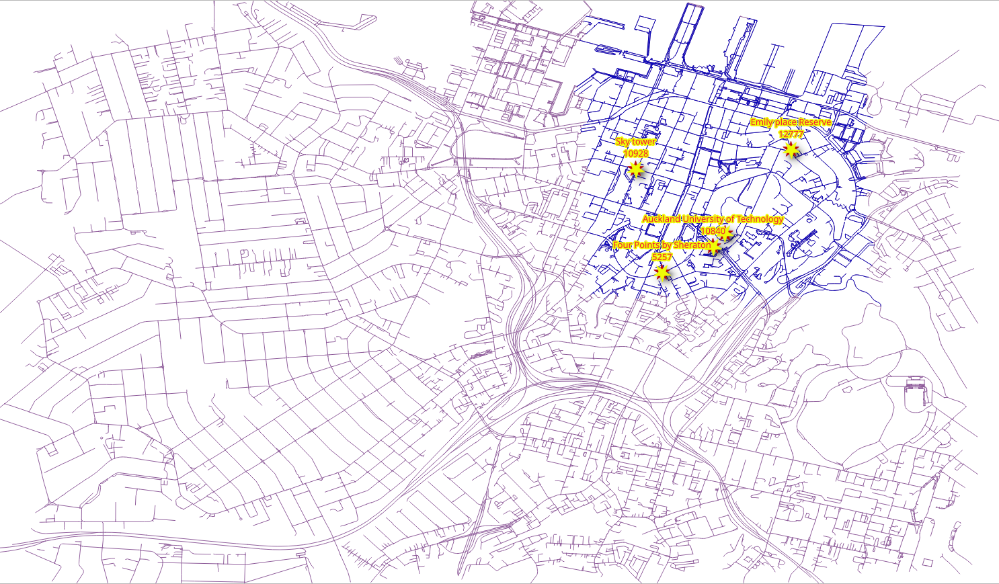
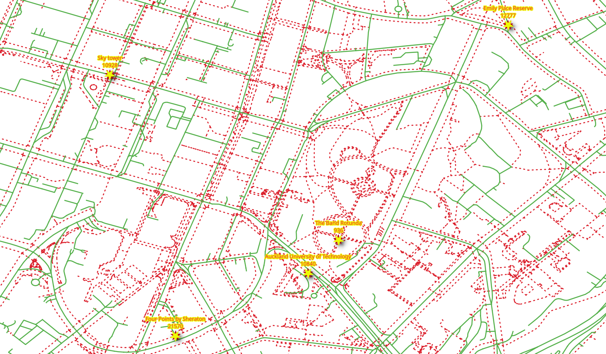
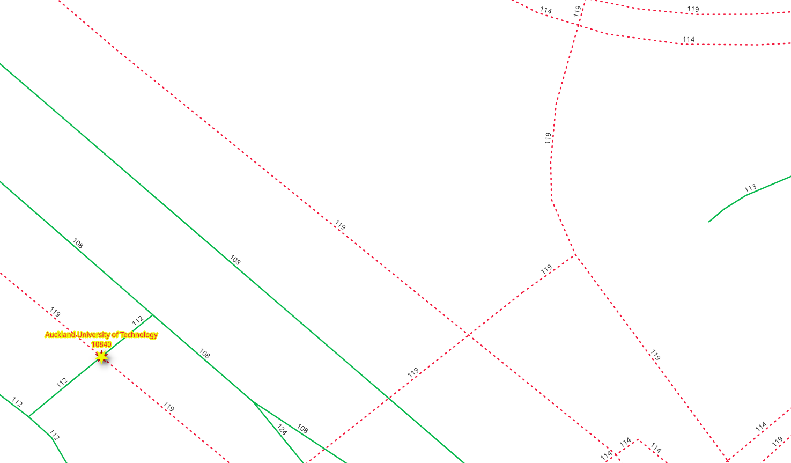
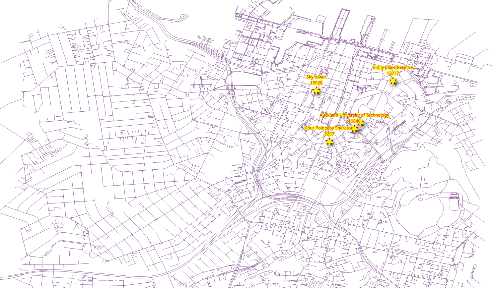
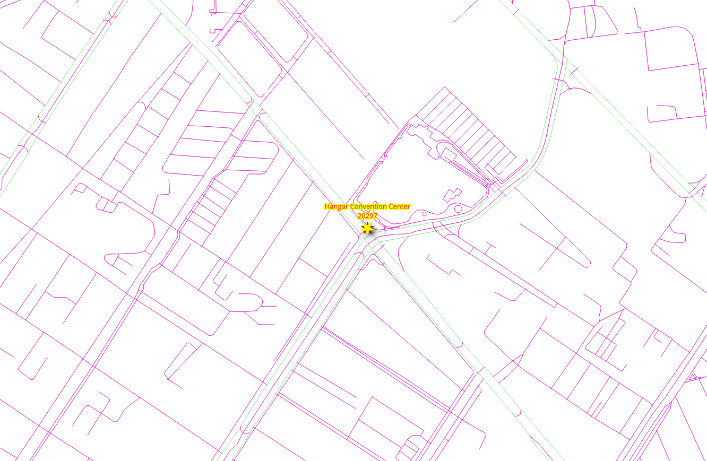
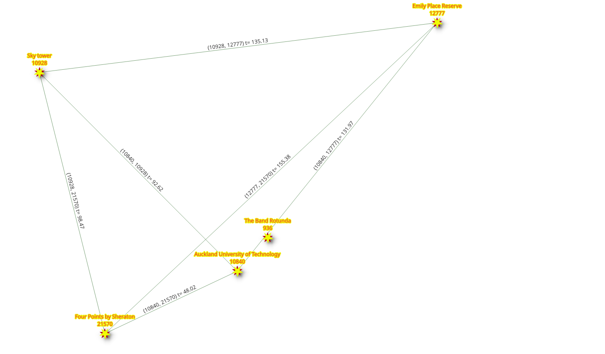

..
  ****************************************************************************
  pgRouting Workshop Manual
  Copyright(c) pgRouting Contributors

  This documentation is licensed under a Creative Commons Attribution-Share
  Alike 3.0 License: http://creativecommons.org/licenses/by-sa/3.0/
  ****************************************************************************

Graphs
###############################################################################

.. contents:: Chapter Contents

Different application require different graphs. This chapter covers how to
discard disconnected segments and different approaches to create graphs.

pgRouting functions in this chapter

- `pgr_extractVertices`_
- `pgr_connectedComponents`_
- `pgr_dijkstraCostMatrix`_

The graph requirements
===============================================================================

In this chapter there are three graph requirements. It consists on three graphs
based on a **fully connected** graph derived from ``ways``: two for different types
of vehicles and one for pedestrian, the source and the target in all of them are
based on the ``source`` and ``target``.

The description of the graphs:

- Particular vehicle:

  - Circulate on the whole @PGR_WORKSHOP_CITY@ area.

    - Do not use `pedestrian`, `steps`, `footway`, `path`, `cycleway`

  - Speed is the default speed from OSM information.

- Taxi vehicle:

  - Circulate on a smaller area:

    - Bounding box: ``(@PGR_WORKSHOP_LITTLE_NET_BBOX@)``
    - Do not use `pedestrian`, `steps`, `footway`, `path`, `cycleway`

  - Speed is 10% slower than that of the particular vehicles.

- Pedestrians:

  - Walk on the whole @PGR_WORKSHOP_CITY@ area.
  - Can only use pedestrian only ways:

    - `pedestrian`, `steps`, `footway`, `path`, `cycleway`

  - The walking speed is ``2 mts/sec``.

Configuration from osm2pgrouting
================================================================================

When dealing with data, being aware of what kind of data is being used can
improve results.

* Vehicles can not circulate on pedestrian ways

|

Penalizing or removal of pedestrian ways will make the results closer to reality.

When converting data from OSM format using the `osm2pgrouting` tool, there is an
additional table: ``configuration``.

.. rubric:: The ``configuration`` table structure can be obtained with the following command.

.. literalinclude:: ../scripts/basic/graphs/graphs.sql
  :start-after: configuration_structure
  :end-before: configuration_contents

.. collapse:: The table description

   .. literalinclude:: ../scripts/basic/graphs/configuration_structure.txt

|

In the image above there is a detail of the ``tag_id`` of the roads.

.. rubric:: The `OSM highway <https://wiki.openstreetmap.org/wiki/Key:highway>`__
   types:

.. literalinclude:: ../scripts/basic/graphs/graphs.sql
  :start-after: configuration_contents
  :end-before: configuration_used
  :language: sql

.. collapse:: Query results

   .. literalinclude:: ../scripts/basic/graphs/configuration_contents.txt

Also, on the ``ways`` table there is a column that can be used to ``JOIN`` with the ``configuration`` table.

.. rubric:: The configuration types in the @PGR_WORKSHOP_CITY@ data

.. literalinclude:: ../scripts/basic/graphs/graphs.sql
  :start-after: configuration_used
  :end-before: create_vertices

.. collapse:: Query results

  .. literalinclude:: ../scripts/basic/graphs/configuration_used.txt

pgr_extractVertices
================================================================================

``pgr_extractVertices`` compute the connected components of an undirected
graph using a Depth First Search approach. A connected component of an
undirected graph is a set of vertices that are all reachable from each other.

.. rubric:: Signature summary

.. code-block:: sql

   pgr_extractVertices(Edges SQL, [dryrun])

   RETURNS SETOF (id, in_edges, out_edges, x, y, geom)
   OR EMPTY SET

Description of the function can be found in `pgr_extractVertices
<https://docs.pgrouting.org/latest/en/pgr_connectedComponents.html>`__

Exercise 1: Create a vertices table
-------------------------------------------------------------------------------

.. rubric:: Problem

Create the vertices table corresponding to the edges in ``ways``.

.. rubric:: Solution

- A graph consists of a set of vertices and a set of edges.
- In this case, the ``ways`` table is a set of edges.
- In order to make use of all the graph functions from pgRouting, it is required
  have the set of vertices defined.
- From the requirements, a fully connected graph is needed, therefore adding a
  ``component`` column.

.. literalinclude:: ../scripts/basic/graphs/graphs.sql
  :language: sql
  :emphasize-lines: 3
  :start-after: create_vertices.txt
  :end-before: vertices_description.txt

.. collapse:: Number of inserted records

  .. literalinclude:: ../scripts/basic/graphs/create_vertices.txt

Reviewing the description of the vertices table

.. literalinclude:: ../scripts/basic/graphs/graphs.sql
  :start-after: vertices_description.txt
  :end-before: selected_rows.txt

.. collapse:: The table description

  .. literalinclude:: ../scripts/basic/graphs/vertices_description.txt

Inspecting the information on the vertices table

.. literalinclude:: ../scripts/basic/graphs/graphs.sql
  :language: sql
  :start-after: selected_rows.txt
  :end-before: fill_columns_1.txt

.. collapse:: Query results

  .. literalinclude:: ../scripts/basic/graphs/selected_rows.txt

Exercise 2: Fill up other columns in the vertices table
-------------------------------------------------------------------------------

.. rubric:: Problem

Fill up geometry information on the vertices table.

.. rubric:: Solution

Count the number of rows that need to be filled up.

.. literalinclude:: ../scripts/basic/graphs/graphs.sql
  :start-after: fill_columns_1.txt
  :end-before: fill_columns_2.txt

.. collapse:: Number of rows with empty geometry

  .. literalinclude:: ../scripts/basic/graphs/fill_columns_1.txt

.. rubric:: Update the ``geom`` and ``osm_id`` columns

* Update based on the ``source`` column from ``ways`` table.
* Use the start point of the geometry to update ``geom`` column.
* Use the ``source_osm`` value to fill up ``osm_id`` column.

.. literalinclude:: ../scripts/basic/graphs/graphs.sql
  :language: sql
  :start-after: fill_columns_2.txt
  :end-before: fill_columns_3.txt

.. rubric:: Verification

.. collapse:: Number of updated records

  .. literalinclude:: ../scripts/basic/graphs/fill_columns_2.txt

Not expecting to be done due to the fact that some vertices are only dead ends.

.. literalinclude:: ../scripts/basic/graphs/graphs.sql
  :language: sql
  :start-after: fill_columns_3.txt
  :end-before: fill_columns_4.txt

.. collapse:: Numbers of records that need update

  .. literalinclude:: ../scripts/basic/graphs/fill_columns_3.txt

.. rubric:: Continue update the ``geom`` and ``osm_id`` columns

* Update based on the ``target`` column from ``ways`` table.
* Use the start point of the geometry to update ``geom`` column.
* Use the ``target_osm`` value to fill up ``osm_id`` column.

.. literalinclude:: ../scripts/basic/graphs/graphs.sql
  :language: sql
  :start-after: fill_columns_4.txt
  :end-before: fill_columns_5.txt

.. rubric:: Verification

.. collapse:: Number of updated records

  .. literalinclude:: ../scripts/basic/graphs/fill_columns_4.txt

Expecting to be done, that is the geometry column should not have a ``NULL``
value.

.. literalinclude:: ../scripts/basic/graphs/graphs.sql
  :language: sql
  :start-after: fill_columns_5.txt
  :end-before: fill_columns_6.txt

.. collapse:: Count should be 0

  .. literalinclude:: ../scripts/basic/graphs/fill_columns_5.txt

.. rubric:: Uupdate the ``x`` and ``y`` columns

Update the ``x`` and ``y`` columns based on the ``geom`` column.

.. literalinclude:: ../scripts/basic/graphs/graphs.sql
  :language: sql
  :start-after: fill_columns_6.txt
  :end-before: set_components1.txt

.. rubric:: Verification

.. collapse:: Number of updated records

  .. literalinclude:: ../scripts/basic/graphs/fill_columns_6.txt

pgr_connectedComponents
================================================================================

``pgr_connectedComponents`` compute the connected components of an undirected
graph using a Depth First Search approach. A connected component of an
undirected graph is a set of vertices that are all reachable from each other.

.. rubric:: Signature summary

.. code-block:: sql

    pgr_connectedComponents(edges_sql)

    RETURNS SET OF (seq, component, node)
    OR EMPTY SET

Description of the function can be found in `pgr_connectedComponents
<https://docs.pgrouting.org/latest/en/pgr_connectedComponents.html>`__

Exercise 3: Set components on edges and vertices tables
-------------------------------------------------------------------------------

.. rubric:: Problem

Get the information about the graph components.

.. rubric:: Solution

Create additional columns on the edges tables.

.. literalinclude:: ../scripts/basic/graphs/graphs.sql
  :language: sql
  :start-after: set_components1.txt
  :end-before: set_components2.txt

.. collapse:: Command output

  .. literalinclude:: ../scripts/basic/graphs/set_components1.txt

.. rubric:: Use the ``pgr_connectedComponents`` to fill up the vertices table.

- Use the results to store the component numbers on the vertices table.

.. literalinclude:: ../scripts/basic/graphs/graphs.sql
  :language: sql
  :emphasize-lines: 1
  :start-after: set_components2.txt
  :end-before: set_components3.txt

.. collapse:: Number of updated records

  .. literalinclude:: ../scripts/basic/graphs/set_components2.txt

.. rubric:: Update the edges table with based on the component number of the vertex

.. literalinclude:: ../scripts/basic/graphs/graphs.sql
  :language: sql
  :start-after: set_components3.txt
  :end-before: see_components1.txt

.. collapse:: Number of updated records

  .. literalinclude:: ../scripts/basic/graphs/set_components3.txt

Exercise 4: Inspect the components
-------------------------------------------------------------------------------

.. rubric:: Problem

Answer the following questions:

#. How many components are in the vertices table?
#. How many components are in the edges table?
#. List the 10 components with more edges.
#. Get the component with the maximum number of edges.

.. rubric:: Solution

.. rubric:: 1. How many components are in the vertices table?

Count the distinct components.

.. literalinclude:: ../scripts/basic/graphs/graphs.sql
  :language: sql
  :start-after: see_components1.txt
  :end-before: see_components2.txt

.. collapse:: Number of components on vertex table

  .. literalinclude:: ../scripts/basic/graphs/see_components1.txt

.. rubric:: 2. How many components are in the edges table?

Count the distinct components.

.. literalinclude:: ../scripts/basic/graphs/graphs.sql
  :language: sql
  :start-after: see_components2.txt
  :end-before: see_components3.txt

.. collapse:: Number of components on edge table

  .. literalinclude:: ../scripts/basic/graphs/see_components2.txt

.. rubric:: 3. List the 10 components with more edges.

* Count number of rows grouped by component. (**line 1**)
* Inverse order to display the top 10. (**line 2**)

.. literalinclude:: ../scripts/basic/graphs/graphs.sql
  :language: sql
  :start-after: see_components3.txt
  :end-before: see_components4.txt

.. collapse:: Top 10 components

  .. literalinclude:: ../scripts/basic/graphs/see_components3.txt

.. rubric:: 4. Get the component with the maximum number of edges.

* Use the query from last question to get the maximum count
* Get the component that matches the maximum value.

.. literalinclude:: ../scripts/basic/graphs/graphs.sql
  :language: sql
  :start-after: see_components4.txt
  :end-before: create_vehicle_net1.txt

.. collapse:: Component with maxmum edge count

  .. literalinclude:: ../scripts/basic/graphs/see_components4.txt

Preparing the graphs
================================================================================

Exercise 5: Creating a view for routing
-------------------------------------------------------------------------------

.. rubric:: Problem

- Create a view with minimal amount of information for processing the particular vehicles.
- Routing `cost` and `reverse_cost` in terms of seconds for routing calculations.
- Exclude `steps`, `footway`, `path`, `cycleway` segments.
- Data needed in the view for further processing.

  - ``name`` The name of the segment.
  - ``length_m`` The length in meters rename to ``length``.
  - ``the_geom`` The geometry rename to ``geom``.
  - ``tag_id`` Keep as is.

- Verify the number of edges was reduced.

.. rubric:: Solution

Creating the view:

- If you need to reconstruct the view, first drop it using the command on **line
  1**.
- Get the component with maximum number of edges (**lines 6-10**)
- The `source` and `target` requirements for the function are to be with OSM
  identifiers. (line **14**)
- The ``cost`` and ``reverse_cost`` are in terms of seconds. (line **15**)
- The additional parameters ``length_m`` and ``the_geom`` are renamed, ``name``
  is also included. (line **16**)
- ``JOIN`` with the `configuration`:

  - Exclude `steps`, `footway`, `path`, `cycleway`. (line **18**)

.. literalinclude:: ../scripts/basic/graphs/graphs.sql
   :language: sql
   :linenos:
   :start-after: create_vehicle_net1.txt
   :end-before: create_vehicle_net2.txt

.. collapse:: Command output

   .. literalinclude:: ../scripts/basic/graphs/create_vehicle_net1.txt

.. rubric:: Verification

Count the rows on the original ``ways`` and on ``vehicle_net``.

.. literalinclude:: ../scripts/basic/graphs/graphs.sql
   :start-after: create_vehicle_net2.txt
   :end-before: create_vehicle_net3.txt

.. collapse:: Row count results

   .. literalinclude:: ../scripts/basic/graphs/create_vehicle_net2.txt

Get the description of the view

.. literalinclude:: ../scripts/basic/graphs/graphs.sql
  :start-after: create_vehicle_net3.txt
  :end-before: create_taxi_net1.txt

.. collapse:: The view description

   .. literalinclude:: ../scripts/basic/graphs/create_vehicle_net3.txt

Exercise 6: Limiting the road network within an area
-------------------------------------------------------------------------------

.. rubric:: Problem

* Create a view ``taxi_net`` for the `taxi`:

  * The taxi can only circulate inside this Bounding Box: ``(@PGR_WORKSHOP_LITTLE_NET_BBOX@)``
  * The taxi speed is 10% slower than the particular vehicle.

* Verify the reduced number of road segments.

.. rubric:: Solution

Creating the view:

* Adjust the taxi's ``cost`` and ``reverse_cost`` to be 10% slower than of the
  particular vehicle. (line **7**)
* The graph for the taxi is a subset of the ``vehicle_net`` graph. (line **9**)
* Can only circulate inside the bounding box:
  ``(@PGR_WORKSHOP_LITTLE_NET_BBOX@)``. (line **10**)

.. literalinclude:: ../scripts/basic/graphs/graphs.sql
  :language: sql
  :emphasize-lines: 7,9,10
  :start-after: create_taxi_net1.txt
  :end-before: create_taxi_net2.txt

.. collapse:: Response of command

   .. literalinclude:: ../scripts/basic/graphs/create_taxi_net1.txt

Count the rows on ``taxi_net``.

.. literalinclude:: ../scripts/basic/graphs/graphs.sql
  :language: sql
  :start-after: create_taxi_net2.txt
  :end-before: create_taxi_net3.txt

.. collapse:: Row count results

   .. literalinclude:: ../scripts/basic/graphs/create_taxi_net2.txt

Get the description.

.. literalinclude:: ../scripts/basic/graphs/graphs.sql
  :start-after: create_taxi_net3.txt
  :end-before: create_walk_net1.txt

.. collapse:: The view description

   .. literalinclude:: ../scripts/basic/graphs/create_taxi_net3.txt

Exercise 7: Creating a materialized view for routing pedestrians
-------------------------------------------------------------------------------

.. rubric:: Problem

- Create a materialized view with minimal amount of information for processing
  pedestrians.
- Routing `cost` and `reverse_cost` will be on seconds for routing calculations.

  - The speed is ``2 mts/sec``.

- Only include the pedestrian only roads: ``pedestrian``, ``steps``, ``footway``,
  ``path``, ``cycleway``
- Data needed in the view for further processing.

  - ``length_m`` The length in meters.
  - ``the_geom`` The geometry.

- Verify the number of edges was reduced.

.. rubric:: Solution

- Creating the view:

  - Similar to `Exercise 5: Creating a view for routing`_:

    - The ``cost`` and ``reverse_cost`` are in terms of seconds with speed of
      ``2 mts/sec``. (line **7**)
    - Exclude ``motorway``, ``primary`` and ``secondary`` . (line **11**)

.. literalinclude:: ../scripts/basic/graphs/graphs.sql
  :language: sql
  :emphasize-lines: 7, 11
  :start-after: create_walk_net1.txt
  :end-before: create_walk_net2.txt

.. collapse:: Response of command

   .. literalinclude:: ../scripts/basic/graphs/create_walk_net1.txt

Count the rows on the view ``walk_net``.

.. literalinclude:: ../scripts/basic/graphs/graphs.sql
  :language: sql
  :start-after: create_walk_net2.txt
  :end-before: create_walk_net3.txt

.. collapse:: Row count results

   .. literalinclude:: ../scripts/basic/graphs/create_walk_net2.txt

Get the description.

.. literalinclude:: ../scripts/basic/graphs/graphs.sql
  :start-after: create_walk_net3.txt
  :end-before: create_net_vertices.txt

.. collapse:: The view description

   .. literalinclude:: ../scripts/basic/graphs/create_walk_net3.txt

pgr_dijkstraCostMatrix
================================================================================

``pgr_dijkstraCostMatrix`` Calculates a cost matrix using Dijkstra algorithm.

.. rubric:: Signature summary

.. code-block:: sql

   pgr_dijkstraCostMatrix(Edges SQL, start vids, [directed])

   RETURNS SETOF (start_vid, end_vid, agg_cost)
   OR EMPTY SET

Description of the function can be found in `pgr_dijkstraCostMatrix
<https://docs.pgrouting.org/latest/en/pgr_dijkstraCostMatrix.html>`__

Exercise 8: Testing the views
-------------------------------------------------------------------------------

.. rubric:: Problem

* Test the created views

In particular:

* Get a traveling cost matrix in seconds from all locations to all locations.
* the views to be tested are:

  * ``vehicle_net``
  * ``taxi_net``
  * ``walk_net``

.. rubric:: Solution

* The locations are:

  * |ID_1|, |ID_2|, |ID_3|, |ID_4| and |ID_5|.
  * Passed as an array to the function.

For ``vehicle_net``:

* ``vehicle_net`` is used.
* Selection of the columns with the corresponding names are on line **1**.
* The view is prepared with the column names that pgRouting use.

  * There is no need to rename columns. (line **3**)

* The OSM identifiers of the departure and destination are used. (line **4**)

.. literalinclude:: ../scripts/basic/graphs/graphs.sql
  :language: sql
  :linenos:
  :emphasize-lines: 1,3,4
  :start-after: test_view1.txt
  :end-before: test_view2.txt

.. collapse:: Query results

   .. literalinclude:: ../scripts/basic/graphs/test_view1.txt

For ``taxi_net``:

* Similar as the previous one but with ``taxi_net``. (line **3**)
* The results give the same route as with ``vehicle_net`` but ``cost`` is
  higher.

.. literalinclude:: ../scripts/basic/graphs/graphs.sql
  :language: sql
  :emphasize-lines: 3
  :start-after: test_view2.txt
  :end-before: test_view3.txt

.. collapse:: Query results

   .. literalinclude:: ../scripts/basic/graphs/test_view2.txt

For ``walk_net``:

* Similar as the previous one but with ``walk_net``. (line **3**)
* The results give a different route than of the vehicles.

  .. literalinclude:: ../scripts/basic/graphs/graphs.sql
    :language: sql
    :emphasize-lines: 3
    :start-after: test_view3.txt
    :end-before: graphs_end.txt

.. collapse:: Query results

   .. literalinclude:: ../scripts/basic/graphs/test_view3.txt
