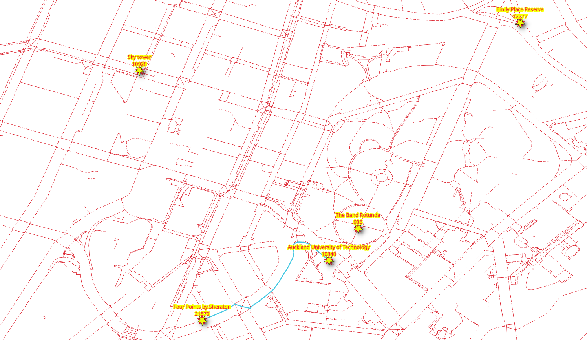
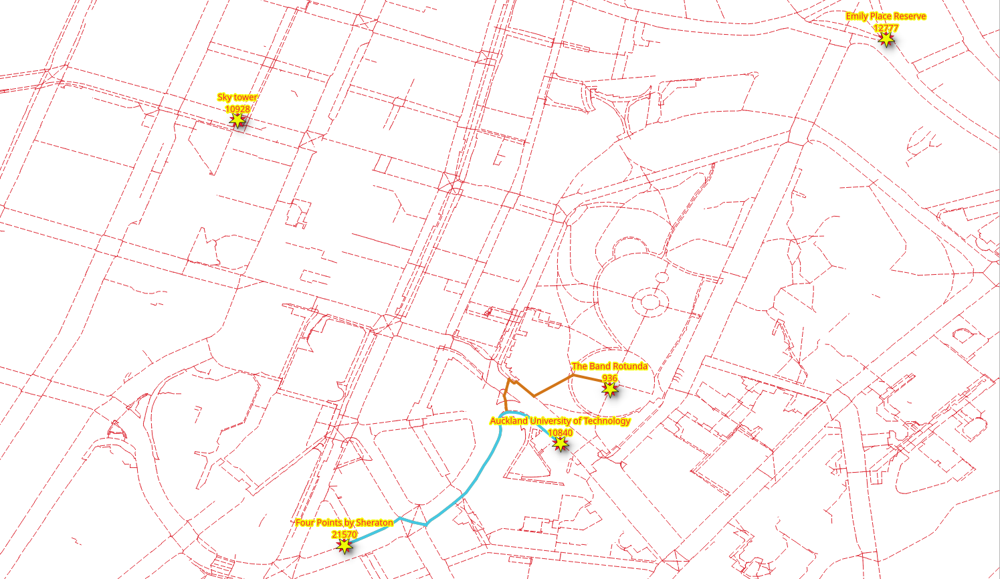
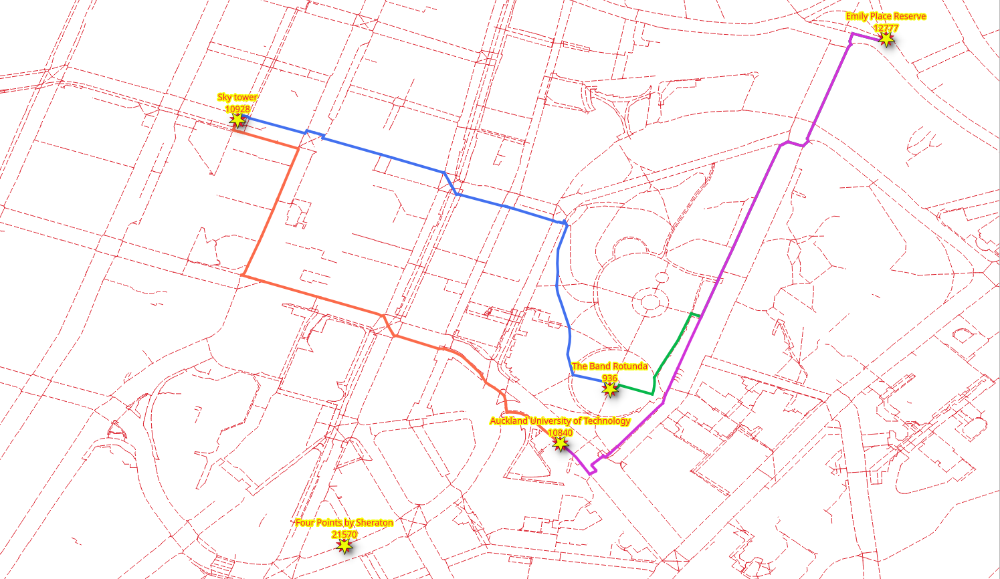
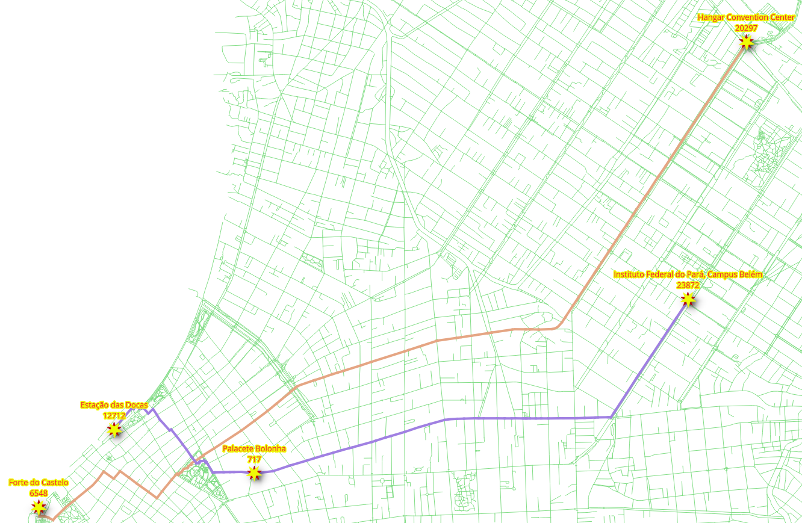

:file: This file is part of the pgRouting project.
:copyright: Copyright (c) 2016-2026 pgRouting developers
:license: Creative Commons Attribution-Share Alike 3.0 https://creativecommons.org/licenses/by-sa/3.0

Pedestrian Routing
===============================================================================

**pgRouting** was first called *pgDijkstra* because it implemented only shortest
path search with *Dijkstra* algorithm. Later other functions were added and the
library was renamed to pgRouting.

pgRouting functions in this chapter

- `pgr_dijkstra`_
- `pgr_dijkstraCost`_

.. contents:: Chapter Contents

Identifiers for the Queries
-------------------------------------------------------------------------------

The assignment of the vertices identifiers on the source and target columns may
be different, the exercises will use the identifiers value assigned by
``osm2pgrouting``

For the workshop, some locations near the FOSS4G event are going to be used.
These locations are within this area |osm_map_link|

* |osmid_1| |place_1|
* |osmid_2| |place_2|
* |osmid_3| |place_3|
* |osmid_4| |place_4|
* |osmid_5| |place_5|

.. note::
   Don't forget to connect to the database, if not connected:

   ::

     psql city_routing

Get the vertex identifiers

.. literalinclude:: ../scripts/basic/pedestrian/pedestrian.sql
  :language: sql
  :start-after: get_id.txt
  :end-before: stars.txt

|

.. literalinclude:: ../scripts/basic/pedestrian/get_id.txt

To use as a guide in QGIS, create a view:

.. literalinclude:: ../scripts/basic/pedestrian/pedestrian.sql
  :language: sql
  :start-after: stars.txt
  :end-before: one_to_one.txt

.. literalinclude:: ../scripts/basic/pedestrian/stars.txt

* |osmid_1| |place_1| (|id_1|)
* |osmid_2| |place_2| (|id_2|)
* |osmid_3| |place_3| (|id_3|)
* |osmid_4| |place_4| (|id_4|)
* |osmid_5| |place_5| (|id_5|)

The corresponding :code:`id` are shown in the following image.

.. image:: images/pedestrian/stars.png
  :scale: 25%

pgr_dijkstra
-------------------------------------------------------------------------------

Dijkstra algorithm was the first algorithm implemented in pgRouting. It does not
require other attributes than the identifiers ``id``, ``source`` and ``target``
and the weights ``cost`` and ``reverse_cost``.

You can specify when to consider the graph as `directed
<https://en.wikipedia.org/wiki/Directed_graph>`__ or undirected.

.. rubric:: Signature Summary

.. code-block:: sql

  pgr_dijkstra(Edges SQL, start_vid,  end_vid  [, directed])
  pgr_dijkstra(Edges SQL, start_vid,  end_vids [, directed])
  pgr_dijkstra(Edges SQL, start_vids, end_vid  [, directed])
  pgr_dijkstra(Edges SQL, start_vids, end_vids [, directed])
  pgr_dijkstra(Edges SQL, Combinations SQL [, directed])

  RETURNS SET OF (seq, path_seq, start_vid, end_vid, node, edge, cost, agg_cost)
      OR EMPTY SET

Description of the function can be found in `pgr_dijkstra
<https://docs.pgrouting.org/latest/en/pgr_dijkstra.html>`__.

.. note::
  * Many pgRouting functions have ``sql::text`` as one of their arguments. While
    this may look confusing at first, it makes the functions very flexible as
    the user can pass a ``SELECT`` statement as function argument as long as
    the returned result contains the required number of attributes and the
    correct attribute names.
  * Most of pgRouting implemented algorithms do not require the **geometry**.
  * The pgRouting functions **do not** return a geometry, but only an ordered
    list of nodes or edges.

Exercise 1: Single pedestrian routing
...............................................................................

.. rubric:: Problem:

* Get walking route

  * from "|place_1|"
  * to "|place_3|".

* Calculate routes with costs in ``length`` in meters.
* Create a view with the results data and geometry to be used in QGIS.

.. rubric:: Solution:

* The pedestrian wants to go from vertex |id_1| to vertex |id_3|.
* The pedestrian's cost is in terms of length. In this case ``length``.
* From a pedestrian perspective the graph is ``undirected``, that is, the
  pedestrian can move in both directions on all segments.

.. literalinclude:: ../scripts/basic/pedestrian/pedestrian.sql
   :language: sql
   :start-after: one_to_one.txt
   :end-before: one_to_one_view.txt
   :emphasize-lines: 2-4

.. collapse:: Query results

   .. literalinclude:: ../scripts/basic/pedestrian/one_to_one.txt

:Inner query: Query formatted as ``TEXT`` used inside the function.

The returned cost attribute represents the cost specified in the inner SQL query
(``edges_sql::text`` argument). In this example cost is ``length`` in unit
"meters". The exercises on this chapter will modify the cost.

.. note::
   ``node`` and ``edge`` results may vary depending on the assignment of the
   identifiers to the vertices given by osm2pgrouting.

To create a view, ``JOIN`` the query results with the walk_net and capture  the
``geom`` in the view.

* The query above is highlighted.
* An additional ``SELECT`` is needed to display the data.

.. literalinclude:: ../scripts/basic/pedestrian/pedestrian.sql
   :language: sql
   :start-after: one_to_one_view.txt
   :end-before: many_to_one.txt
   :emphasize-lines: 3-9

.. collapse:: Query results

  .. literalinclude:: ../scripts/basic/pedestrian/one_to_one_view.txt

.. note::
   Every time you make a change on the database, in QGIS, refresh the database
   and move the view to the layers.

Exercise 2: Many Pedestrians going to the same destination
...............................................................................

.. rubric:: Problem:

* Walking

  * from "|place_1|" and "|place_2|"
  * to the "|place_3|".

* Calculate routes with costs in ``length`` in kilometers.

.. rubric:: Solution:

* The pedestrians are departing at vertices |id_1| and |id_2|.
* All pedestrians want to go to vertex |id_3|.
* The cost to be in kilometers using attribute ``length``.

.. literalinclude:: ../scripts/basic/pedestrian/pedestrian.sql
   :language: sql
   :start-after: many_to_one.txt
   :end-before: one_to_many.txt
   :emphasize-lines: 3-9
   :linenos:

.. collapse:: Query results

   .. literalinclude:: ../scripts/basic/pedestrian/many_to_one.txt

Exercise 3: Many Pedestrians departing from the same location
...............................................................................

.. rubric:: Problem:

* Walking

  * from "|place_3|"
  * to "|place_1|" and "|place_2|"

* Calculate routes using the ``cost`` which is in seconds for a walking speed of
  ``2 mts/sec``.

  * See :doc:`graphs` for the costs setup.

.. rubric:: Solution:

* All pedestrians are departing from vertex |id_3|.
* Pedestrians want to go to locations |id_1| and |id_2|.
* The ``cost`` column on ``walk_net`` is in seconds.

.. literalinclude:: ../scripts/basic/pedestrian/pedestrian.sql
   :language: sql
   :start-after: one_to_many.txt
   :end-before: many_to_many.txt
   :linenos:
   :emphasize-lines: 3-9

.. collapse:: Query results

  .. literalinclude:: ../scripts/basic/pedestrian/one_to_many.txt

Exercise 4: Many Pedestrians going to different destinations
...............................................................................

.. rubric:: Problem:

* Walking

  * from "|place_1|" and "|place_2|"
  * to "|place_3|" and "|place_5|"

* Calculate routes with costs in minutes at walking speed ``s = 1.3 m/s``.

.. rubric:: Solution:

* The pedestrians depart from |id_1| and |id_2|.
* The pedestrians want to go to destinations |id_3| and |id_5|.
* The cost to be in minutes, with a walking speed ``s = 1.3 m/s`` and ``t = d/s``.

.. literalinclude:: ../scripts/basic/pedestrian/pedestrian.sql
   :language: sql
   :start-after: many_to_many.txt
   :end-before: combinations.txt
   :linenos:
   :emphasize-lines: 3-9

.. collapse:: Query results

  .. literalinclude:: ../scripts/basic/pedestrian/many_to_many.txt

Exercise 5: Combination of routes
...............................................................................

.. rubric:: Problem:

* Walking

  * First pedestrian goes from "|place_1|" to "|place_4|"
  * Second pedestrian goes from "|place_3|" to "|place_5|"

* Calculate routes with costs in minutes at walking speed ``s = 1.3 m/s``.

.. rubric:: Solution:

* First pedestrian departs from |id_1| and the destination is |id_3|.
* Second pedestrian departs from |id_2| and the destination is |id_5|.
* The cost to be in minutes, with a walking speed ``s = 1.3 m/s`` and ``t = d/s``.

.. literalinclude:: ../scripts/basic/pedestrian/pedestrian.sql
   :language: sql
   :start-after: combinations.txt
   :end-before: dijkstracost.txt
   :linenos:
   :emphasize-lines: 3-11

.. collapse:: Query results

  .. literalinclude:: ../scripts/basic/pedestrian/combinations.txt

pgr_dijkstraCost
-------------------------------------------------------------------------------

When the main goal is to calculate the total cost, without "inspecting" the `pgr_dijkstra` results,
using ``pgr_dijkstraCost`` returns a more compact result.

.. rubric:: Signature Summary

.. code-block:: none

  pgr_dijkstraCost(edges_sql, start_vid,  end_vid  [, directed])
  pgr_dijkstraCost(edges_sql, start_vid,  end_vids [, directed])
  pgr_dijkstraCost(edges_sql, start_vids, end_vid  [, directed])
  pgr_dijkstraCost(edges_sql, start_vids, end_vids [, directed])
  pgr_dijkstraCost(edges_sql, combinations_sql   [, directed])

  RETURNS SET OF (start_vid, end_vid, agg_cost)
      OR EMPTY SET

Description of the parameters can be found in `pgr_dijkstraCost
<https://docs.pgrouting.org/latest/en/pgr_dijkstraCost.html#description-of-the-signatures>`__

Exercise 6: Time for many Pedestrians going to different destinations
...................................................................................................

.. rubric:: Problem:

* Walking

  * from "|place_1|" or "|place_2|"
  * to "|place_4|" or "|place_5|"

* Get only the cost in minutes.

.. image:: images/pedestrian/pedestrian_cost_many_to_many.png
  :scale: 25%

.. rubric:: Solution:

* The pedestrians depart from |id_1| and |id_2| (line **5**).
* The pedestrians want to go to destinations |id_4| and |id_5| (line **6**).
* The cost to be in minutes, with a walking speed ``s = 1.3 m/s`` and ``t = d/s``.
* Result as aggregated costs.

.. literalinclude:: ../scripts/basic/pedestrian/pedestrian.sql
   :language: sql
   :start-after: dijkstracost.txt
   :end-before: note_1.txt
   :linenos:

.. collapse:: Query results

  .. literalinclude:: ../scripts/basic/pedestrian/dijkstracost.txt

The same results can be obtained from the ``pedestrian_many_to_many`` view:

.. literalinclude:: ../scripts/basic/pedestrian/pedestrian.sql
   :language: sql
   :start-after: note_1.txt

.. collapse:: Query results

   .. literalinclude:: ../scripts/basic/pedestrian/note_1.txt

