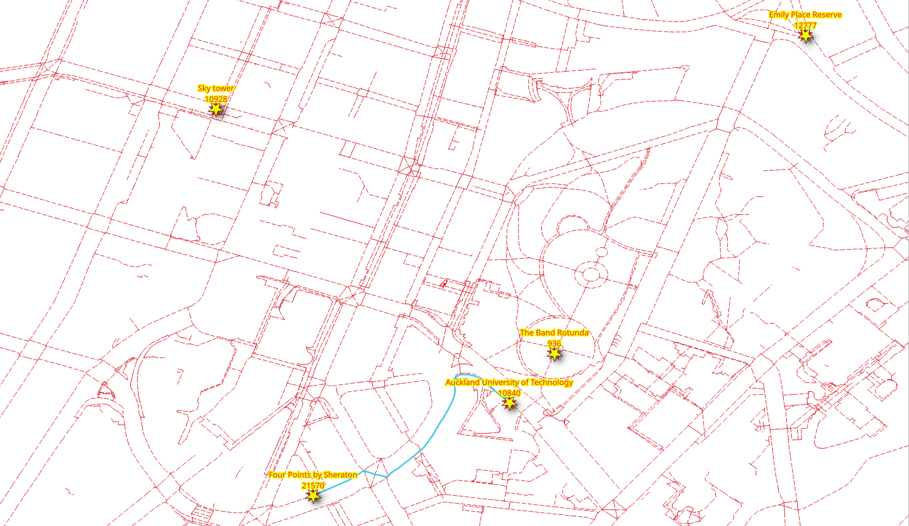
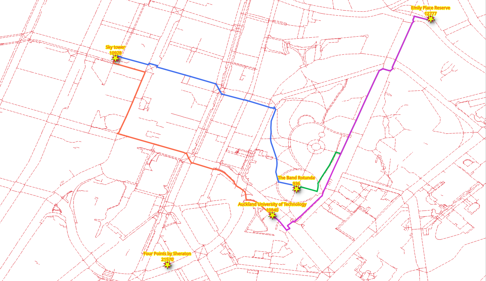
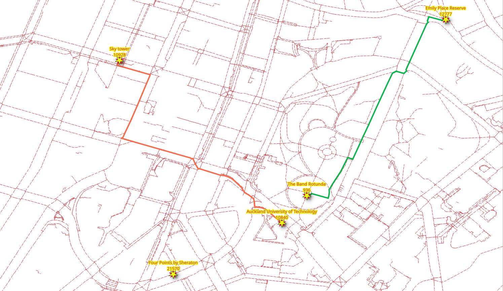

..
  ****************************************************************************
  pgRouting Workshop Manual
  Copyright(c) pgRouting Contributors

  This documentation is licensed under a Creative Commons Attribution-Share
  Alike 3.0 License: https://creativecommons.org/licenses/by-sa/3.0/
  ****************************************************************************

Pedestrian Routing
===============================================================================

**pgRouting** was first called *pgDijkstra*, because it implemented only shortest
path search with *Dijkstra* algorithm. Later other functions were added and the
library was renamed to pgRouting.

pgRouting functions in this chapter

- `pgr_dijkstra`_
- `pgr_dijkstraCost`_

.. contents:: Chapter Contents

pgr_dijkstra
-------------------------------------------------------------------------------

Dijkstra algorithm was the first algorithm implemented in pgRouting. It doesn't
require other attributes than the identifiers ``id``, ``source`` and ``target``
and the weights ``cost`` and ``reverse_cost``.

You can specify when to consider the graph as `directed
<https://en.wikipedia.org/wiki/Directed_graph>`__ or undirected.

.. rubric:: Signature Summary

.. code-block:: sql

  pgr_dijkstra(Edges SQL, start_vid,  end_vid  [, directed])
  pgr_dijkstra(Edges SQL, start_vid,  end_vids [, directed])
  pgr_dijkstra(Edges SQL, start_vids, end_vid  [, directed])
  pgr_dijkstra(Edges SQL, start_vids, end_vids [, directed])
  pgr_dijkstra(Edges SQL, Combinations SQL [, directed])

  RETURNS SET OF (seq, path_seq, start_vid, end_vid, node, edge, cost, agg_cost)
      OR EMPTY SET

Description of the function can be found in `pgr_dijkstra
<https://docs.pgrouting.org/latest/en/pgr_dijkstra.html>`__.

.. note::
  * Many pgRouting functions have ``sql::text`` as one of their arguments. While
    this may look confusing at first, it makes the functions very flexible as
    the user can pass a ``SELECT`` statement as function argument as long as
    the returned result contains the required number of attributes and the
    correct attribute names.
  * Most of pgRouting implemented algorithms do not require the **geometry**.
  * The pgRouting functions **do not** return a geometry, but only an ordered
    list of nodes or edges.

.. rubric:: Identifiers for the Queries

The assignment of the vertices identifiers on the source and target columns may
be different, the following exercises will use the results of this query.
For the workshop, some locations near of the FOSS4G event are going to be used.
These locations are within this area https://www.openstreetmap.org/#map=16/-36.8520950/174.7631803

* |osmid_1| |place_1|
* |osmid_2| |place_2|
* |osmid_3| |place_3|
* |osmid_4| |place_4|
* |osmid_5| |place_5|

Connect to the database, if not connected:

::

  psql city_routing

Get the vertex identifiers

.. literalinclude:: ../scripts/basic/pedestrian/pedestrian.sql
  :language: sql
  :start-after: get_id.txt
  :end-before: one_to_one.txt

|

.. literalinclude:: ../scripts/basic/pedestrian/get_id.txt

* |osmid_1| |place_1| (|id_1|)
* |osmid_2| |place_2| (|id_2|)
* |osmid_3| |place_3| (|id_3|)
* |osmid_4| |place_4| (|id_4|)
* |osmid_5| |place_5| (|id_5|)

The corresponding :code:`id` are shown in the following image, and a sample route from
"|place_3|" to "|place_1|".

Exercise 1: Single pedestrian routing
...............................................................................

.. rubric:: Problem:

* Walking

  * from "|place_1|"
  * to "|place_3|".

* Calculate routes with costs in ``length`` in meters.

.. rubric:: Solution:

* The pedestrian wants to go from vertex |id_1| to vertex |id_3| (lines **5** and **6**).
* The pedestrian's cost is in terms of length. In this case ``length`` (line **3**).
* From a pedestrian perspective the graph is ``undirected`` (line **7**), that is, the
  pedestrian can move in both directions on all segments.

.. literalinclude:: ../scripts/basic/pedestrian/pedestrian.sql
   :language: sql
   :start-after: one_to_one.txt
   :end-before: many_to_one.txt
   :linenos:

.. collapse:: Query results

  .. literalinclude:: ../scripts/basic/pedestrian/one_to_one.txt

.. note::
  * The returned cost attribute represents the cost specified in the inner SQL
    query (``edges_sql::text`` argument). In this example cost is ``length`` in
    unit "meters". Cost may be time, distance or any combination of both or any
    other attributes or a custom formula.
  * ``node`` and ``edge`` results may vary depending on the assignment of the
    identifiers to the vertices given by osm2pgrouting.

Exercise 2: Many Pedestrians going to the same destination
...............................................................................

.. rubric:: Problem:

* Walking

  * from "|place_1|" and "|place_2|"
  * to the "|place_3|".

* Calculate routes with costs in ``length`` in kilometers.

.. image:: images/pedestrian/pedestrian_one_to_many.png
  :scale: 25%

.. rubric:: Solution:

* The pedestrians are departing at vertices |id_1| and |id_2| (line **5**).
* All pedestrians want to go to vertex |id_3| (line **6**).
* The cost to be in kilometers using attribute ``length`` (line **3**).

.. literalinclude:: ../scripts/basic/pedestrian/pedestrian.sql
   :language: sql
   :start-after: many_to_one.txt
   :end-before: one_to_many.txt
   :linenos:

.. collapse:: Query results

   .. literalinclude:: ../scripts/basic/pedestrian/many_to_one.txt

Exercise 3: Many Pedestrians departing from the same location
...............................................................................

.. rubric:: Problem:

* Walking

  * from "|place_3|"
  * to "|place_1|" and "|place_2|"

* Calculate routes using the ``cost`` which is in seconds for a walking speed of
  ``2 mts/sec``.

  * See :doc:`graphs` for the costs setup.

.. image:: images/pedestrian/pedestrian_one_to_many.png
  :scale: 25%

.. rubric:: Solution:

* All pedestrians are departing from vertex |id_3| (line **5**).
* Pedestrians want to go to locations |id_1| and |id_2| (line **6**).
* The ``cost`` column on ``walk_net`` is in seconds. (line **3**)

.. literalinclude:: ../scripts/basic/pedestrian/pedestrian.sql
   :language: sql
   :start-after: one_to_many.txt
   :end-before: many_to_many.txt
   :linenos:

.. collapse:: Query results

  .. literalinclude:: ../scripts/basic/pedestrian/one_to_many.txt

Exercise 4: Many Pedestrians going to different destinations
...............................................................................

.. rubric:: Problem:

* Walking

  * from "|place_1|" and "|place_2|"
  * to "|place_4|" and "|place_5|"

* Calculate routes with costs in minutes at walking speed ``s = 1.3 m/s``.

.. rubric:: Solution:

* The pedestrians depart from |id_1| and |id_2| (line **5**).
* The pedestrians want to go to destinations |id_4| and |id_5| (line **6**).
* The cost to be in minutes, with a walking speed ``s = 1.3 m/s`` and ``t = d/s``.

.. literalinclude:: ../scripts/basic/pedestrian/pedestrian.sql
   :language: sql
   :start-after: many_to_many.txt
   :end-before: combinations.txt
   :linenos:

.. collapse:: Query results

  .. literalinclude:: ../scripts/basic/pedestrian/many_to_many.txt

.. note:: .. include:: ../scripts/basic/pedestrian/note_1.txt

Exercise 5: Combination of routes
...............................................................................

.. rubric:: Problem:

* Walking

  * First pedestrian goes from "|place_1|" to "|place_4|"
  * Second pedestrian goes from "|place_2|" to "|place_5|"

* Calculate routes with costs in minutes at walking speed ``s = 1.3 m/s``.

.. rubric:: Solution:

* First pedestrian departs from |id_1| and the destination is |id_4| (line **6**).
* Second pedestrian departs from |id_2| and the destination is |id_5| (line **7**).
* The cost to be in minutes, with a walking speed ``s = 1.3 m/s`` and ``t = d/s``.

.. literalinclude:: ../scripts/basic/pedestrian/pedestrian.sql
   :language: sql
   :start-after: combinations.txt
   :end-before: dijkstracost.txt
   :linenos:

.. collapse:: Query results

  .. literalinclude:: ../scripts/basic/pedestrian/combinations.txt

pgr_dijkstraCost
-------------------------------------------------------------------------------

When the main goal is to calculate the total cost, without "inspecting" the `pgr_dijkstra` results,
using ``pgr_dijkstraCost`` returns a more compact result.

.. rubric:: Signature Summary

.. code-block:: none

  pgr_dijkstraCost(edges_sql, start_vid,  end_vid  [, directed])
  pgr_dijkstraCost(edges_sql, start_vid,  end_vids [, directed])
  pgr_dijkstraCost(edges_sql, start_vids, end_vid  [, directed])
  pgr_dijkstraCost(edges_sql, start_vids, end_vids [, directed])
  pgr_dijkstraCost(edges_sql, combinations_sql   [, directed])

  RETURNS SET OF (start_vid, end_vid, agg_cost)
      OR EMPTY SET

Description of the parameters can be found in `pgr_dijkstraCost
<https://docs.pgrouting.org/latest/en/pgr_dijkstraCost.html#description-of-the-signatures>`__

Exercise 6: Time for many Pedestrians going to different destinations
...................................................................................................

.. rubric:: Problem:

* Walking

  * from "|place_1|" or "|place_2|"
  * to "|place_4|" or "|place_5|"

* Get only the cost in minutes.

.. image:: images/pedestrian/pedestrian_dijkstracost.png
  :scale: 25%

.. rubric:: Solution:

* The pedestrians depart from |id_1| and |id_2| (line **5**).
* The pedestrians want to go to destinations |id_4| and |id_5| (line **6**).
* The cost to be in minutes, with a walking speed ``s = 1.3 m/s`` and ``t = d/s``.
* Result as aggregated costs.

.. literalinclude:: ../scripts/basic/pedestrian/pedestrian.sql
   :language: sql
   :start-after: dijkstracost.txt
   :end-before: note_1.txt
   :linenos:

.. collapse:: Query results

  .. literalinclude:: ../scripts/basic/pedestrian/dijkstracost.txt

Compare with `Exercise 4: Many Pedestrians going to different destinations`_ 's note.
