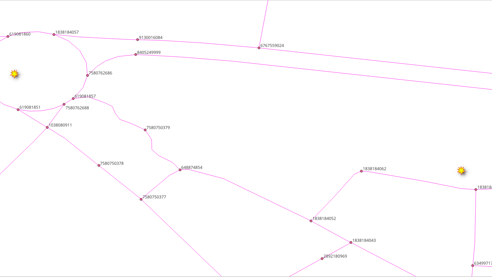
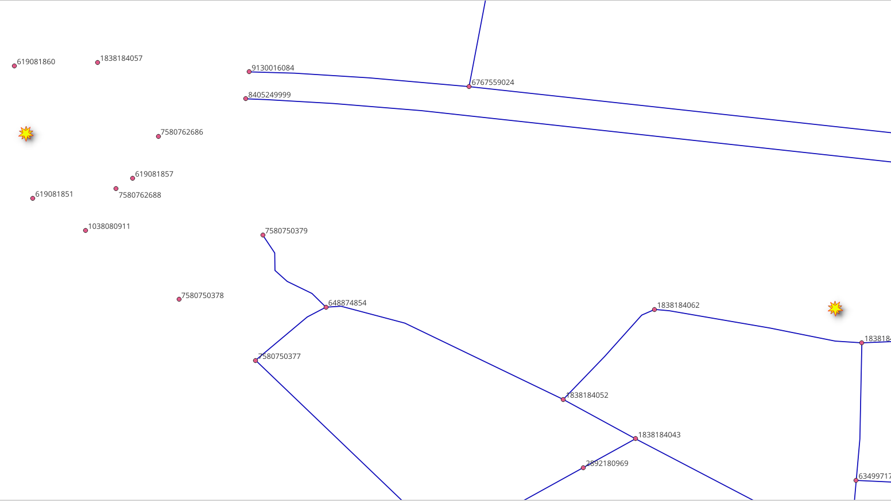
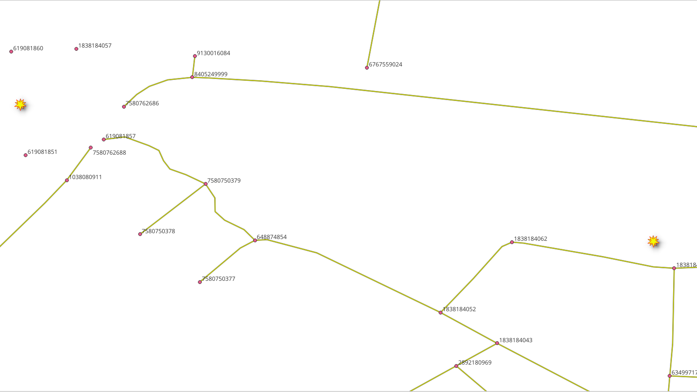
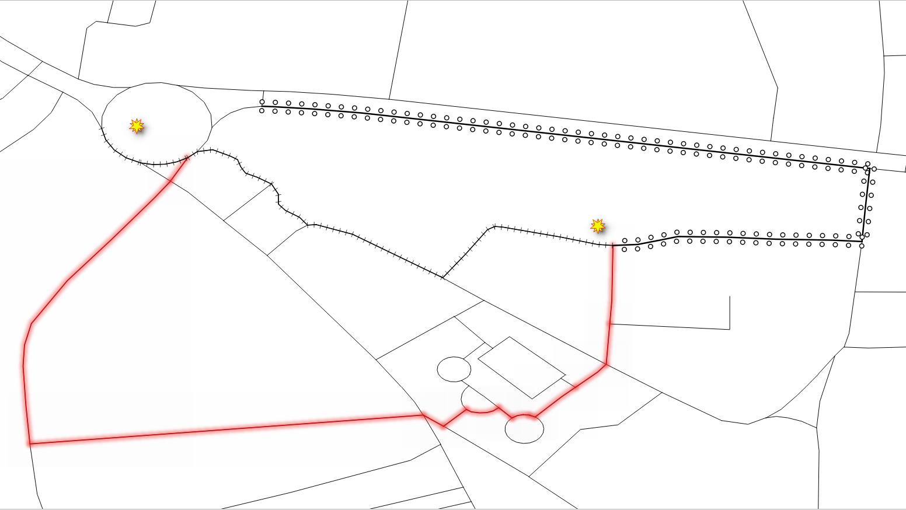

..
  ****************************************************************************
  pgRouting Workshop Manual
  Copyright(c) pgRouting Contributors

  This documentation is licensed under a Creative Commons Attribution-Share
  Alike 3.0 License: http://creativecommons.org/licenses/by-sa/3.0/
  ****************************************************************************

pl/pgsql function
###############################################################################

.. image:: images/chapter5/route.png
  :width: 250pt
  :align: center

Other kind of functions are `pl/pgsql
<https://www.postgresql.org/docs/current/plpgsql.html>`__.  As the applications
requirements become more complex, using wrappers of previously defined functions
becomes necessary for clarity.

.. contents:: Chapter contents

Requirements for routing from A to B
===============================================================================

.. rubric:: Chapter problem:

* Create a function ``wrk_fromAtoB`` that allows routing from 2 geometries.
* The function takes latitude/longitude points as input parameters.
* Returns a route that includes a geometry so that if can be displayed, for example, in QGIS.
* Will also return some other attributes.

The detailed description:

.. rubric:: Input parameters

============  ==========  ===
Column        type        Description
============  ==========  ===
edges_subset  REGCLASS    Edge table name identifier.
lat1          NUMERIC     The latitude of the `departure` point.
lon1          NUMERIC     The longitude of the `departure` point.
lat2          NUMERIC     The latitude of the `destination` point.
lon2          NUMERIC     The longitude of the `destination` point.
do_debug      BOOLEAN     Flag to create a ``WARNING`` with the query that is been executed
============  ==========  ===

.. rubric::  Output columns

============= =================================================
Column          Description
============= =================================================
seq           For ordering purposes.
gid           The edge identifier that can be used to JOIN the results to the ``ways`` table.
name          The street name.
azimuth       Between start and end node of an edge.
length        In meters.
minutes       Minutes taken to traverse the segment.
route_geom    The road geometry with corrected directionality.
============= =================================================

For this chapter, the following points will be used for testing.

* (lat,lon) = (@POINT1_LAT@, @POINT1_LON@)
* (lat,lon) = (@POINT2_LAT@, @POINT2_LON@)

The Vertices Table
===============================================================================

Graphs have a `set of edges` and a `set of vertices` associated to it.
The views need their vertices table.

Exercise 1: Create vertices table
-------------------------------------------------------------------------------

.. rubric:: Problem

* Create a vertices table for the views:

  * ``vehicle_net``
  * ``taxi_net``
  * ``walk_net``

.. rubric:: Solution

* Use ``pgr_extractVertices`` (explained in :doc:`graph_views`) to create the
  vertices table
* ``JOIN`` the vertices table with ``ways_vertices`` (created in
  :doc:`graph_views`) to get the ``x``, ``y``, ``geom`` information.

For ``vehicle_net``:

.. literalinclude:: ../scripts/basic/chapter_8/all-sections-8.sql
  :language: sql
  :emphasize-lines: 1,6
  :start-after: views_vertices1.txt
  :end-before: views_vertices2.txt

For ``taxi_net``:

.. literalinclude:: ../scripts/basic/chapter_8/all-sections-8.sql
  :start-after: views_vertices2.txt
  :end-before: views_vertices3.txt

For ``walk_net``:

Modify the above queries to create the ``walk_net_vertices`` table.

.. collapse:: Answer

  .. literalinclude:: ../scripts/basic/chapter_8/all-sections-8.sql
    :start-after: views_vertices3.txt
    :end-before: exercise_8_3_1.txt

.. note:: It is left to the reader to remove disconected components on the views.

   See :doc:`graph_views`

Exercise 3: Nearest Vertex
-------------------------------------------------------------------------------

.. rubric:: Problem

Calculate the (OSM) identifier of the nearest vertex to a point.

In particular use the following (lat, lon) value: ``(@POINT1_LAT@, @POINT1_LON@)``.

* calculate the nearest OSM identifier of the vertex to:

  * ``ways_vertices``
  * ``vehicle_net_vertices``
  * ``taxi_net_vertices``
  * ``walk_net_vertices``

.. rubric:: Solution

* Remember that the ``id`` has an OSM vertex identifier on the vertices tables.
* Using the Postgis distance operator `<-> <https://postgis.net/docs/geometry_distance_knn.html>`__ to order by distance.
* Get only the first row, to obtain the nearest identifier of the vertex.

For ways_vertices:

.. literalinclude:: ../scripts/basic/chapter_8/all-sections-8.sql
  :language: sql
  :start-after: exercise_8_3_1.txt
  :end-before: exercise_8_3_2.txt

.. collapse:: Query results

  .. literalinclude:: ../scripts/basic/chapter_8/exercise_8_3_1.txt

For ``vehicle_net_vertices``:

Modify the previous query

.. literalinclude:: ../scripts/basic/chapter_8/all-sections-8.sql
  :language: sql
  :linenos:
  :emphasize-lines: 1,2
  :start-after: exercise_8_3_2.txt
  :end-before: exercise_8_3_3.txt

.. collapse:: Query results

  .. literalinclude:: ../scripts/basic/chapter_8/exercise_8_3_2.txt

For ``taxi_net_vertices_pgr``:

Modify the previous query.

.. collapse:: Query results

  .. literalinclude:: ../scripts/basic/chapter_8/exercise_8_3_3.txt

For ``walk_net_vertices_pgr``:

Modify the previous query.

.. collapse:: Query results

  .. literalinclude:: ../scripts/basic/chapter_8/exercise_8_3_4.txt

Exercise 4: Nearest vertex function
-------------------------------------------------------------------------------

.. rubric:: Problem

When operations look similar for different tables, a function can be created.

* Create a function that calculates the OSM identifier of the nearest vertex to a point.
* Function name: ``wrk_nearest``.
* Needs to work only for the **final application** views and table.

The input parameters:

============  ==========  ===
Column        type        Description
============  ==========  ===
vertex_table  REGCLASS    Table name identifier.
lat           NUMERIC     The latitude of a point.
lon           NUMERIC     The longitude of a point.
============  ==========  ===

The output:

=========  =====
type       Description
=========  =====
BIGINT     the OSM identifier that is nearest to (lat,lon).
=========  =====

.. rubric:: Solution

* The function returns only one ``BIGINT`` value.
* Using `format
  <https://www.postgresql.org/docs/12/functions-string.html#FUNCTIONS-STRING-FORMAT>`__
  to build the query.

  * The structure of the query is similar to `Exercise 3: Nearest Vertex`_
    solutions.
  * ``%1$I`` for the table name identifier.
  * ``%2$s`` and ``%3$s`` for the latitude and longitude.

    * The point is formed with (lon/lat) ``(%3$s, %2$s)``.

.. literalinclude:: ../scripts/basic/chapter_8/all-sections-8.sql
  :language: sql
  :force:
  :start-after: exercise_8_4.txt
  :end-before: exercise_8_5_1.txt

Exercise 5: Test nearest vertex function
-------------------------------------------------------------------------------

.. rubric:: Problem

* Test the ``wrk_Nearest`` function.

Use the following (lat,lon) values: ``(@POINT1_LAT@, @POINT1_LON@)``.

* The point is the same as in `Exercise 3: Nearest Vertex`_ problem.

  * Verify the results are the same.

* calculate the nearest OSM identifier of the vertex to:

  * ``ways_vertices``
  * ``vehicle_net_vertices``
  * ``taxi_net_vertices``
  * ``walk_net_vertices``

.. rubric:: Solution

For ``ways_vertices``:

* Use the function with ``ways_vertices`` as the ``vertex_table`` parameter.
* Pass the (lat,lon) values as second and third parameters.
* Using the function on the original data does not return the OSM identifier.

  The value stored in ``id`` column is not the OSM identifier.

.. literalinclude:: ../scripts/basic/chapter_8/all-sections-8.sql
  :language: sql
  :start-after: exercise_8_5_1.txt
  :end-before: exercise_8_5_2.txt

.. collapse:: Query results

  .. literalinclude:: ../scripts/basic/chapter_8/exercise_8_5_1.txt

For ``vehicles_net_vertices``:

* Modify the previous query.

.. literalinclude:: ../scripts/basic/chapter_8/all-sections-8.sql
  :language: sql
  :start-after: exercise_8_5_2.txt
  :end-before: exercise_8_5_3.txt

.. collapse:: Query results

  .. literalinclude:: ../scripts/basic/chapter_8/exercise_8_5_2.txt

For ``taxi_net_vertices``:

* Modify the previous query.

.. collapse:: Query results

  .. literalinclude:: ../scripts/basic/chapter_8/exercise_8_5_3.txt

For ``walk_net_vertices``:

.. collapse:: Query results

  .. literalinclude:: ../scripts/basic/chapter_8/exercise_8_5_4.txt

wrk_fromAtoB function
===============================================================================

In this section, creation and testing the required function will be tackled.

Exercise 6: Creating the main function
-------------------------------------------------------------------------------

.. rubric:: Problem

* Create the function ``wrk_fromAtoB``.
* Follow the description given at `Requirements for routing from A to B`_.
* Use specialized functions:

  * ``wrk_NearestOSM`` created on `Exercise 4: Nearest vertex function`_.

    * It receives the point in natural language format.
    * Obtains the OSM identifier needed by ``wrk_dijkstra``.

  * ``wrk_dijkstra`` created on :ref:`basic/sql_function:Exercise 6: Function for an application`.

.. rubric:: Solution

The function's signature:

* The input parameters highlighted.
* The output columns are not highlighted.
* The function returns a set of values.

.. literalinclude:: ../scripts/basic/chapter_8/all-sections-8.sql
  :language: sql
  :emphasize-lines: 2-5
  :start-after: exercise_8_6.txt
  :end-before: signature ends

|

The function's body:

Call to the function ``wrk_dijkstra``

* Using PostgreSQL ``format`` to make substitutions

  * The first parameter is the string to be replaced
  * The rest are the data parameters, are the strings use for replacement.

* ``wrk_dijkstra`` obtains the values for the output
* The ``edges_subset`` value will replace ``%1$I``:
* For the ``source`` and ``target``:

  * ``wrk_Nearest`` is used to find the identifier.

    * The vertices table name is formed with ``%1$I_vertices_pgr``.

  * ``lat1``, ``lon1`` values will replace ``%2$s, %3$s`` respectively.
  * ``lat2``, ``lon2`` values will replace ``%2$s, %3$s`` respectively.

* To get the constructed query in form of a warning:

  * The ``WARNING`` will be issued only when ``do_debug`` is true.
  * No output will be generated.

.. literalinclude:: ../scripts/basic/chapter_8/all-sections-8.sql
   :language: sql
   :force:
   :emphasize-lines: 9-13, 16-18, 20-22
   :start-after: signature ends
   :end-before: exercise_8_7_1.txt

.. collapse:: The complete function

  .. literalinclude:: ../scripts/basic/chapter_8/all-sections-8.sql
     :language: sql
     :force:
     :start-after: exercise_8_6.txt
     :end-before: exercise_8_7_1.txt

Exercise 7: Using the main function
-------------------------------------------------------------------------------

.. rubric:: Problem

Use ``wrk_fromAtoB``

* Departure point is: (lat,lon) = ``(@POINT1_LAT@, @POINT1_LON@)``
* Destination point is: (lat,lon) = ``(@POINT2_LAT@, @POINT2_LON@)``
* For ``vehicle_net``:

  * Use with default value of ``do_debug``.

* For ``taxi_net``:

  * Use with ``do_debug`` set to ``true``.

* For ``walk_net``:

  * Use with default value of ``do_debug``.
  * Store results on a table.
  * Show the table contents.

.. Note:: The function is not meant to be used with ``ways``

.. rubric:: Solution

For ``vehicle_net``:

* The first parameter is the table name.
* The next two parameters are the latitude and longitude of the departure point.
* The next two parameters are the latitude and longitude of the destination point.

.. literalinclude:: ../scripts/basic/chapter_8/all-sections-8.sql
  :language: sql
  :start-after: exercise_8_7_1.txt
  :end-before: exercise_8_7_2.txt

.. collapse:: Query results

  .. literalinclude:: ../scripts/basic/chapter_8/exercise_8_7_1.txt

For ``taxi_net``:

* Do a dry run by adding ``true`` to get the query that is executed.

.. literalinclude:: ../scripts/basic/chapter_8/all-sections-8.sql
  :language: sql
  :start-after: exercise_8_7_2.txt
  :end-before: exercise_8_7_3.txt

.. collapse:: Query results

  .. literalinclude:: ../scripts/basic/chapter_8/exercise_8_7_2.txt

For ``walk_net``:

.. literalinclude:: ../scripts/basic/chapter_8/all-sections-8.sql
  :language: sql
  :start-after: exercise_8_7_3.txt
  :end-before: \o

.. collapse:: Query results

  .. literalinclude:: ../scripts/basic/chapter_8/exercise_8_7_3.txt
