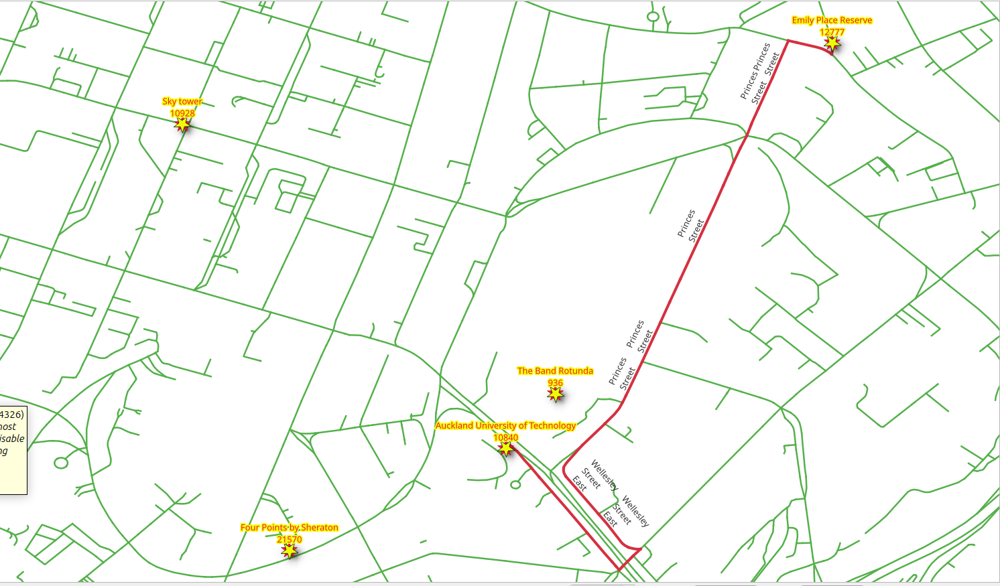
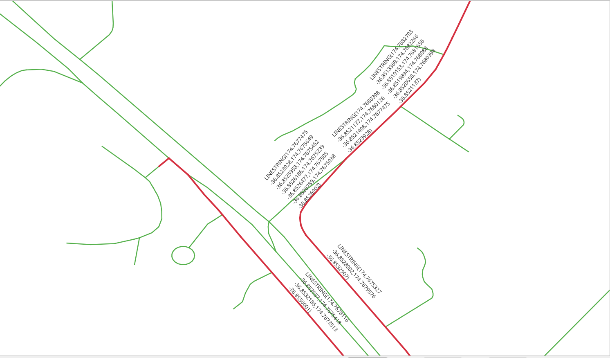
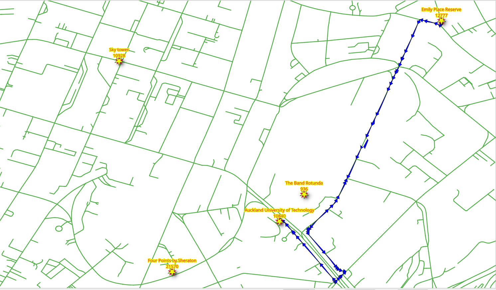
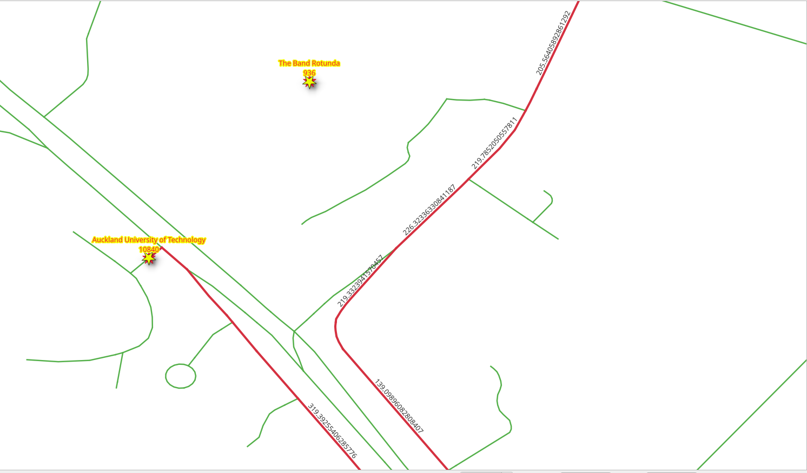
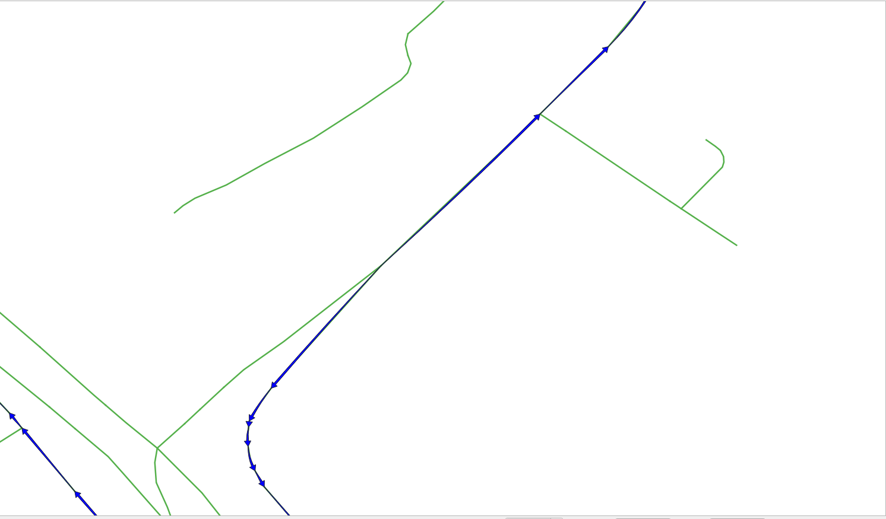

:file: This file is part of the pgRouting project.
:copyright: Copyright (c) 2013-2026 pgRouting developers
:license: Creative Commons Attribution-Share Alike 3.0 https://creativecommons.org/licenses/by-sa/3.0

SQL function
###############################################################################

.. contents:: Chapter Contents

While pgRouting functions provide a low-level interface, developing for a higher-level
application requires these requirements to be represented directly in the SQL queries.
As these SQL queries get more complex, it is desirable to store them in PostgreSQL
stored procedures or functions. Stored procedures or functions are an effective way
to wrap application logic, in this case, related to routing logic and requirements.

The function requirements
===============================================================================

The function will wrap ``pgr_dijkstra``.

The function will use:

- ``vehicle_net``
- ``vehicle_penalized_net``

The function returns the following routing information:

- ``seq`` - A unique identifier of the rows
- ``id`` - The segment's identifier
- ``seconds`` - Number of seconds to traverse the segment
- ``name`` - The segment's name
- ``length`` - The segment's length
- ``azimuth`` - The azimuth of the segment
- ``readable`` - The geometry in human readable form.
- ``geom`` - The routing geometry

.. rubric:: Design of the function

The function to be created ``wrk_dijkstra`` with the following input parameters and
output columns:

.. rubric:: Input parameters

================= ========= =================
Parameter          Type      Description
================= ========= =================
``source``        BIGINT    The identifier of the `departure` location.
``target``        BIGINT    The identifier of the `destination` location.
================= ========= =================

.. rubric:: output columns

================== ========= =================
Name               Type      Description
================== ========= =================
``seq``             INTEGER   A unique number for each result row.
``id``              BIGINT    The edge identifier.
``seconds``         FLOAT     The number of seconds it takes to traverse the segment.
``name``            TEXT      The name of the segment.
``length``          FLOAT     The length in meters of the segment.
``azimuth``         FLOAT     The azimuth of the segment.
``readable``        TEXT      The geometry in human readable form.
``geom``            geometry  The geometry of the segment in the correct direction.
================== ========= =================

Additional information handling
===============================================================================

When the application needs additional information, like the name of the street,
``JOIN`` the results with other tables.

Exercise 1: Get additional information
-------------------------------------------------------------------------------

.. rubric:: Problem

* Create a function that gets all the required information

.. rubric:: Solution

* The function returns the columns asked.
* Rename ``pgr_dijkstra`` results to application requirements names.
* ``LEFT JOIN`` the results with ``vehicle_net`` to get the additional
  information.

  * ``LEFT`` to include the row with ``id = -1`` because it does not exist on
    ``vehicle_net``

.. literalinclude:: ../scripts/basic/sql_function/sql_function.sql
   :language: sql
   :force:
   :start-after: get_more_info.txt
   :end-before: get_read_geom.txt

Geometry handling
===============================================================================

From pgRouting point of view, the geometry is part of the additional
information needed on the results for an application. Therefore ``JOIN`` the
results with other tables that contain the geometry and for further processing
with PostGIS functions.

Exercise 3: Route geometry (binary format)
-------------------------------------------------------------------------------

.. rubric:: Problem

Get the geometries of the route from |place_1| to |place_2|

.. rubric:: Solution

* The function returns ``geom``.

.. literalinclude:: ../scripts/basic/sql_function/sql_function.sql
   :language: sql
   :start-after: get_geom.txt
   :end-before: get_azimuth.txt

.. collapse:: Query results

  .. literalinclude:: ../scripts/basic/sql_function/get_geom.txt

Exercise 2: Route geometry (human readable)
-------------------------------------------------------------------------------

.. rubric:: Problem

Get the geometries in readable form of the route from |place_1| to |place_2|

.. rubric:: Solution

* The function returns ``readable``.

.. literalinclude:: ../scripts/basic/sql_function/sql_function.sql
   :language: sql
   :start-after: get_read_geom.txt
   :end-before: get_geom.txt

.. collapse:: Query results

  .. literalinclude:: ../scripts/basic/sql_function/get_read_geom.txt

Exercise 5: Get the azimuth
-------------------------------------------------------------------------------

There are many geometry functions in PostGIS, the workshop will covered some
of them like ``ST_AsText``, ``ST_Reverse``, ``ST_EndPoint``, ``ST_Azimuth``.

.. rubric:: Problem

Get the azimuth of the geometries of the route from |place_1| to |place_2|

.. rubric:: Solution

* The function returns ``azimuth``.

.. literalinclude:: ../scripts/basic/sql_function/sql_function.sql
   :language: sql
   :start-after: get_azimuth.txt
   :end-before: wrong_directionality.txt

.. collapse:: results

  .. literalinclude:: ../scripts/basic/sql_function/get_azimuth.txt

Exercise 4: Route geometry directionality
-------------------------------------------------------------------------------

Visually, with the route displayed with arrows, it can be found that there are
arrows that do not match the directionality of the route.

To have correct directionality, the ending point of a geometry must match the
starting point of the next geometry

* Inspecting the detail of the results of `Exercise 2: Route geometry (human readable)`_

.. collapse:: Rows where criteria is not met

   .. literalinclude:: ../scripts/basic/sql_function/sql_function.sql
      :language: sql
      :start-after: wrong_directionality.txt
      :end-before: fix_directionality.txt

.. literalinclude:: ../scripts/basic/sql_function/wrong_directionality.txt

.. rubric:: Problem

* Fix the directionality of the geometries and of the columns that depend on it.

  * ``geom``
  *

.. rubric:: Solution

To get the correct direction some geometries need to be reversed:

* Reversing a geometry will depend on the ``node`` column of the query to
  Dijkstra.

* A conditional ``CASE`` statement that returns:

  * The geometry when ``node`` is the ``source`` column.
  * The reversed geometry when ``node`` is not the ``source`` column.

.. literalinclude:: ../scripts/basic/sql_function/sql_function.sql
   :language: sql
   :linenos:
   :force:
   :start-after: fix_directionality.txt
   :end-before: good_directionality.txt

Inspecting the problematic rows, the directionality has been fixed.

.. collapse:: Query: Rows where criteria is not met

   .. literalinclude:: ../scripts/basic/sql_function/sql_function.sql
      :language: sql
      :start-after: good_directionality.txt
      :end-before: final_function.txt

.. literalinclude:: ../scripts/basic/sql_function/good_directionality.txt

Writing the final function
-------------------------------------------------------------------------------

The final function using ``vehicle_penalized_net``

.. literalinclude:: ../scripts/basic/sql_function/sql_function.sql
   :language: sql
   :force:
   :start-after: final_function.txt
   :end-before: using_fn1.txt

Exercise 6: Using the function
-------------------------------------------------------------------------------

Try the function with a combination of the interesting places:

* |id_1| |place_1|
* |id_2| |place_2|
* |id_3| |place_3|
* |id_4| |place_4|
* |id_5| |place_5|

Names of the streets in the route

.. literalinclude:: ../scripts/basic/sql_function/sql_function.sql
  :language: sql
  :start-after: using_fn1.txt
  :end-before: helpers.txt

.. collapse:: Query results

  .. literalinclude:: ../scripts/basic/sql_function/using_fn1.txt

