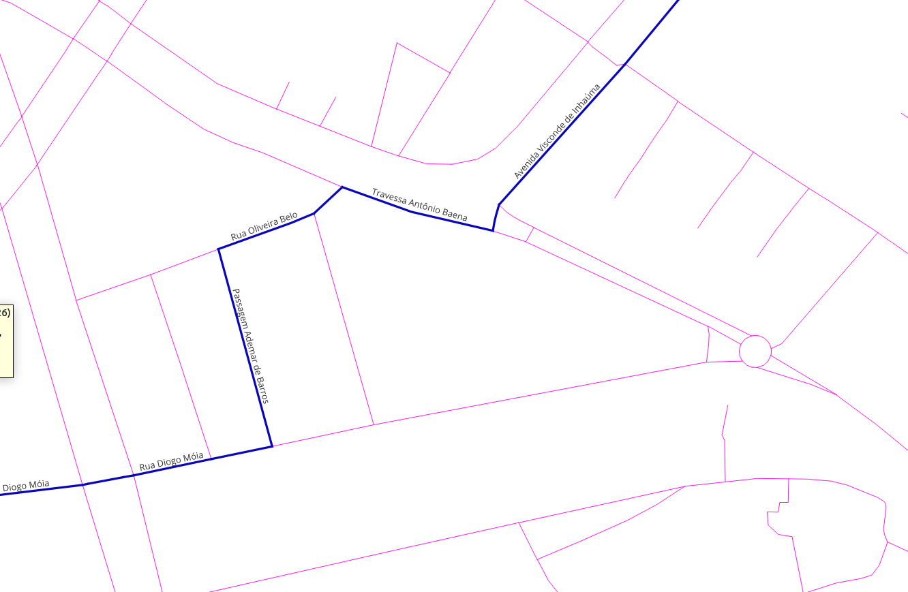
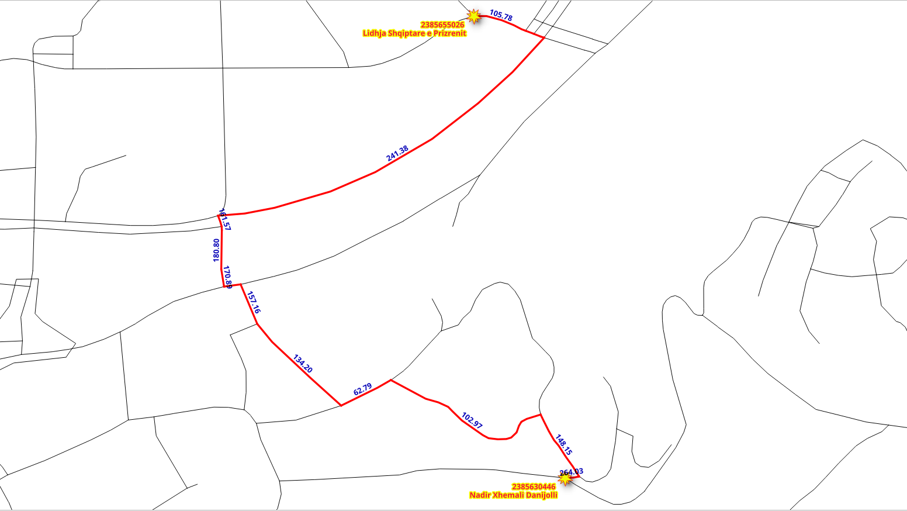

..
  ****************************************************************************
  pgRouting Workshop Manual
  Copyright(c) pgRouting Contributors

  This documentation is licensed under a Creative Commons Attribution-Share
  Alike 3.0 License: http://creativecommons.org/licenses/by-sa/3.0/
  ****************************************************************************

SQL function
###############################################################################

.. image:: images/chapter5/route.png
  :scale: 25%
  :align: center

.. contents:: Chapter Contents

pgRouting functions provide `low level` interface.

When developing for a `higher level` application,
the requirements need to be represented in the SQL queries.
As these SQL queries get more complex, it is desirable to store them in postgreSQL
stored procedures or functions.
Stored procedures or functions are an effective way to wrap application logic, in this case,
related to routing logic and requirements.

The application requirements
===============================================================================

A front end needs the following routing information:
  - ``seq`` - A unique identifier of the rows
  - ``id`` - The segment's identifier
  - ``name`` - The segment's name
  - ``length`` - The segment's length
  - ``seconds`` - Number of seconds to traverse the segment
  - ``azimuth`` - The azimuth of the segment
  - ``route_geom`` - The routing geometry
  - ``route_readable`` - The geometry in human readable form.

.. rubric:: Design of the function

The function to be created ``wrk_dijkstra`` with the following input parameters and
output columns:

.. rubric:: Input parameters

================= ========= =================
Parameter          Type      Description
================= ========= =================
``edges_subset``  REGCLASS  The table/view that is going to be used for processing
``source_osm``    BIGINT    The OSM identifier of the `departure` location.
``target_osm``    BIGINT    The OSM identifier of the `destination` location.
================= ========= =================

.. rubric:: output columns

================== ========= =================
Name               Type      Description
================== ========= =================
``seq``             INTEGER   A unique number for each result row.
``id``              BIGINT    The edge identifier.
``name``            TEXT      The name of the segment.
``seconds``         FLOAT     The number of seconds it takes to traverse the segment.
``azimuth``         FLOAT     The azimuth of the segment.
``length``          FLOAT     The leng in meters of the segment.
``route_readable``  TEXT      The geometry in human readable form.
``route_geom``      geometry  The geometry of the segment in the correct direction.
================== ========= =================

.. note:: For the following exercises only ``vehicle_net`` will be used, but
  you can test the queries with the other views.

Additional information handling
===============================================================================

When the application needs additional information, like the name of the street,
``JOIN`` the results with other tables.

Exercise 1: Get additional information
-------------------------------------------------------------------------------

.. rubric:: Problem

* From |ch7_place_1| to |ch7_place_2|, using OSM identifiers.
* Get the following information:

  * ``seq``
  * ``id``
  * ``name``
  * ``seconds``
  * ``length``

.. rubric:: Solution

* The columns asked (line **2**).
* Rename ``pgr_dijkstra`` results to application requirements names. (line **4**).
* ``LEFT JOIN`` the results with ``vehicle_net`` to get the additional information. (line **9**)

  * ``LEFT`` to include the row with ``id = -1`` because it does not
    exist on ``vehicle_net``

.. literalinclude:: ../scripts/basic/sql_function/sql_function.sql
  :language: sql
  :linenos:
  :emphasize-lines: 2, 4,9
  :start-after: exercise_7_5.txt
  :end-before: exercise_7_6.txt

.. collapse:: Query results

  .. literalinclude:: ../scripts/basic/sql_function/exercise_7_5.txt

Geometry handling
===============================================================================

From pgRouting point of view, the geometry is part of the additional
information, needed on the results for an application. Therefore ``JOIN`` the
results with other tables that contain the geometry and for further processing
with PostGIS functions.

Exercise 2: Route geometry (human readable)
-------------------------------------------------------------------------------

.. rubric:: Problem

Route from the |ch7_place_1| to |ch7_place_2|

* Additionally to the previous exercise, get the

  * geometry ``geom`` in human readable form named as ``route_readable``

.. tip::

  ``WITH`` provides a way to write auxiliary statements in larger queries.
  It can be thought of as defining temporary tables that exist just for one query.

.. rubric:: Solution

* The routing query named ``results`` in a WITH clause. (lines **2** to **5**)
* The results from the previous exercise. (lines **8** and **9**)

  .. note:: For result reading purposes, the result columns from the previous
     are in a comment. Uncomment to see the complete results for the problem.

* The ``geom`` processed with ``ST_AsText`` to get the human readable form.
  (line **12**)

  * Renaming the result to ``route_readable``

* The ``LEFT JOIN`` with ``vehicle_net``. (line **14**)

.. literalinclude:: ../scripts/basic/sql_function/sql_function.sql
  :language: sql
  :linenos:
  :emphasize-lines: 2-5,8-9,12,14
  :start-after: exercise_7_6.txt
  :end-before: exercise_7_7.txt

.. exercise 2 results

.. collapse:: Query results

  .. literalinclude:: ../scripts/basic/sql_function/exercise_7_6.txt

Exercise 3: Route geometry (binary format)
-------------------------------------------------------------------------------

.. image:: images/chapter7/ch7-e6.png
  :width: 300pt
  :alt: From |ch7_place_1| to |ch7_place_2| showing arrows.

.. rubric:: Problem

Route from the |ch7_place_1| to |ch7_place_2|

* Additionally to the previous exercise, get the

  * ``geom`` in binary format with the name ``route_geom``

.. rubric:: Solution

* The query from the previous exercise is used
* The ``SELECT`` clause also contains:

  * The ``geom`` including the renaming (line **9**)

.. literalinclude:: ../scripts/basic/sql_function/sql_function.sql
  :language: sql
  :emphasize-lines: 10
  :linenos:
  :start-after: exercise_7_7.txt
  :end-before: wrong_directionality.txt

.. collapse:: Query results

  .. literalinclude:: ../scripts/basic/sql_function/exercise_7_7.txt

Exercise 4: Route geometry directionality
-------------------------------------------------------------------------------

.. image:: images/chapter7/ch7-e8.png
  :width: 300pt
  :alt: From |ch7_place_1| to |ch7_place_2|

Visually, with the route displayed with arrows, it can be found that there are
arrows that do not match the directionality of the route.

To have correct directionality, the ending point of a geometry must match the
starting point of the next geometry

* Inspecting the detail of the results of `Exercise 2: Route geometry (human
  readable)`_

  * Rows **59** to **61** do not match that criteria

.. collapse:: Query: Rows where criteria is not met

  .. literalinclude:: ../scripts/basic/sql_function/sql_function.sql
    :language: sql
    :start-after: wrong_directionality.txt
    :end-before: exercise_7_8.txt

.. literalinclude:: ../scripts/basic/sql_function/wrong_directionality.txt
  :language: sql

.. rubric:: Problem

Route from the |ch7_place_1| to |ch7_place_2|

* Fix the directionality of the geometries of the previous exercise

  * ``geom`` in human readable form named as ``route_readable``
  * ``geom`` in binary format with the name ``route_geom``
  * Both columns must have the geometry fixed for directionality.

.. rubric:: Solution

To get the correct direction some geometries need to be reversed:

* Reversing a geometry will depend on the ``node`` column of the query to
  Dijkstra (line **2**)

* A conditional ``CASE`` statement that returns the geometry in human readable
  form:

  * Of the geometry when ``node`` is the ``source`` column. (line **11**)
  * Of the reversed geometry when ``node`` is not the ``source`` column. (line **12**)

* A conditional ``CASE`` statement that returns:

  * The geometry when ``node`` is the ``source`` column. (line **17**)
  * The reversed geometry when ``node`` is not the ``source`` column. (line **16**)

.. literalinclude:: ../scripts/basic/sql_function/sql_function.sql
  :language: sql
  :linenos:
  :emphasize-lines: 3,9,11,12,16,17
  :start-after: exercise_7_8.txt
  :end-before: good_directionality.txt

.. collapse:: results

  .. literalinclude:: ../scripts/basic/sql_function/exercise_7_8.txt

Inspecting some the problematic rows, the directionality has been fixed.

.. collapse:: Query: Rows where criteria is not met

  .. literalinclude:: ../scripts/basic/sql_function/sql_function.sql
    :language: sql
    :start-after: good_directionality.txt
    :end-before: exercise_7_9.txt

.. literalinclude:: ../scripts/basic/sql_function/good_directionality.txt

Exercise 5: Using the geometry
-------------------------------------------------------------------------------

There are many geometry functions in PostGIS, the workshop already covered some of them like
``ST_AsText``, ``ST_Reverse``, ``ST_EndPoint``, etc.
This exercise will make use an additional function ``ST_Azimuth``.

.. rubric:: Problem

Modify the query from the previous exercise

* Additionally obtain the azimuth of the correct geometry.
* Because ``vehicle_net`` and the other 2 views are sub graphs of ``ways``, do
  the ``JOIN`` with ``ways``.

.. rubric:: Solution

* Move the query that gets the additional information into the ``WITH`` statement.

  * Name it ``additional``. (line **6**)

* The ``ways`` table geometry name is ``the_geom``.
* Final ``SELECT`` statements gets:

  * Calculates the azimuth of ``route_geom``. (line **27**)

.. literalinclude:: ../scripts/basic/sql_function/sql_function.sql
  :language: sql
  :emphasize-lines: 6,27
  :start-after: exercise_7_9.txt
  :end-before: exercise_7_10.txt

.. collapse:: results

  .. literalinclude:: ../scripts/basic/sql_function/exercise_7_9.txt

Creating the Function
===============================================================================

The following function simplifies (and sets default values) when it calls the
shortest path Dijkstra function.

.. warning::
  pgRouting uses heavely function overloading:

  * Avoid creating functions with a name of a pgRouting routing function
  * Avoid the name of a function to start with `pgr_`, `_pgr` or `ST_`

Exercise 6: Function for an application
-------------------------------------------------------------------------------

.. rubric:: Problem

Putting all together in a SQL function

* function name ``wrk_dijkstra``
* Should work for any given view.

  * Allow a view as a parameter
  * A table can be used if the columns have the correct names.

* ``source`` and ``target`` are in terms of ``osm_id``.
* The result should meet the requirements indicated at the beginning of the chapter

.. rubric:: Solution

* The signature of the function:

  * The input parameters are from line **4** to **6**.
  * The output columns are from line **7** to **14** (not highlighted).
  * The function returns a set. (line **16**)

.. literalinclude:: ../scripts/basic/sql_function/sql_function.sql
  :emphasize-lines: 4-6,16
  :language: sql
  :start-after: exercise_7_10.txt
  :end-before: BODY

* The body of the function:

  * Appending the view name on line **7** in the ``SELECT`` query to ``pgr_dijkstra``.
  * Using the data to get the route from ``source`` to ``target``. (line **8**)
  * The ``JOIN`` with ``ways`` is necessary, as the views are subset of ``ways`` (line **25**)

.. literalinclude:: ../scripts/basic/sql_function/sql_function.sql
  :emphasize-lines: 7,8,25
  :language: sql
  :force:
  :start-after: RETURNS SETOF
  :end-before: using_fn1.txt

.. collapse:: Response of command

  .. literalinclude:: ../scripts/basic/sql_function/exercise_7_10.txt

.. _exercise-ch7-e10:

Exercise 7: Using the function
-------------------------------------------------------------------------------

.. rubric:: Problem

* Test the function with the three views
* From the |ch7_place_1| to the |ch7_place_2| using the OSM identifier

.. rubric:: Solution

* Use the function on the ``SELECT`` statement
* The first parameter changes based on the view to be tested

Names of the streets in the route

.. literalinclude:: ../scripts/basic/sql_function/sql_function.sql
  :language: sql
  :start-after: using_fn1.txt
  :end-before: using_fn2.txt

.. collapse:: Query results

  .. literalinclude:: ../scripts/basic/sql_function/using_fn1.txt

Total seconds spent in each street

.. literalinclude:: ../scripts/basic/sql_function/sql_function.sql
  :language: sql
  :start-after: using_fn2.txt
  :end-before: using_fn3.txt

.. collapse:: Query results

  .. literalinclude:: ../scripts/basic/sql_function/using_fn2.txt

Get all the information of the route

.. literalinclude:: ../scripts/basic/sql_function/sql_function.sql
  :language: sql
  :start-after: using_fn3.txt

.. collapse:: Query results

  .. literalinclude:: ../scripts/basic/sql_function/using_fn3.txt

Try the function with a combination of the interesting places:

* |osmid_1| |place_1|
* |osmid_2| |place_2|
* |osmid_3| |place_3|
* |osmid_4| |place_4|
* |osmid_5| |place_5|
