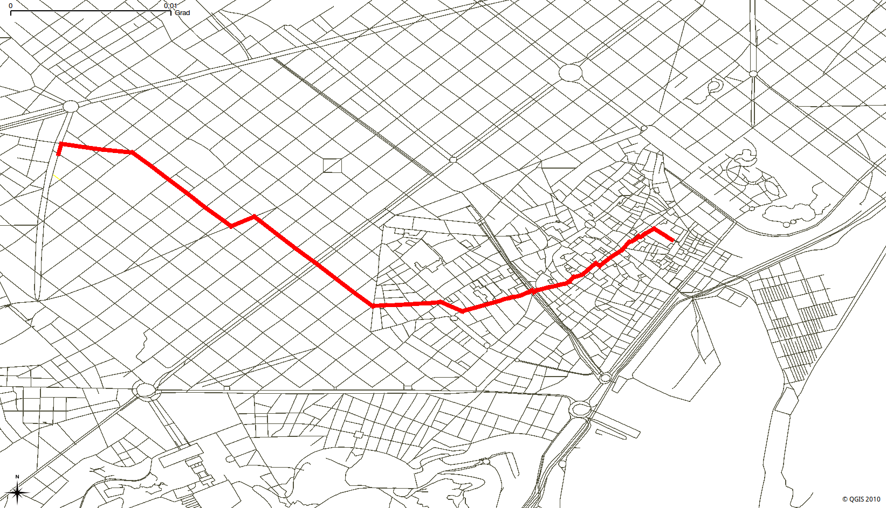

..
   ****************************************************************************
    pgRouting Workshop Manual
    Copyright(c) pgRouting Contributors

    This documentation is licensed under a Creative Commons Attribution-Share
    Alike 3.0 License: http://creativecommons.org/licenses/by-sa/3.0/
   ****************************************************************************

.. _routing:

pgRouting Algorithms
===============================================================================

pgRouting was first called *pgDijkstra*, because it implemented only shortest path search with *Dijkstra* algorithm.
Later other functions were added and the library was renamed to pgRouting.

This chapter will cover selected pgRouting algorithms and some of the attributes required.

.. Note:: This chapter use the ``pgrouting-workshop`` database created in the from :ref:`osm2pgrouting` Chapter.

* :ref:`dijkstra`

  * :ref:`Exercise 1 <d-1>` Single Pedestrian Routing.
  * :ref:`Exercise 2 <d-2>` Many Pedestrians going to the same destination.
  * :ref:`Exercise 3 <d-3>`  Many Pedestrians going departing from the same location.
  * :ref:`Exercise 4 <d-4>`  Many Pedestrians going to different destinations.

* :ref:`dijkstraCost`

  * :ref:`Exercise 5 <d-5>`  Many Pedestrians going to different destinations interested only on the aggregate cost.

* :ref:`astar`

  * :ref:`Exercise 6 <d-6>` Single Pedestrian Routing with A*.

.. _dijkstra:

pgr_dijkstra
-------------------------------------------------------------------------------

Dijkstra algorithm was the first algorithm implemented in pgRouting. It doesn't require other attributes than ``id``, ``source`` and ``target`` ID and ``cost``.
You can specify when to consider the graph as `directed <http://en.wikipedia.org/wiki/Directed_graph>`_ or undirected.

.. rubric:: Signature Summary

.. code-block:: sql

    pgr_dijkstra(edges_sql, start_vid,  end_vid)
    pgr_dijkstra(edges_sql, start_vid,  end_vid,  directed:=true)
    pgr_dijkstra(edges_sql, start_vid,  end_vids, directed:=true)
    pgr_dijkstra(edges_sql, start_vids, end_vid,  directed:=true)
    pgr_dijkstra(edges_sql, start_vids, end_vids, directed:=true)

    RETURNS SET OF (seq, path_seq [, start_vid] [, end_vid], node, edge, cost, agg_cost)
        OR EMPTY SET

Description of the parameters can be found in `pgr_dijkstra <http://docs.pgrouting.org/latest/en/src/dijkstra/doc/pgr_dijkstra.html#description-of-the-signatures>`_

.. note::

    * Many pgRouting functions have ``sql::text`` as one of their arguments. While this may look confusing at first, it makes the functions very flexible as the user can pass any ``SELECT`` statement as function argument as long as the returned result contains the required number of attributes and the correct attribute names.
    * Most of pgRouting implemeted algorithms do not require the network geometry.
    * Most of pgRouting functions do not return a geometry, but only an ordered list of nodes.

In this case, we are going to consider the information for routing a pedestrian.

The assignment of the vertices identifiers on the source and target columns may be different, the following exercises will use the results of this query.

.. rubric:: Identifiers for the Queries

.. code-block:: sql

    SELECT osm_id, id FROM ways_vertices_pgr 
        WHERE osm_id IN (33180347, 253908904, 332656435, 3068609695, 277708679)
        ORDER BY osm_id;
       osm_id   |  id   
    ------------+-------
       33180347 | 13224
      253908904 |  6549
      277708679 |  6963
      332656435 |  1458
     3068609695 |  9224
    (4 rows)

.. _d-1:
 
.. topic:: Exercise 1

    Single pedestrian routing

* Pedestrian: "I am in vertex 13224 and want to walk to vertex 6549."

.. rubric:: Problem description

* The pedestrian wants to go from vertex 13224 to vertex 6549.
* The pedestrian's cost is in terms of length. In this case ``length`` is in degrees.

.. rubric:: Query

.. literalinclude:: solutions/shortest_problems.sql
    :language: sql
    :start-after: d-1.txt
    :end-before: d-2.txt

.. rubric:: Query result

:ref:`sol-d-1`

.. note::
    
    * With more complex SQL statements, using JOINs for example, the result may be in a wrong order. In that case ``ORDER BY seq`` will ensure that the path is in the right order again.
    * The returned cost attribute represents the cost specified in the ``edges_sql::text`` argument. In this example cost is ``length`` in unit "degrees". Cost may be time, distance or any combination of both or any other attributes or a custom formula.

.. note:: ``node`` and ``edge`` results may vary depending on the assignment of the identifiers to the vertices given by osm2pgrouting.

.. _d-2:

.. topic:: Exercise 2

    Many Pedestrians going to the same destination.

* Pedestrian A: "I am in vertex 6549 and I am meeting my friends at vertex 13224."
* Pedestrian B: "I am in vertex 1548 and I am meeting my friends at vertex 13224."
* Pedestrian C: "I am in vertex 9224 and I am meeting my friends at vertex 13224."

.. rubric:: Problem description

* The pedestrians are located at vertices 6549, 1458, 9224
* Want to go to vertex 13224.
* The cost to be in meters.

.. rubric:: Query

.. literalinclude:: solutions/shortest_problems.sql
    :language: sql
    :start-after: d-2.txt
    :end-before: d-3.txt

.. rubric:: Query result

:ref:`sol-d-2`

.. _d-3:

.. topic:: Exercise 3

    Many Pedestrians going departing from the same location.

* Pedestrian A: "Me and my friends are at vertex 13224 and I want to go to vertex 6549."
* Pedestrian B: "Me and my friends are at vertex 13224 and I want to go to vertex 1548."
* Pedestrian C: "Me and my friends are at vertex 13224 and I want to go to vertex 9224."

.. rubric:: Problem description

* The pedestrians are located at vertex 13224
* The pedestrians want to go to locations 6549, 1458, 9224
* The cost to be in seconds.
* Use as walking speed: s = 1.3 m/s
* t = d/s

.. rubric:: Query

.. literalinclude:: solutions/shortest_problems.sql
    :language: sql
    :start-after: d-3.txt
    :end-before: d-4.txt

.. rubric:: Query result

:ref:`sol-d-3`

.. _d-4:

.. topic:: Exercise 4

    Many Pedestrians going to different destinations.

* Pedestrian A: "I am in vertex 6549 and I am meeting my friends at vertex 13224 or at vertex 6963."
* Pedestrian B: "I am in vertex 1548 and I am meeting my friends at vertex 13224 or at vertex 6963."
* Pedestrian C: "I am in vertex 9224 and I am meeting my friends at vertex 13224 or at vertex 6963."

.. rubric:: Problem description

* The pedestrians are located at vertices 6549, 1458, 9224
* The pedestrians want to go to this destinations: 13224. 6963
* The cost to be in minutes.
* Use as walking speed: s = 1.3 m/s
* t = d/s
* 1 minute = 60 seconds

.. rubric:: Query

.. literalinclude:: solutions/shortest_problems.sql
    :language: sql
    :start-after: d-4.txt
    :end-before: d-5.txt

.. rubric:: Query result

:ref:`sol-d-4`

If they go to vertex 13224: the total time would be approximately TODO

If they go to vertex 6963: the total time would be approximately TODO

.. _dijkstraCost:

pgr_dijkstraCost
-------------------------------------------------------------------------------

If the main goal is to calculate the total cost, for example to calculate multiple routes for a cost matrix, then ``pgr_dijkstraCost`` returns a more compact result. 

.. rubric:: Signature Summary

.. code-block:: none

    pgr_dijkstraCost(edges_sql, start_vid,  end_vid)
    pgr_dijkstraCost(edges_sql, start_vid,  end_vid,  directed:=true)
    pgr_dijkstraCost(edges_sql, start_vid,  end_vids, directed:=true)
    pgr_dijkstraCost(edges_sql, start_vids, end_vid,  directed:=true)
    pgr_dijkstraCost(edges_sql, start_vids, end_vids, directed:=true)

    RETURNS SET OF (start_vid, end_vid, agg_cost)
        OR EMPTY SET

Description of the parameters can be found in `pgr_dijkstraCost <http://docs.pgrouting.org/latest/en/src/dijkstra/doc/pgr_dijkstraCost.html#description-of-the-signatures>`_

.. _d-5:

.. topic:: Exercise 5

    Many Pedestrians going to different destinations interested only on the aggregate cost.

* Pedestrian A: "I am in vertex 6549 and I am meeting my friends at vertex 13224 or at vertex 6963."
* Pedestrian B: "I am in vertex 1548 and I am meeting my friends at vertex 13224 or at vertex 6963."
* Pedestrian C: "I am in vertex 9224 and I am meeting my friends at vertex 13224 or at vertex 6963."
* all: "we only want to know the Cost in hours"

.. rubric:: Problem description

* The pedestrians are located at vertices 6549, 1458, 9224
* The pedestrians want to go to this destinations: 13224. 6963
* The pedestrians are located at vertex 30, 34, and 62
* The pedestrians want to go to this destinations: 60, 49
* The cost to be in hours.
* Use as walking speed: s = 5 km /hr
* t = d/s
* 1 km = 0.001 m

.. rubric:: Query

.. literalinclude:: solutions/shortest_problems.sql
    :language: sql
    :start-after: d-5.txt
    :end-before: d-6.txt

.. rubric:: Query result

:ref:`sol-d-5`

.. _astar:

pgr_astar
-------------------------------------------------------------------------------

A-Star algorithm is another well-known routing algorithm. It adds geographical information to source and target of each network link. This enables the routing query to prefer links which are closer to the target of the shortest path search.

.. rubric:: Signature Summary

.. code-block:: sql

    pgr_costResult[] pgr_astar(sql text, source integer, target integer, directed boolean, has_rcost boolean);

Returns a set of ``pgr_costResult`` (seq, id1, id2, cost) rows, that make up a path.

Description of the parameters can be found in `pgr_astar <http://docs.pgrouting.org/latest/en/src/dijkstra/doc/pgr_astar.html#description>`_

.. _d-6:

.. topic:: Exercise 6

     Single Pedestrian Routing with Astar.

* Pedestrian: "I am in vertex 13224 and want to walk to vertex 6549."

.. rubric:: Problem description

* The pedestrian wants to go from vertex 13224 to vertex 6549.
* The pedestrian's cost is in terms of length. In this case ``length`` is in degrees.

.. literalinclude:: solutions/shortest_problems.sql
    :language: sql
    :start-after: d-6.txt
    :end-before: d-7.txt

.. rubric:: Query result

:ref:`sol-d-6`

.. note::

    * The result of Dijkstra and A-Star might not be the same, because of the heuristic.
    * A-Star is theoretically faster than Dijkstra algorithm as the network size is getting larger.
    * A new Version of A-Star is under development.

There are many other functions available with the latest pgRouting release, most of them work in similar ways
For the complete list of pgRouting functions see the API documentation: http://docs.pgrouting.org/

