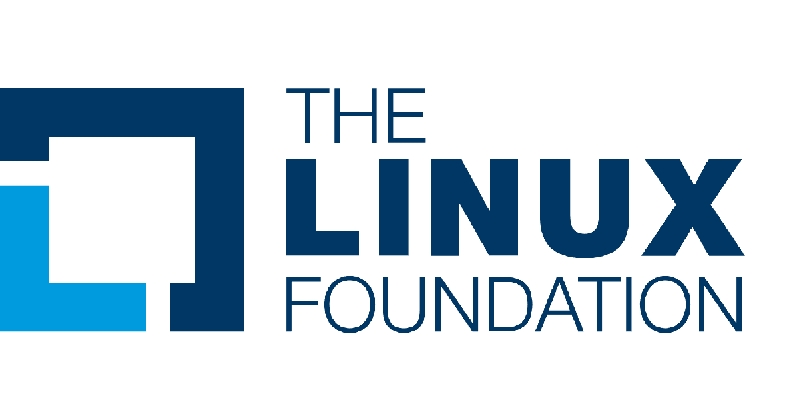

..
  ****************************************************************************
  pgRouting Workshop Manual
  Copyright(c) pgRouting Contributors

  This documentation is licensed under a Creative Commons Attribution-Share
  Alike 3.0 License: https://creativecommons.org/licenses/by-sa/3.0/
  ****************************************************************************

Introduction
===============================================================================

|pgrouting-web| adds routing functionality to |postgis-web|.

Please see the :doc:`contents <../index>` for full content of **@WORKSHOP_AREA@** workshop.
This workshop covers two levels for using pgRouting: `Basic`_ and `Advanced_`.

Basic
-------------------------------------------------------------------------------

will demonstrate the routing functionality by
providing examples using |osm-web| road network data from @PGR_WORKSHOP_CITY@.
Covering topics from how to prepare the data, making routing queries,
understanding the results, up to writing a custom 'plpgsql' function that can be
integrated with other FOSS tools.

* Installing pgRouting.
* Creating a routing topology.
* Importing |osm-web| road network data.
* Using pgRouting algorithms.
* Writing advanced queries.
* Writing a custom PostgreSQL stored procedure in `plpgsql`

.. rubric:: Prerequisites

* Workshop level: basic.
* Previous knowledge: SQL (PostgreSQL, PostGIS)
* Equipments: `OSGeoLive <https://live.osgeo.org>`__ (@OSGeoLive_VERSION@)

Advanced
-------------------------------------------------------------------------------

pgRouting is an extendible open-source library that provides a variety of tools
for graph algorithms, this is not limited to routing vehicles. The advanced
section covers several graph problems that can be solved using pgRouting.

.. rubric:: Prerequisites

* Workshop level: Advanced.
* Previous knowledge: SQL (PostgreSQL, PostGIS, pgRouting)
* Equipments: `OSGeoLive <https://live.osgeo.org>`__ (@OSGeoLive_VERSION@)

Aknowledments
-------------------------------------------------------------------------------

.. rubric:: Sponsored by

.. rubric:: Developers of @WORKSHOP_AREA@ workshop:

* *Vicky Vergara* Is a freelance developer from Mexico. She's the core developer
  of pgRouting project and GSoC Mentor. OSGeo Charter member.

.. rubric:: Past and present tutors and developers

Daniel Kastl,
Ko Nagase,
Stephen Woodbridge,
Swapnil Joshi,
Rajat Shinde,
Rohith Reddy,
Vicky Vergara

.. rubric:: Past and present supporters

Georepublic,
Paragon Corporation

.. rubric:: License

This work is licensed under a `Creative Commons Attribution-Share Alike 3.0
License <https://creativecommons.org/licenses/by-sa/3.0/>`_.

.. image:: images/chapter1/license.png

Become a sponsor
-------------------------------------------------------------------------------

