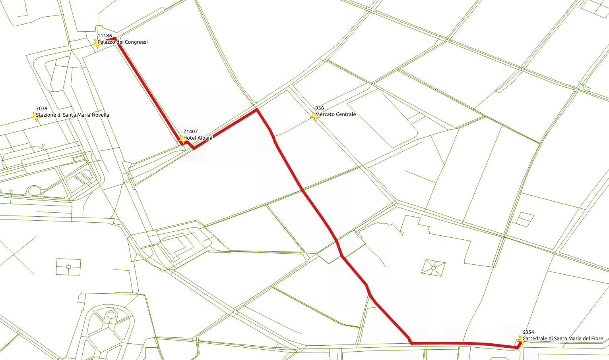
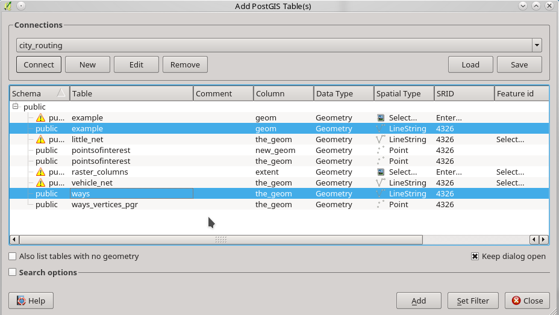

..
  ****************************************************************************
  pgRouting Workshop Manual
  Copyright(c) pgRouting Contributors

  This documentation is licensed under a Creative Commons Attribution-Share
  Alike 3.0 License: http://creativecommons.org/licenses/by-sa/3.0/
  ****************************************************************************

###############################################################################
Using Qgis
###############################################################################

Other kind of functions are `pl/pgsql`.
As applications requirements become more complex, using previously defined functions
becomes necessary.

.. contents:: Chapter Contents

Set Up QGIS
===============================================================================

Graphs have a `set of edges` and `set of vertices` associated to it.
`osm2pgrouting` provides the `ways_vertices_pgr` table which is associated with
the `ways` table.
When a subset of `edges` is used like in ``vehicle_net`` or in ``small_net``,
the set of vertices associated to each one must be used in order to, for example,
locate the nearest vertex to a lat/lon location.

#. Launch QGIS from :menuselection:`Geospatial --> Desktop GIS --> QGIS` and select :menuselection:`Project --> Open` from the menu bar.

   .. image:: images/chap_QGIS/qgis1.png
      :height: 50pt

   .. note:: The location of QGIS may vary.

   The workshop instructions are based on QGIS 2.14 Essen

   .. image:: images/chap_QGIS/qgis2.png
      :height: 50pt

#. Close the broswer pannel

   .. image:: images/chap_QGIS/qgis3.png
      :height: 50pt
      :width: 300pt

#. Connect to a posgGIS enabeled potsgreSQL database clicking on :menuselection:`Add postGIS layer`

   .. image:: images/chap_QGIS/qgis4.png
      :height: 50pt

#. Create a new connection clicking on :menuselection:`New`

   .. image:: images/chap_QGIS/qgis5.png
      :height: 50pt

#. Fill the information and test the connection

   .. image:: images/chap_QGIS/qgis6.png
          :height: 100pt
          :align: Left

   :Name: ``city_routing``
   :Host: ``localhost``
   :Port: ``5432``
   :Database: ``city_routing``
   :User name: ``user``
   :Password: ``user``

#. Allow qgis to remember login and password

   .. image:: images/chap_QGIS/qgis7.png
      :height: 50pt

Add a postGIS Layer
===============================================================================

Click :menuselection:`Connect` and a list of tables and views from the database will show.

It is necessaary to select the column that has a distinct unique value:

* ``seq`` on the routing views
* ``gid`` on the data views

Format a Routing Layer
===============================================================================

#. Choose a routing view,  :menuselection:`Right click --> Zoom to Layer`

   .. image:: images/chap_QGIS/qgis9.png
      :height: 50pt

#. :menuselection:`Right click --> Properties`

    .. image:: images/chap_QGIS/qgis10.png
      :height: 50pt

#. :menuselection:`Style --> Color`

   .. image:: images/chap_QGIS/qgis11.png
      :height: 50pt

#. :menuselection:`Style --> + --> Symbol Layer Type --> Marker line`

   .. image:: images/chap_QGIS/qgis12.png
      :height: 50pt

#. :menuselection:`Apply --> Close`

Copy/Paste Format
===============================================================================

#. Choose a formmated layer and :menuselection:`Right click --> Styles --> Copy Styles`

   .. image:: images/chap_QGIS/qgis13.png
      :height: 50pt

#. Choose another layer and :menuselection:`Right click --> Styles --> Paste Styles`

   .. image:: images/chap_QGIS/qgis14.png
      :height: 50pt

Save the project
===============================================================================

#. :menuselection:`Project --> Save As ...`

   .. image:: images/chap_QGIS/qgis15.png
      :height: 50pt

#. Navigate to: :menuselection:`User --> Desktop --> workshop` and save ``pgrouting-Bucharest-Example``

   .. image:: images/chap_QGIS/qgis16.png
      :height: 50pt

