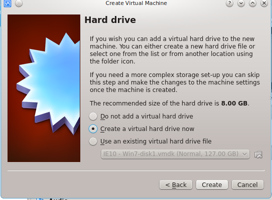

..
   ****************************************************************************
    pgRouting Workshop Manual
    Copyright(c) pgRouting Contributors

    This documentation is licensed under a Creative Commons Attribution-Share
    Alike 3.0 License: http://creativecommons.org/licenses/by-sa/3.0/
   ****************************************************************************

.. _installation:

Installation
===============================================================================

For this workshop you need:

* Linux operating system like Ubuntu
* An editor like Gedit, Medit or similar
* `Geoserver <https://live.osgeo.org/en/quickstart/geoserver_quickstart.html>`_ for the routing application
* Internet connection

.. note:: Other systems canbe used, but it's out of the scope of this workshop

All required tools are available on the `OSGeo Live <http://live.osgeo.org>`_.

The following reference is a quick summary of how to use OSGeo Live on your computer.

.. note:: To install pgRouting on your computer go to :ref:`more_installation`

OSGeo Live using a USB stick or CD
---------------------------------------

* Insert the USB or CD
* Restart your computer and wait for that first screen to pop up. Often, it'll say something like

  "Press F12 to Choose Boot Device" somewhere on the screen.  Press that key now."

* Give it a moment to continue booting, and you should see a menu pop up with a list of choices on it.

  * Highlight your CD or USB drive and press Enter.

* Exit the menu, the computer will restart using the selected device
* Choose your preferred language and click on ‘Try Ubuntu’.

More information on: http://www.ubuntu.com/download/desktop/try-ubuntu-before-you-install

OSGeo Live on a virtualBox
---------------------------------------

* You need `virtualBox <https://www.virtualbox.org/>`_ software
* Go to https://sourceforge.net/projects/osgeo-live/files/10.0/ and download `osgeo-live-10.0-amd64.iso`
* Open virtualBox and click **new**
* Fill name and operating system

.. image:: images/firstScreen.png
    :scale: 50%

* Fill memory size

.. image:: images/firstScreen2.png
    :scale: 50%

* Fill hard drive

* Fill hard drive file type

.. image:: images/firstScreen4.png
    :scale: 50%

* Fill Storage on physical hard drive

.. image:: images/firstScreen5.png
    :scale: 50%

* Fill Storage on physical hard drive

.. image:: images/firstScreen6.png
    :scale: 50%

* Fill File location and size

.. image:: images/firstScreen7.png
    :scale: 50%

* Click on storage & click on "add icon" and "add CD/DVD device"

.. image:: images/firstScreen8.png
    :scale: 50%

* Add the `osgeo-live-10.0-amd64.iso` file.

.. image:: images/firstScreen9.png
    :scale: 50%

* Now you have OSGeo Live on the virtualBox

.. image:: images/firstScreen10.png
    :scale: 50%

* Double Click on "OSGeo live 10".
* Choose your preferred language and click on ‘Try Ubuntu’.
* to be able to use the Clipboard between your computer and the virtual machine:

  * :menuselection:`devices --> Shared Clipboard --> bidirectional`

