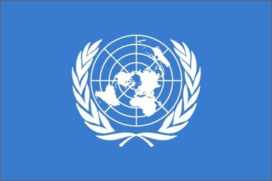

..
  ****************************************************************************
  pgRouting Workshop Manual
  Copyright(c) pgRouting Contributors

  This documentation is licensed under a Creative Commons Attribution-Share
  Alike 3.0 License: http://creativecommons.org/licenses/by-sa/3.0/
  ****************************************************************************

**************************************************** 
Achieving SDGs with pgRouting: A Unique Perspective
****************************************************

History
-------------------------------------------------------------------------------

The `UN OpenGIS initiative <http://unopengis.org/unopengis/main/main.php>`__
along with `OSGeo Foundation <https://www.osgeo.org/>`__ organized the `OSGeo
UN Committee Educational Challenge
<https://www.osgeo.org/foundation-news/2021-osgeo-un-committee-educational-challenge>`__
where Challenge 2 was to create Workshop material for pgRouting. The challenge
supports the objectives of the OSGeo UN Committee, i.e. promoting the
development and use of open-source software that meets UN needs and supports
the aims of the UN. pgRouting is not only useful for routing cars on roads but
it can also be used to analyse water distribution networks, river flow or the
connectivity of an electricity network. Currently, this workshop expands the
pgRouting workshop  by addressing three of the seventeen SDGs

.. contents:: Chapter Contents

Audience
-------------------------------------------------------------------------------

This educational material can be used by researchers, educators and
professionals researchers, educators and professionals in local, regional,
national or international agencies who have some knowledge of PostGIS and
PostgreSQL, and want to teach themselves how to use pgRouting. It is recommended
to have a basic knowledge of database management systems and geospatial data
structures and formats.

Prerequisite knowledge
-------------------------------------------------------------------------------
* Workshop level: Advanced * Previous knowledge: SQL (PostgreSQL, PostGIS), a
  brief idea about the applications of GIS and pgRouting * Brief idea about
  applications of GIS and pgRouting * System Requirements: This workshop uses
  OSGeoLive (The latest available version) * Chapter 1-8 of pgRouting Workshop 

United Nations
-------------------------------------------------------------------------------

The United Nations (UN) is an intergovernmental organization founded in 1945
that aims to maintain international peace and security and develop friendly
relations among nations to achieve international cooperation. The UN has its
headquarters in New York City [international territory] and has other main
offices in Geneva, Nairobi, Vienna, and The Hague.

The Major Objectives of the UN are to:

* Maintain International Peace and Security 
* Protect Human Rights 
* Deliver Humanitarian Aid 
* Support Sustainable Development and Climate Action 
* Uphold International Law

What are the Sustainable Development Goals?
-------------------------------------------------------------------------------
.. image:: images/introduction/un_17_sdgs.png 
  :align: center

The Sustainable Development Goals (SDGs) are 17 interconnected goals that were
adopted by the United Nations in 2015 as a universal call to all the nations to
take action to end poverty, hunger protects the planet from the
overexploitation by global cooperation. UN aims to achieve the goals by
ensuring that all people enjoy peace and prosperity. The seventeen goals are
integrated—they recognize that action in one area will affect outcomes in
others and that development must balance social, economic and environmental
sustainability. Countries have committed to prioritizing progress for those
who's furthest behind. The following table gives an overview of all the SDGs.

.. list-table:: **Overview of UN Sustainable Development Goals (SDGs)** 
   :widths:25 25 50 
   :header-rows: 1
 
   * - Goal Number 
     - Goal Name 
     - Objective
   * - Goal 1
     - No Poverty
     - End poverty in all its forms everywhere
   * - Goal 2 
     - Zero Hunger    
     - End hunger, achieve food security and improved nutrition and promote
       sustainable agriculture
   * - Goal 3   
     - Good Health and Well Being  
     - Ensure healthy lives and promote well-being for all at all ages
   * - Goal 4
     - Quality Education   
     - Ensure inclusive and equitable quality education and promote lifelong
       learning opportunities for all
   * - Goal 5 
     - Gender Equality     
     - Achieve gender equality and empower  all women and girls
   * - Goal 6
     - Clean Water and Sanitation 
     - Ensure availability and sustainable management of water and sanitation for
       all
   * - Goal 7
     - Affordable and Clean Energy 
     - Ensure access to affordable, reliable, sustainable and modern energy for
       all
   * - Goal 8
     - Decent Work and Economic Growth  
     - Promote sustained, inclusive and sustainable economic growth, full and
       productive employment and decent work for all
   * - Goal 9
     - Industry Innovation and Infrastructure  
     - Build resilient infrastructure, promote inclusive and sustainable
       industrialization and foster innovation
   * - Goal 10
     - Reduced Inequalities  
     - Reduce inequality within and among countries
   * - Goal 11 
     - Sustainable Cities and Communities  
     - Make cities and human settlements inclusive, safe, resilient and
       sustainable
   * - Goal 12 
     - Responsible Consumption and Production  
     - Ensure sustainable consumption and production patterns
   * - Goal 13
     - Climate Action  
     - Take urgent action to combat climate change and its impacts
   * - Goal 14
     - Life Below Water  
     - Conserve and sustainably use the oceans, seas and marine resources for
       sustainable development
   * - Goal 15
     - Life on Land  
     - Protect, restore and promote sustainable use of terrestrial ecosystems,
       sustainably manage forests, combat desertification, and halt and reverse
       land degradation and halt biodiversity loss
   * - Goal 16
     - Peace, Justice and Strong Institutions 
     - Promote peaceful and inclusive societies for sustainable development,
       provide access to justice for all and build effective, accountable and
       inclusive institutions at all levels
   * - Goal 17
     - Partnerships for the Goals  
     - Strengthen the means of implementation and revitalize the global
       partnership for sustainable development

Currently this workshop addresses three of the seventeen SDGs and covers the following:

* Get the data
* UN SDG 3 Good Health and Well Being  
* UN SDG 11 Sustainable Cities and Communities
* UN SDG __
