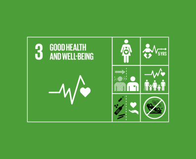

..
  ****************************************************************************
  pgRouting Workshop Manual
  Copyright(c) pgRouting Contributors

  This documentation is licensed under a Creative Commons Attribution-Share
  Alike 3.0 License: http://creativecommons.org/licenses/by-sa/3.0/
  ****************************************************************************

UN SDG3: Good Health and Well Being
###############################################################################

SDG 3 aspires to ensure health and well-being for all, including a bold
commitment to end the epidemics of AIDS, tuberculosis, malaria and other
communicable diseases by 2030. It also aims to achieve universal health
coverage, and provide access to safe and effective medicines and vaccines for
all. Supporting research and development for vaccines is an essential part of
this process as well as expanding access to affordable medicines.

Excercise 3.1: Optimal locations of mobile hospitals 
================================================================================

**Problem Statement**

* To determine the optimal locations of Hospitals

**Core Idea** 

* More Hospitals will be required at places where a higher no. of people are living.

**Approach**

* To prepare a dataset with:

  - Nodes: Probable hospital locations
  - Edges: Roads
  - Polygons: Buildings with population

* Estimate the population of the buildings
* Find the nearest road to the buildings
* Store the sum of population of nearest buildings in roads table
* pgRouting query to find out most optimal locations (Cost will be proportional
  to population residing by the roads)

.. contents:: Chapter Contents

 
Estimating the population of buildings
...............................................................................
Population of an building can be estimated by its area and its categoyr.
Buildings of OpenStreetMap data are classified into various categories. For
this excercise, the buildings are classified into the following classes:

- Negligible: People donot live in these places. But the default is 1 because of 
  homeless people.
- Very Sparse: People donot live in these places. But the deafault is 2 because 
  there may be people guarding the place.
- Sparse: Considering the universities and college because the students live there.
- Moderate: A family unit housing kind of location.
- Dense: A meduim sized residential building.
- Very Dense: A large sized resiential building.

The class-specific factor is multiplied with the area of each building to get
the population

.. literalinclude:: ../scripts/un_sdg/sdg3/all_exercises_sdg1.sql
    :start-after: -- population_function_from_here
    :end-before:  -- population_function_to_here
    :language: sql 
    :linenos:

.. note:: All these are estimations based on this particular area. More complicated 
          functions can be done that consider height of the apartments but the design
          of a function is going to depend on the availability of the data. For example,
          using census data can achieve more accurate estimation.

Calculating the population residing along the road
...............................................................................
To store the population of buildigs in the roads, nearest road to a building 
is to be found.

.. literalinclude:: ../scripts/un_sdg/sdg3/all_exercises_sdg1.sql
    :start-after: -- nearest_road_from_here
    :end-before:  -- nearest_road_to_here
    :language: sql 
    :linenos:
    
After finding the nearest road, the sum of population of all the nearest
buildings is stored in the population column of the roads table

.. literalinclude:: ../scripts/un_sdg/sdg3/all_exercises_sdg1.sql
    :start-after: -- road_population_from_here
    :end-before:  -- road_population_to_here
    :language: sql 
    :linenos:

Finding out optimal locations of mobile hospitals
...............................................................................
