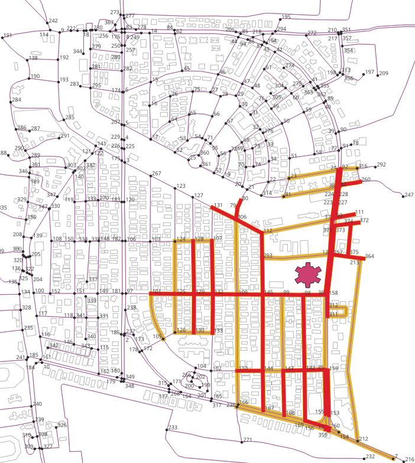

..
  ****************************************************************************
  pgRouting Workshop Manual
  Copyright(c) pgRouting Contributors

  This documentation is licensed under a Creative Commons Attribution-Share
  Alike 3.0 License: http://creativecommons.org/licenses/by-sa/3.0/
  ****************************************************************************

UN SDG3: Good Health and Well Being
###############################################################################

SDG 3 aspires to ensure health and well-being for all, including a bold
commitment to end the epidemics of AIDS, tuberculosis, malaria and other
communicable diseases by 2030. It also aims to achieve universal health
coverage, and provide access to safe and effective medicines and vaccines for
all. Supporting research and development for vaccines is an essential part of
this process as well as expanding access to affordable medicines.

.. image:: images/sdg3/un_sdg3.png
  :align: center

.. contents:: Chapter Contents

Excercise: Travel-Time based Estimation of Population Served by Hospital
================================================================================

**Problem Statement**

To determine the population served by a hospital based on travel time

**Core Idea** 

More Hospitals will be required at places where a higher no. of people are living.

**Approach**

* To prepare a dataset with:

  - Nodes: Probable hospital locations
  - Edges: Roads
  - Polygons: Buildings with population

* Estimate the population of the buildings
* Find the nearest road to the buildings
* Store the sum of population of nearest buildings in roads table
* pgRouting query to find out most optimal locations (Cost will be proportional
  to population residing by the roads)

Pre-processing roads and buildings data
--------------------------------------------------------------------------------

First step is to pre-process the data obtained from Chapter-2. The sub heads from
``Setting the Search Path`` to ``Process to discard disconnected roads`` explain the
pre-processing steps.

Setting the Search Path for roads and Buildings
...............................................................................
Set the search path of the ``Roads`` and ``Buildings`` to their respective schemas.

Enumerate all the schemas

.. code-block:: bash

        \dn

.. code-block:: bash

           List of schemas
           Name    |  Owner   
        -----------+----------
         buildings | swapnil
         public    | postgres
         roads     | swapnil
        (3 rows)

Show the current search path

.. code-block:: bash

        SHOW search_path;

.. code-block:: bash

           search_path   
        -----------------
         "$user", public
        (1 row)

Set the search path

.. code-block:: bash

        SET search_path TO roads,buildings,public;
        SHOW search_path;

.. code-block:: bash

            search_path    
        -------------------
        roads, buildings, public
        (1 row)

Enumerate all the tables

.. code-block:: bash

        \dt

.. code-block:: bash

                             List of relations
          Schema   |            Name             | Type  |  Owner  
        -----------+-----------------------------+-------+---------
         buildings | buildings_pointsofinterest  | table | user
         buildings | buildings_ways              | table | user
         buildings | buildings_ways_vertices_pgr | table | user
         public    | spatial_ref_sys             | table | swapnil
         roads     | configuration               | table | user
         roads     | roads_pointsofinterest      | table | user
         roads     | roads_ways                  | table | user
         roads     | roads_ways_vertices_pgr     | table | user
        (8 rows)

Counting the number of Roads and Buildings
...............................................................................
Display the number of roads and buildings which were imported in Chapter 2

.. literalinclude:: ../scripts/un_sdg/sdg3/all_exercises_sdg3.sql
    :start-after: \o count_roads_and_buildings.txt
    :end-before:  \o preprocessing_buildings.txt 
    :language: postgresql 
    :linenos:  

.. image:: images/sdg3/roads_and_buildings.png
  :align: center
  :scale: 75%

Preprocessing Buildings
...............................................................................
Polygons with less than 3 points/vertices are not considered valid polygons in 
PostgreSQL. Hence, they need to be cleaned up.

Add a spatial column to the table

.. literalinclude:: ../scripts/un_sdg/sdg3/all_exercises_sdg3.sql
    :start-after: --Add a spatial column to the table
    :end-before:  -- Removing the geometries that are not polygons
    :language: postgresql 
    :linenos:     

Removing the geometries that are not polygons 

.. literalinclude:: ../scripts/un_sdg/sdg3/all_exercises_sdg3.sql
    :start-after: -- Removing the geometries that are not polygons
    :end-before:  -- Creating the polygons
    :language: postgresql 
    :linenos: 

Creating the polygons

.. literalinclude:: ../scripts/un_sdg/sdg3/all_exercises_sdg3.sql
    :start-after: -- Creating the polygons
    :end-before:  -- Adding a column for storing the area
    :language: postgresql 
    :linenos: 

Adding a column for storing the area

.. literalinclude:: ../scripts/un_sdg/sdg3/all_exercises_sdg3.sql
    :start-after: -- Adding a column for storing the area
    :end-before:  -- Storing the area
    :language: postgresql 
    :linenos: 

Storing the area

.. literalinclude:: ../scripts/un_sdg/sdg3/all_exercises_sdg3.sql
    :start-after: -- Storing the area
    :end-before:  \o discard_disconnected_roads.txt
    :language: postgresql 
    :linenos: 

Process to discard disconnected roads
...............................................................................
pgRouting algorithms are only useful when the road netowrk belongs to a single 
graph (or all the roads are connected to each other). Hence, the disconnected 
roads have to be removed from ther network to get accurate results.
This image gives an example of the diconnected edges.

.. image:: images/sdg3/remove_disconnected_roads.png
  :align: center

.. literalinclude:: ../scripts/un_sdg/sdg3/all_exercises_sdg3.sql
    :start-after: -- Add a column for storing the component
    :end-before:  -- Update the vertices with the component number
    :language: postgresql 
    :linenos: 

Update the vertices with the component number

.. literalinclude:: ../scripts/un_sdg/sdg3/all_exercises_sdg3.sql
    :start-after: -- Update the vertices with the component number
    :end-before:  -- These components are to be removed
    :language: postgresql 
    :linenos: 

These components are to be removed

.. literalinclude:: ../scripts/un_sdg/sdg3/all_exercises_sdg3.sql
    :start-after: -- These components are to be removed
    :end-before:  -- The edges that need to be removed
    :language: postgresql 
    :linenos: 

These edges are to be removed

.. literalinclude:: ../scripts/un_sdg/sdg3/all_exercises_sdg3.sql
    :start-after: -- The edges that need to be removed
    :end-before:  -- Removing the unwanted edges
    :language: postgresql 
    :linenos: 

Removing the unwanted edges

.. literalinclude:: ../scripts/un_sdg/sdg3/all_exercises_sdg3.sql
    :start-after: -- Removing the unwanted edges
    :end-before:  -- Removing unused vertices
    :language: postgresql 
    :linenos: 

Removing unused vertices

.. literalinclude:: ../scripts/un_sdg/sdg3/all_exercises_sdg3.sql
    :start-after: -- Removing unused vertices
    :end-before:  -- finding the service area
    :language: postgresql 
    :linenos: 

Finding the travel-time based service area of hospital
--------------------------------------------------------------------------------
``pgr_drivingDistance`` will be used to find the service area. The steps to be followed are:
* Finding the closest road vertex
* Finding the service area
* Generalising the service area

Finding the closest road vertex
...............................................................................

.. image:: images/sdg3/finding_closest_vertex.png
  :align: center

.. literalinclude:: ../scripts/un_sdg/sdg3/all_exercises_sdg3.sql
    :start-after: -- finding the closest road vertex
    :end-before:  -- service area
    :language: postgresql 
    :linenos: 
    

Finding the service area
...............................................................................

.. literalinclude:: ../scripts/un_sdg/sdg3/all_exercises_sdg3.sql
    :start-after: \o service_area.txt
    :end-before:  \o correct_service_area.txt
    :language: postgresql 
    :linenos: 

.. image:: images/sdg3/service_area.png
  :align: center  
  :scale: 75%
  
Generalising the service area
...............................................................................

.. literalinclude:: ../scripts/un_sdg/sdg3/all_exercises_sdg3.sql
    :start-after: \o correct_service_area.txt
    :end-before:  \o population_residing_along_the_road.txt
    :language: postgresql 
    :linenos: 

Calculating the population residing along the road
--------------------------------------------------------------------------------
More hospitals are needed in the areas where more people live. To solve this 
problem we will first have to estimate the population of each building.

Estimating the population of buildings
...............................................................................
Population of an building can be estimated by its area and its categoyr.
Buildings of OpenStreetMap data are classified into various categories. For
this excercise, the buildings are classified into the following classes:

- Negligible: People donot live in these places. But the default is 1 because of 
  homeless people.
- Very Sparse: People donot live in these places. But the deafault is 2 because 
  there may be people guarding the place.
- Sparse: Considering the universities and college because the students live there.
- Moderate: A family unit housing kind of location.
- Dense: A meduim sized residential building.
- Very Dense: A large sized resiential building.

The class-specific factor is multiplied with the area of each building to get
the population

.. literalinclude:: ../scripts/un_sdg/sdg3/all_exercises_sdg3.sql
    :start-after: -- population_function_from_here
    :end-before:  \o buildings_population_calculation.txt
    :language: postgresql 
    :linenos:     

.. note:: All these are estimations based on this particular area. More complicated 
          functions can be done that consider height of the apartments but the design
          of a function is going to depend on the availability of the data. For example,
          using census data can achieve more accurate estimation.

Adding a column for storing the population

.. literalinclude:: ../scripts/un_sdg/sdg3/all_exercises_sdg3.sql
    :start-after: -- Adding a column for storing the population
    :end-before:  -- Storing the population
    :language: postgresql 
    :linenos: 

Storing the population

.. literalinclude:: ../scripts/un_sdg/sdg3/all_exercises_sdg3.sql
    :start-after: -- Storing the population
    :end-before:  -- population_function_to_here
    :language: postgresql 
    :linenos: 

Finding the nearest roads to store the population
...............................................................................
To store the population of buildigs in the roads, nearest road to a building 
is to be found.

.. literalinclude:: ../scripts/un_sdg/sdg3/all_exercises_sdg3.sql
    :start-after: -- nearest_road_from_here
    :end-before:  -- nearest_road_to_here
    :language: postgresql 
    :linenos: 

Storing the population in the roads
...............................................................................

After finding the nearest road, the sum of population of all the nearest
buildings is stored in the population column of the roads table

.. literalinclude:: ../scripts/un_sdg/sdg3/all_exercises_sdg3.sql
    :start-after: -- road_population_from_here
    :end-before:  -- testing
    :language: postgresql 
    :linenos: 

.. literalinclude:: ../scripts/un_sdg/sdg3/all_exercises_sdg3.sql
    :start-after: -- testing
    :end-before:  -- road_population_to_here   
    :language: postgresql 
    :linenos: 

.. image:: images/sdg3/road_population.png
  :align: center
  :scale: 75%

Finding total population served by the hospital based on travel-time
--------------------------------------------------------------------------------

.. literalinclude:: ../scripts/un_sdg/sdg3/all_exercises_sdg3.sql
    :start-after: -- finding total population
    :end-before:  \o
    :language: postgresql 
    :linenos: 