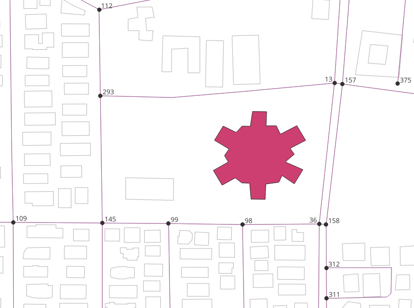

..
  ****************************************************************************
  pgRouting Workshop Manual
  Copyright(c) pgRouting Contributors

  This documentation is licensed under a Creative Commons Attribution-Share
  Alike 3.0 License: http://creativecommons.org/licenses/by-sa/3.0/
  ****************************************************************************

UN SDG3: Good Health and Well Being
###############################################################################

SDG 3 aspires to ensure health and well-being for all, including a bold
commitment to end the epidemics of AIDS, tuberculosis, malaria and other
communicable diseases by 2030. It also aims to achieve universal health
coverage, and provide access to safe and effective medicines and vaccines for
all. Supporting research and development for vaccines is an essential part of
this process as well as expanding access to affordable medicines. It is very 
important to estimate the area served by the hospital for better planning which
would ultimately help in achieving universal coverage. 

.. image:: images/sdg3/un_sdg3.png
  :align: center

.. contents:: Chapter Contents

Exercise: Travel-Time based Estimation of Population Served by Hospital
================================================================================

**Problem Statement**

To determine the population served by a hospital based on travel time

**Core Idea** 

Population residing along the roads which reach to a hospital within a particular
time is dependant on that hospital.

**Approach**

* To prepare a dataset with:

  - Nodes: Probable hospital locations
  - Edges: Roads
  - Polygons: Buildings with population

* Find the travel-time based the roads served
* Estimate the population of the buildings
* Find the nearest road to the buildings
* Store the sum of population of nearest buildings in roads table
* Find the sum of population on all the roads in the roads served

Pre-processing roads and buildings data
--------------------------------------------------------------------------------
First step is to pre-process the data obtained from Chapter-2. The sub heads from
``Setting the Search Path`` to ``Process to discard disconnected roads`` explain 
the pre-processing steps.

Setting the Search Path for roads and Buildings
...............................................................................
First step in pre processing is to set the search path for ``Roads`` and ``Buildings``
data. `Search path` is a list of schemas helps the system determine how a particular
table is to be imported. In this case, search path of roads table is set to roads
and buildings schema.``\dn`` is used to list down all the present schemas. 
``SHOW search_path`` command shows the current search path. ``SET search_path`` 
is used to set the search path to ``roads`` and ``buildings``. Finally, ``\dt``
is used to verify if the Schema have bees changed correctly. Following code snippets
show the steps as well as the outputs.

**1. Enumerate all the schemas**

.. code-block:: bash

        \dn

.. code-block:: bash

           List of schemas
           Name    |  Owner   
        -----------+----------
         buildings | swapnil
         public    | postgres
         roads     | swapnil
        (3 rows)

**2. Show the current search path**

.. code-block:: bash

        SHOW search_path;

.. code-block:: bash

           search_path   
        -----------------
         "$user", public
        (1 row)

**3. Set the search path**

.. code-block:: bash

        SET search_path TO roads,buildings,public;
        SHOW search_path;

.. code-block:: bash

            search_path    
        -------------------
        roads, buildings, public
        (1 row)

**4. Enumerate all the tables**

.. code-block:: bash

        \dt

.. code-block:: bash

                             List of relations
          Schema   |            Name             | Type  |  Owner  
        -----------+-----------------------------+-------+---------
         buildings | buildings_pointsofinterest  | table | user
         buildings | buildings_ways              | table | user
         buildings | buildings_ways_vertices_pgr | table | user
         public    | spatial_ref_sys             | table | swapnil
         roads     | configuration               | table | user
         roads     | roads_pointsofinterest      | table | user
         roads     | roads_ways                  | table | user
         roads     | roads_ways_vertices_pgr     | table | user
        (8 rows)

Counting the number of Roads and Buildings
...............................................................................
Counting the number of edges present in the gives the information if the amount 
of data. Also, some of the rows can be seen to  understand the structure of the 
table and how the data is stored in it.

.. literalinclude:: ../scripts/un_sdg/sdg3/all_exercises_sdg3.sql
    :start-after: \o count_roads_and_buildings.txt
    :end-before:  \o preprocessing_buildings.txt 
    :language: sql 
    :linenos:  

Following image shows the roads and buildings visualised in ``QGIS``

Preprocessing Buildings
...............................................................................
The table ``buildings_ways`` contains the buildings in edge form. They have to be
converted into polygons. Also, polygons with less than 3 points/vertices are not
considered valid polygons in PostgreSQL. Hence, the buildings having less than 3
vertices need to be cleaned up. Follow the steps given below to complete this task.

**1. Add a spatial column to the table to store the Polygon Geometry**

.. literalinclude:: ../scripts/un_sdg/sdg3/all_exercises_sdg3.sql
    :start-after: --Add a spatial column to the table
    :end-before:  -- Removing the geometries that are not polygons
    :language: sql 
    :linenos:     

**2. Removing the polygons with less less than 4 points**

 ``ST_NumPoints`` is used to find the number of points per edge.

.. literalinclude:: ../scripts/un_sdg/sdg3/all_exercises_sdg3.sql
    :start-after: -- Removing the geometries that are not polygons
    :end-before:  -- Creating the polygons
    :language: sql 
    :linenos: 

**3. Creating the polygons**

``ST_MakePolygons`` is used to make the polygons. This step stores the geom of 
polygons in the ``poly_geom`` column which was created earlier.

.. literalinclude:: ../scripts/un_sdg/sdg3/all_exercises_sdg3.sql
    :start-after: -- Creating the polygons
    :end-before:  -- Adding a column for storing the area
    :language: sql 
    :linenos: 

**4. Adding a column for storing the area**

.. literalinclude:: ../scripts/un_sdg/sdg3/all_exercises_sdg3.sql
    :start-after: -- Adding a column for storing the area
    :end-before:  -- Storing the area
    :language: sql 
    :linenos: 

**5. Calculating the area**

``ST_Area`` is used to calculate area of polygons. Area is stored in the
new column

.. literalinclude:: ../scripts/un_sdg/sdg3/all_exercises_sdg3.sql
    :start-after: -- Storing the area
    :end-before:  \o discard_disconnected_roads.txt
    :language: sql 
    :linenos: 

Process to discard disconnected roads
...............................................................................
pgRouting algorithms are only useful when the road network belongs to a single 
graph (or all the roads are connected to each other). Hence, the disconnected 
roads have to be removed from their network to get appropriate results.
This image gives an example of the disconnected edges.

.. image:: images/sdg3/remove_disconnected_roads.png
  :align: center

Follow the steps given below to complete this task.

**1. Add a column named** ``component`` **to store component number.**

.. literalinclude:: ../scripts/un_sdg/sdg3/all_exercises_sdg3.sql
    :start-after: -- Add a column for storing the component
    :end-before:  -- Update the vertices with the component number
    :language: sql 
    :linenos: 

**2. Update the** ``component`` **column in** ``roads_ways_vertices_pgr`` **with the component number**

.. literalinclude:: ../scripts/un_sdg/sdg3/all_exercises_sdg3.sql
    :start-after: -- Update the vertices with the component number
    :end-before:  -- These components are to be removed
    :language: sql 
    :linenos: 

This will store the component number of each edge in the table. Now, the completely 
connected network of roads should have the maximum count in the ``componenet`` table.
For example,there are 100 roads in a network and 3 are disconnected. 97 connected
roads will have the same component number, say 1. If there are 3 disconnected roads
have the connected component number, say 2, write a query to remove all the edges
with the component number 2.

**3. Finding the components which are to be removed**

This query selects all the components which are not equal to the component number
with maximum count using a subquery which groups the rows in ``roads_ways_vertices_pgr`` 
by the component.

.. literalinclude:: ../scripts/un_sdg/sdg3/all_exercises_sdg3.sql
    :start-after: -- These components are to be removed
    :end-before:  -- The edges that need to be removed
    :language: sql 
    :linenos: 

**4. Finding the road vertices which belong to those components which are to be removed**

This query selects all the road vertices which have the component number from step 3.

.. literalinclude:: ../scripts/un_sdg/sdg3/all_exercises_sdg3.sql
    :start-after: -- The edges that need to be removed
    :end-before:  -- Removing the unwanted edges
    :language: sql 
    :linenos: 

**5. Removing the unwanted edges**

In ``roads_ways`` table (edge table) ``source`` and ``target`` have the ``id`` of
the vertices from where the edge starts and ends. To delete all the disconnected 
edges the following query takes the output from the query of Step 4 and deletes
all the edges having the same ``source`` as the ``id``.

.. literalinclude:: ../scripts/un_sdg/sdg3/all_exercises_sdg3.sql
    :start-after: -- Removing the unwanted edges
    :end-before:  -- Removing unused vertices
    :language: sql 
    :linenos: 

**6. Removing unused vertices**

The following query uses the output of Step 4 to remove the vertices of the disconnected
edges.

.. literalinclude:: ../scripts/un_sdg/sdg3/all_exercises_sdg3.sql
    :start-after: -- Removing unused vertices
    :end-before:  -- finding the service area
    :language: sql 
    :linenos: 

Finding the travel-time based the roads served of hospital
--------------------------------------------------------------------------------
After pre-processing the data, next step is to find the area served by the
hospital. This area can be computed from the entrance of the hospital or from any
point on road near the hospital. In this exercise it is computed from closest 
road vertex. ``pgr_drivingDistance`` will be used to find the roads served. The
steps to be followed are:

* Finding the closest road vertex
* Finding the roads served
* Generalising the roads served

Finding the closest road vertex
...............................................................................
There are multiple road vertices near the hospital. Create a function to find 
the geographically closest road vertex. 

``closest_vertex`` function takes geometry of other table as input and gives
the gid of the closest vertex as output by comparing ``geom`` of both the tables.

.. literalinclude:: ../scripts/un_sdg/sdg3/all_exercises_sdg3.sql
    :start-after: -- finding the closest road vertex
    :end-before:  -- service area
    :linenos: 
    

Finding the roads served
...............................................................................
In this exercise, the roads served based on travel-time is calculated. This can be 
calculated using ``pgrdrivingDistance`` function of pgRouting. Time in minutes is 
considered as ``cost``. The ``agg_cost`` column would show the time required to 
reach the hospital.

For the following query,

* In line 3, Pedestrian speed is assumed to be as ``1 m/s``. As ``time`` = ``distance/speed``, 
  ``length_m`` / ``1 m/s`` / ``60`` gives the time in minutes. 
* In line 7, ``tag_id = '318'``  as 318 is the tag_id of hospital in the configuration
  file of buildings.
* In line 8, ``10`` is written for 10 minutes which is a threshold for ``agg_cost``. 
* In line 8, ``FALSE`` is written as the query is for undirected graph.

.. literalinclude:: ../scripts/un_sdg/sdg3/all_exercises_sdg3.sql
    :start-after: \o service_area.txt
    :end-before:  \o correct_service_area.txt
    :language: sql 
    :linenos: 

Following figure shows the output of the above query visualised in QGIS. The lines
highlighted by ``red`` colour show the area from where the hospital can be reached
within 10 minutes of walking at ``1 m/s``. It is evident from the output figure 
that some of the roads which are near to the hospital are not highlighted. For 
example, to roads in the north of the hospital. This is because the only one edge
per road vertex was selected by the query. Next session will solve this issue by
doing a little modification in the query.

.. image:: images/sdg3/service_area.png
  :align: center  
  :scale: 75%

Generalising the roads served
...............................................................................
The edges which are near to to hospital should also be selected in the roads served
as the hospital also serves those buildings. The following query takes the query
from previous section as a ``subquery`` and selects all the edges from ``roads_ways``
that have the same ``source`` and ``target`` to that of ``subquery`` (Line 14).

.. literalinclude:: ../scripts/un_sdg/sdg3/all_exercises_sdg3.sql
    :start-after: \o correct_service_area.txt
    :end-before:  \o population_residing_along_the_road.txt
    :linenos: 

Following figure shows the output of the above query visualised in QGIS. Lines 
highlighted in ``yellow`` show the `generalised the roads served`. This gives a better
estimate of the areas from where the hospital can be reached by a particular speed.

.. image:: images/sdg3/generalised_service_area.png
  :align: center
  :scale: 75%

Calculating the population residing along the road
--------------------------------------------------------------------------------
Now the next step is to estimate the dependant population. Official source of 
population is Census conducted by the government. But for this exercise, population
will be estimated from the ``area`` as well as the ``category`` of the building.
This area will be stored in the nearest roads. Following steps explain the
process in detail.

Estimating the population of buildings
...............................................................................
Population of an building can be estimated by its area and its category.
Buildings of OpenStreetMap data are classified into various categories. For
this exercise, the buildings are classified into the following classes:

- Negligible: People do not live in these places. But the default is 1 because of 
  homeless people.
- Very Sparse: People do not live in these places. But the default is 2 because 
  there may be people guarding the place.
- Sparse: Considering the universities and college because the students live there.
- Moderate: A family unit housing kind of location.
- Dense: A medium sized residential building.
- Very Dense: A large sized residential building.

The class-specific factor is multiplied with the area of each building to get
the population

.. literalinclude:: ../scripts/un_sdg/sdg3/all_exercises_sdg3.sql
    :start-after: -- population_function_from_here
    :end-before:  \o buildings_population_calculation.txt
    :linenos:     

.. note:: All these are estimations based on this particular area. More complicated 
          functions can be done that consider height of the apartments but the 
          design of a function is going to depend on the availability of the data.
          For example, using census data can achieve more accurate estimation.

Add a column for storing the population in the ``buildings_ways``

.. literalinclude:: ../scripts/un_sdg/sdg3/all_exercises_sdg3.sql
    :start-after: -- Adding a column for storing the population
    :end-before:  -- Storing the population
    :language: sql 
    :linenos: 

Use the ``population`` function to store the population in the new column created
in the ``building_ways``.

.. literalinclude:: ../scripts/un_sdg/sdg3/all_exercises_sdg3.sql
    :start-after: -- Storing the population
    :end-before:  -- population_function_to_here
    :language: sql 
    :linenos: 

Finding the nearest roads to store the population
...............................................................................
To store the population of buildings in the roads, nearest road to a building 
is to be found. Create Function for finding the closest edge.

.. literalinclude:: ../scripts/un_sdg/sdg3/all_exercises_sdg3.sql
    :start-after: -- Create Function for finding the closest edge
    :end-before:  -- Add a column for storing the closest edge
    :linenos: 

Add a column in ``buildings_ways`` for storing the id of closest edge

.. literalinclude:: ../scripts/un_sdg/sdg3/all_exercises_sdg3.sql
    :start-after: -- Add a column for storing the closest edge
    :end-before:  -- Store the edge_id of the closest edge in the column
    :language: sql 
    :linenos: 

Store the edge id of the closest edge in the new column

.. literalinclude:: ../scripts/un_sdg/sdg3/all_exercises_sdg3.sql
    :start-after: -- Store the edge_id of the closest edge in the column
    :end-before:  -- nearest_road_to_here
    :language: sql 
    :linenos: 

Storing the population in the roads
...............................................................................

After finding the nearest road, the sum of population of all the nearest
buildings is stored in the population column of the roads table.

Add a column in ``roads_ways`` for storing population

.. literalinclude:: ../scripts/un_sdg/sdg3/all_exercises_sdg3.sql
    :start-after: -- Add population column to roads table
    :end-before:  -- Update the roads with the SUM of population of buildings closest to it
    :language: sql 
    :linenos: 

Update the roads with the sum of population of buildings closest to it

.. literalinclude:: ../scripts/un_sdg/sdg3/all_exercises_sdg3.sql
    :start-after: -- Update the roads with the SUM of population of buildings closest to it
    :end-before:  -- testing
    :language: sql 
    :linenos: 

Verify is the population is stored using the folowing query.

.. literalinclude:: ../scripts/un_sdg/sdg3/all_exercises_sdg3.sql
    :start-after: -- testing
    :end-before:  -- road_population_to_here   
    :language: sql 
    :linenos: 

Finding total population served by the hospital based on travel-time
--------------------------------------------------------------------------------
Use the query from 3.1.2.3 as a subquery to get all the edges in the roads served.
Note that ``s.population`` is added in line 14 which gves the population.
After getting the population for each edge/road, use ``sum()`` to get the total 
population which is dependant on the hospital.

.. literalinclude:: ../scripts/un_sdg/sdg3/all_exercises_sdg3.sql
    :start-after: -- finding total population
    :end-before:  \o
    :language: sql 
    :linenos: 
