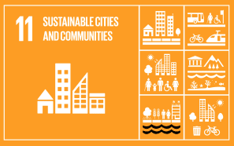
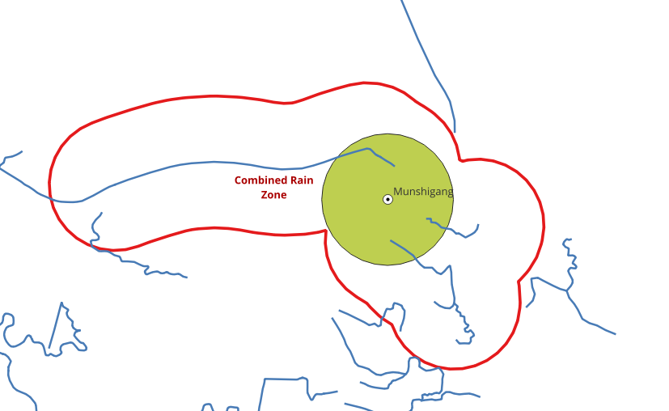

..
  ****************************************************************************
  pgRouting Workshop Manual
  Copyright(c) pgRouting Contributors

  This documentation is licensed under a Creative Commons Attribution-Share
  Alike 3.0 License: http://creativecommons.org/licenses/by-sa/3.0/
  ****************************************************************************

Sustainable Cities and Communities
###############################################################################

`Sustainable Cities and Communities` is the 11th Sustainable Development Goal which
aspires to make cities `inclusive, safe, resilient` and `sustainable`.The world is
becoming increasingly urbanized. Since 2007, more than half the world’s
population has been living in cities. This makes it very important for the cities
to remain alert when there is a chance of disaster like floods. Local
administration should know if their city is going to get affected by the rains
which happen in their proximity so that they can raise an alert amongst the citizens.
This exercise will solve one of such problems.

`Image Source <https://sdgs.un.org/goals/goal11>`__

.. contents:: Chapter Contents

Problem: City getting affected by rain or not
================================================================================

**Problem Statement**

To determine the areas where if it rains will affect a city/town

**Core Idea**

If it rains in vicinity of a river connecting the city, the city will get
affected by the rains.

**Approach**

* Choose a city
* Get the Rivers (Edges)
* Create river components
* Create a Buffer around the city
* Finding the components intersecting the buffer
* Finding the rain zones

Choose a city
================================================================================

For this exercise, Munshigang city from Bangladesh is chosen. This city has multiple
rivers in its proximity which makes it an apt location to demonstrate this exercise.
The exercise will try to find the areas, where if it rains the city will be affected.
To define the location of this city and use it in for further steps, create a table to
store the name along with latitude and longitude values of City's location. This stores
the city as a point.

Exercise 1: Create a point for the city
--------------------------------------------------------------------------------

.. rubric:: Create a table for the cities

.. literalinclude:: ../scripts/un_sdg/sdg11/all_exercises_sdg11.sql
    :start-after: create_city1.txt
    :end-before:  create_city2.txt
    :language: sql

.. collapse:: Query results

   .. literalinclude:: ../scripts/un_sdg/sdg11/create_city1.txt

.. rubric:: Insert Munshigang

.. literalinclude:: ../scripts/un_sdg/sdg11/all_exercises_sdg11.sql
    :start-after: create_city2.txt
    :end-before:  create_city3.txt
    :language: sql

.. collapse:: Query results

   .. literalinclude:: ../scripts/un_sdg/sdg11/create_city2.txt

.. rubric:: Simulate the city region with a buffer

.. literalinclude:: ../scripts/un_sdg/sdg11/all_exercises_sdg11.sql
    :start-after: create_city3.txt
    :end-before:  create_city4.txt
    :language: sql

.. collapse:: Query results

   .. literalinclude:: ../scripts/un_sdg/sdg11/create_city3.txt

.. rubric:: See description of the table

.. literalinclude:: ../scripts/un_sdg/sdg11/all_exercises_sdg11.sql
    :start-after: create_city4.txt
    :end-before:  set_path.txt

.. collapse:: Command results

   .. literalinclude:: ../scripts/un_sdg/sdg11/create_city4.txt

Latitude and longitude values are converted into ``geometry`` form using ``ST_Point``
which returns a point with the given X and Y coordinate values. ``ST_SetSRID`` is used
to set the SRID (Spatial Reference Identifier) on the point geometry to ``4326``.

Prepare the database
================================================================================

Data obtained in :doc:`data`.

This section will cover the status of the database in order to get the same
results when processing the queries.

Exercise 1: Set the search path
--------------------------------------------------------------------------------

First step in pre processing is to set the search path for ``Waterways``
data. Search path is a list of schemas that helps the system determine how a
particular table is to be imported.

.. literalinclude:: ../scripts/un_sdg/sdg11/all_exercises_sdg11.sql
    :start-after: set_path.txt
    :end-before:  get_extensions.txt
    :language: sql

.. collapse:: Query results

   .. literalinclude:: ../scripts/un_sdg/sdg11/set_path.txt

Exercise 2: Verify database configuration
--------------------------------------------------------------------------------

As part of the every project tasks: inspect the database structure.

.. rubric:: Get the extensions that are installed

.. literalinclude:: ../scripts/un_sdg/sdg11/all_exercises_sdg11.sql
    :start-after: get_extensions.txt
    :end-before:  get_tables.txt

.. collapse:: Command results

   .. literalinclude:: ../scripts/un_sdg/sdg11/get_extensions.txt

.. rubric:: List installed tables

.. literalinclude:: ../scripts/un_sdg/sdg11/all_exercises_sdg11.sql
    :start-after: get_tables.txt
    :end-before: exercise_6.txt

.. collapse:: Command results

   .. literalinclude:: ../scripts/un_sdg/sdg11/get_tables.txt

Exercise 6: Count the number of Waterways
................................................................................

The importance of counting the information on this workshop is to make sure that
the same data is used and consequently the results are same. Also, some of the
rows can be seen to understand the structure of the table and how the data is
stored in it.

.. literalinclude:: ../scripts/un_sdg/sdg11/all_exercises_sdg11.sql
    :start-after: exercise_6.txt
    :end-before:  delete1.txt
    :language: sql

.. collapse:: Query results

   .. literalinclude:: ../scripts/un_sdg/sdg11/exercise_6.txt

Processing waterways data
================================================================================

This section will work the graph that is going to be used for processing. While
building the graph, the data has to be inspected to determine if there is any
invalid data. This is a very important step to make sure that the data is of
required quality. pgRouting can also be used to do some Data Adjustments.

Exercise 7: Remove waterways not for the problem
--------------------------------------------------------------------------------

.. image:: images/sdg11/remove_waterways.png
  :align: center
  :alt: Waterways to be removed

This exercise focusses only the areas in the mainland, where if it rains the city is
affected. Hence, the rivers which are there in the swamp area wich is in a lower
altitude of the city, are to be removed from the ``waterways_ways`` table.

.. rubric:: Remove swamp rivers

.. literalinclude:: ../scripts/un_sdg/sdg11/all_exercises_sdg11.sql
    :start-after: delete1.txt
    :end-before: delete2.txt
    :language: sql

.. collapse:: Query results

   .. literalinclude:: ../scripts/un_sdg/sdg11/delete1.txt

.. note:: When working for many cities, a better approach might be to create
   views.

.. rubric:: Also delete a boundary tagged as waterway

.. literalinclude:: ../scripts/un_sdg/sdg11/all_exercises_sdg11.sql
    :start-after: delete2.txt
    :end-before: only_connected1.txt
    :language: sql

.. collapse:: Query results

   .. literalinclude:: ../scripts/un_sdg/sdg11/delete2.txt

.. note:: A better approach might be to fix the original data in OSM website.

Exercise 8: Get the Connected Components of Waterways
================================================================================

As the rivers in the data are not having single edge, i.e, multiple edges make up
a river, it is important to find out the connected edges and store the information
in the ``waterways_ways`` table. This will help us to identify which edges belong to
a river. First, the connected components are found and then stored in a new column
named ``component``.

The pgRouting function ``pgr_connectedComponents`` is used to complete this task
and its explaind with more detail in :doc:`../basic/graph_views`.

A sub-query is created to find out all the connected components. After that,
the ``component`` column is updated using the results obtained from the sub-query.
This helps in storing the component id in the ``waterways_ways_vertices_pgr`` table.
Next query uses this output and stores the component id in the waterways_ways
(edges) table. Follow the steps given below to complete this task.

.. rubric:: Create a vertices table.

.. literalinclude:: ../scripts/un_sdg/sdg11/all_exercises_sdg11.sql
    :start-after: only_connected1.txt
    :end-before: only_connected2.txt
    :language: sql

.. collapse:: Query results

  .. literalinclude:: ../scripts/un_sdg/sdg11/only_connected1.txt

.. rubric:: Fill up the ``x``, ``y`` and ``geom`` columns.

.. literalinclude:: ../scripts/un_sdg/sdg11/all_exercises_sdg11.sql
    :start-after: only_connected2.txt
    :end-before: only_connected3.txt
    :language: sql

.. collapse:: Query results

  .. literalinclude:: ../scripts/un_sdg/sdg11/only_connected2.txt

.. rubric:: Add a ``component`` column on the edges and vertices tables.

.. literalinclude:: ../scripts/un_sdg/sdg11/all_exercises_sdg11.sql
    :start-after: only_connected3.txt
    :end-before: only_connected4.txt
    :language: sql

.. collapse:: Query results

  .. literalinclude:: ../scripts/un_sdg/sdg11/only_connected3.txt

.. rubric:: Fill up the ``component`` column on the vertices table.

.. literalinclude:: ../scripts/un_sdg/sdg11/all_exercises_sdg11.sql
    :start-after: only_connected4.txt
    :end-before: only_connected5.txt
    :language: sql

.. collapse:: Query results

  .. literalinclude:: ../scripts/un_sdg/sdg11/only_connected4.txt

.. rubric:: Fill up the ``component`` column on the edges table.

.. literalinclude:: ../scripts/un_sdg/sdg11/all_exercises_sdg11.sql
    :start-after: only_connected5.txt
    :end-before: exercise_10.txt
    :language: sql

Exercise 10: Creating a function that gets the city buffer
--------------------------------------------------------------------------------

A function can be created for the same task. This will be help when the table
has more than one city.

.. literalinclude:: ../scripts/un_sdg/sdg11/all_exercises_sdg11.sql
   :start-after:  exercise_10.txt
   :end-before:   exercise_11.txt
   :language: sql
   :force:

.. collapse:: Query results

  .. literalinclude:: ../scripts/un_sdg/sdg11/exercise_10.txt

Exercise 11: Finding the components intersecting the buffer
================================================================================

Next step is to find the components of waterways which lie in the buffer zone of
the city. These are the waterways which will affect the city when it rains around
them. This is done using ``ST_Intersects``. Note that ``get_city_buffer`` function
is used in the query below.

.. literalinclude:: ../scripts/un_sdg/sdg11/all_exercises_sdg11.sql
    :start-after: exercise_11.txt
    :end-before: get_rain_zone1.txt
    :language: sql
    :linenos:

.. collapse:: Command result

  .. literalinclude:: ../scripts/un_sdg/sdg11/exercise_11.txt

Output shows the distinct component numbers which lie in the buffer zone of the city.
That is, the rivers that lie within the city.

Exercise 12: Get the rain zones
================================================================================

In this excercise the area , where if it rains, the
city would be affected, is calculated. This area is called ``rain zone`` in the excercise

Create a Buffer around the river components.

- Add columns named ``rain_zone`` in waterways_ways

  - To store buffer geometry of the rain zones.

- Find the buffer for every edge that intersects the city buffer area using ``ST_Buffer``
- and update the ``rain_zone`` column.

.. rubric:: Adding column to store Buffer geometry

.. literalinclude:: ../scripts/un_sdg/sdg11/all_exercises_sdg11.sql
    :start-after: get_rain_zone1.txt
    :end-before: get_rain_zone2.txt
    :language: sql

.. collapse:: Query results

  .. literalinclude:: ../scripts/un_sdg/sdg11/get_rain_zone1.txt

.. rubric:: Storing Buffer geometry

.. literalinclude:: ../scripts/un_sdg/sdg11/all_exercises_sdg11.sql
    :start-after: get_rain_zone2.txt
    :end-before:  exercise_13.txt
    :language: sql

.. collapse:: Query results

  .. literalinclude:: ../scripts/un_sdg/sdg11/get_rain_zone2.txt

This will give us the requires area, where if it rains, the city will be affected.

Exercise 13: Create a union of rain zones
================================================================================
Multiple polygons that are obtained can also be merged using ``ST_Union``. This
will give a single polygon as the output.

When it rains in the vicinity, the city will get affected by the rain.

.. literalinclude:: ../scripts/un_sdg/sdg11/all_exercises_sdg11.sql
    :start-after: exercise_13.txt
    :end-before:  \o
    :language: sql

.. collapse:: Query results

  .. literalinclude:: ../scripts/un_sdg/sdg11/exercise_13.txt
