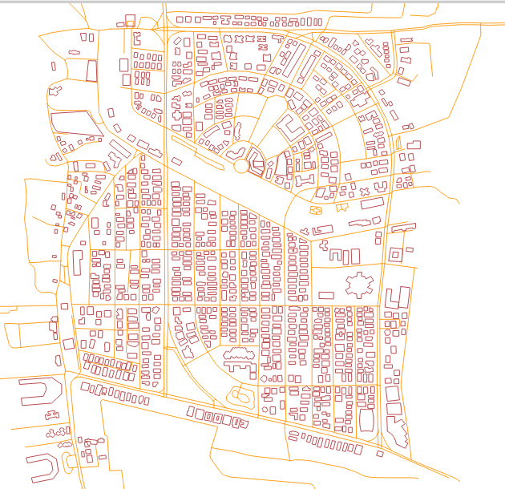
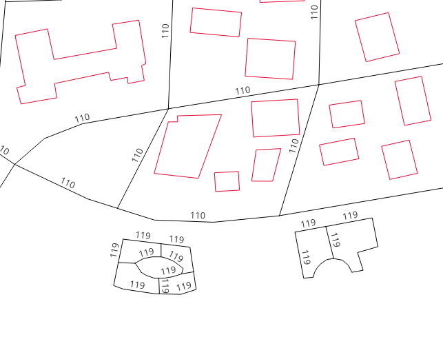
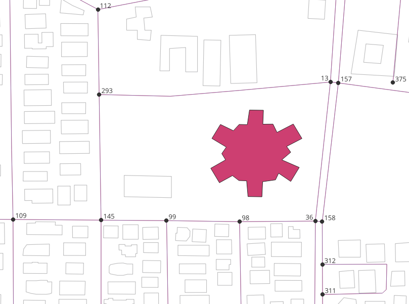
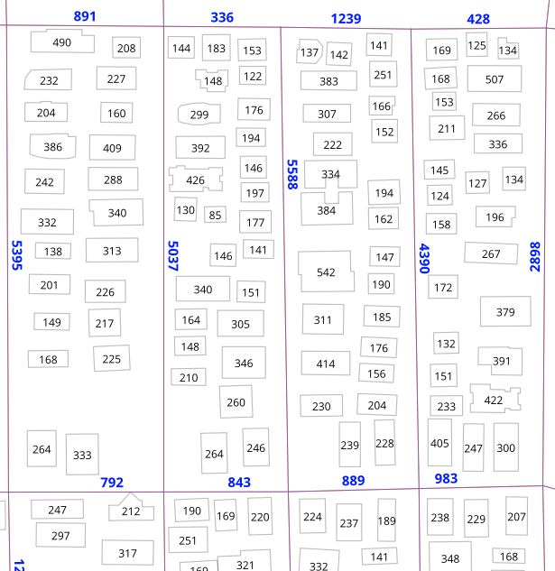
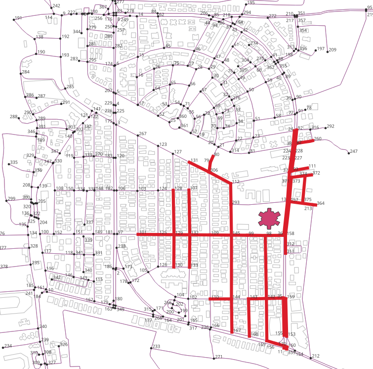
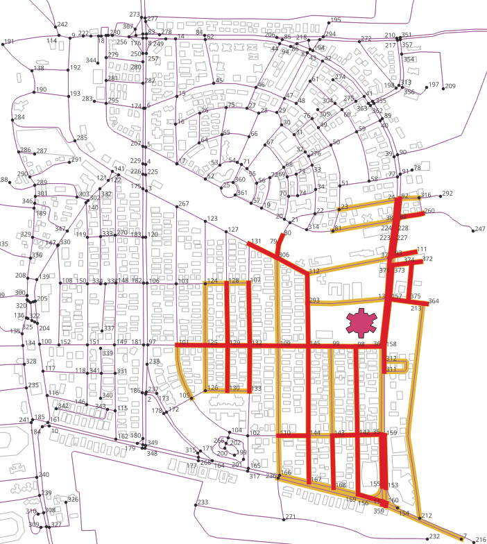

:file: This file is part of the pgRouting project.
:copyright: Copyright (c) 2021-2026 pgRouting developers
:license: Creative Commons Attribution-Share Alike 3.0 https://creativecommons.org/licenses/by-sa/3.0

Good Health and Well Being
###############################################################################

`Image Source <https://sdgs.un.org/goals/goal3>`__

`Good Health and Well Being` is the 3rd Sustainable Development Goal which aspires
to ensure health and well-being for all, including a bold commitment to end the
epidemics like AIDS, tuberculosis, malaria and other communicable diseases by 2030.
It also aims to achieve universal health coverage, and provide access to safe and
effective medicines and vaccines for all. Supporting research and development for
vaccines is an essential part of this process as well as expanding access to
affordable medicines. Hospitals are a very important part of a well functioning
health infrastructure. Appropriate planning is required for optimal distribution
of the population of an area to its hospitals. Hence, it is very important to estimate
the number of dependent people living near the hospital for better planning which
would ultimately help in achieving universal coverage of health services. This chapter
will focus on solving one of such problems.

.. contents:: Chapter Contents

Problem: Estimation of Population Served by Hospitals
================================================================================

**Problem Statement**

Determine the population served by a hospital based on walking travel time.

**Core Idea**

Population residing along the roads which lead to a hospital within a particular
time are dependent on that hospital.

**Approach**

* Get the data of

  - Roads
  - Buildings

* Small analysis of the database.
* Simulate census data.
* Remove disconnected roads from the graph.
* Estimate the population living on the buildings.

  * Find the nearest road to the buildings.

* Estimate the population living on the roads.
* Calculate the walking travel time from a road to a hospital.
* Calculate the population within a 10-minute walk to a location.

First step is to prepare the data obtained from :doc:`data`.

Follow the instructions in :doc:`data` to create and populate the ``mumbai``
database.

Following image shows the roads and buildings.

PostreSQL basics
================================================================================

Preparing work area

The ``search_path`` is a variable that determines the order in which database
schemas are searched for objects.

By setting the ``search_path`` to appropriate values, prepending the schema name
to tables can be avoided.

Exercise 1: Inspecting schemas
-------------------------------------------------------------------------------

Inspect the schemas by displaying all the present schemas using the following
command

.. literalinclude:: ../scripts/un_sdg/sdg3/sdg3.sql
   :start-after: show_schemas.txt
   :end-before:  show_path1.txt

.. collapse:: Command output

  .. literalinclude:: ../scripts/un_sdg/sdg3/show_schemas.txt

The schema names are ``buildings``, ``roads`` and ``public``. The owner depends
on who has the rights to the database.

Exercise 2: Inspecting the search path
-------------------------------------------------------------------------------

Display the current search path using the following query.

.. literalinclude:: ../scripts/un_sdg/sdg3/sdg3.sql
   :start-after: show_path1.txt
   :end-before:  set_path.txt
   :language: sql

.. collapse:: Command output

  .. literalinclude:: ../scripts/un_sdg/sdg3/show_path1.txt

This is the current search path. Tables in other schemas cannot be accessed with
this path.

Exercise 3: Adjusting the search path
-------------------------------------------------------------------------------

In this case, the search path needs to include ``roads`` and
``buildings`` schemas. The following query is used to adjust the search path.

.. literalinclude:: ../scripts/un_sdg/sdg3/sdg3.sql
   :start-after: set_path.txt
   :end-before: show_path2.txt
   :language: sql

.. collapse:: Command output

   .. literalinclude:: ../scripts/un_sdg/sdg3/set_path.txt

Checking the search path again

.. literalinclude:: ../scripts/un_sdg/sdg3/sdg3.sql
   :start-after: show_path2.txt
   :end-before: enumerate_tables.txt
   :language: sql

.. collapse:: Command output

   .. literalinclude:: ../scripts/un_sdg/sdg3/show_path2.txt

Exercise 4: Enumerating tables
-------------------------------------------------------------------------------

With ``\dt`` the tables are listed showing the schema and the owner

.. literalinclude:: ../scripts/un_sdg/sdg3/sdg3.sql
   :start-after: enumerate_tables.txt
   :end-before: count1.txt

.. collapse:: Command output

  .. literalinclude:: ../scripts/un_sdg/sdg3/enumerate_tables.txt

Simulation of census data
================================================================================

Due to the lack of census data, this exercise will estimate the population,
based on the area size of the building and the kind of use the building gets.

Buildings of OpenStreetMap data are classified into various categories.

.. literalinclude:: ../scripts/un_sdg/sdg3/sdg3.sql
    :start-after: kind_of_buildings.txt
    :end-before: population_function.txt
    :language: sql

.. collapse:: Query Results

  .. literalinclude:: ../scripts/un_sdg/sdg3/kind_of_buildings.txt

For this exercise, the population will be set as follows:

- Negligible:

  - People do not live in these places.
  - Population: 1 person.

    - There may be people guarding the place.

- Very Sparse:

  - ``retail``, ``commercial``, ``school``
  - People do not live in these places.
  - Population: At least 2 persons.

    - Because there may be people guarding the place.

- Sparse:

  - Buildings with low population density, like ``university``.
  - Population: At least 3 persons.

    - Because there may be people guarding the place.
    - Students might live there.

- Moderate:

  - Location where people might be living temporarily, like ``hotel`` and
    ``hospital``.
  - Population: At least 5 persons.

- Dense:

  - A medium sized residential building.
  - Population: At least 7 persons.

- Very Dense:

  - A large sized residential building, like ``apartments``.
  - Population: At least 10 persons.

Exercise 5: Estimating the population
-------------------------------------------------------------------------------
Each density class has a **class-specific factor** that represents how many
people per square meter are expected (e.g., 0.0002 for Very Sparse, 1.0 for
Very Dense). This factor is multiplied by a building's area to estimate its
population, with a minimum floor per class.

For example:

- Very Dense

  - A large sized residential building, like ``apartments``.
  - Population: At least 10 persons.

Each class has a specific numeric factor (visible in the SQL function below)
that scales the building area to estimate the number of residents.

This class specific factor is multiplied with the area of each building to get
the population. Follow the steps given below to complete this task.

.. rubric:: Create a function to find population using class-specific factor and area.

.. literalinclude:: ../scripts/un_sdg/sdg3/sdg3.sql
    :start-after: population_function.txt
    :end-before: show_population_100.txt
    :language: postgresql

.. rubric:: Testing the function with 100 square meters buildings.

.. literalinclude:: ../scripts/un_sdg/sdg3/sdg3.sql
   :start-after: show_population_100.txt
   :end-before: show_population_300.txt
   :language: sql

.. collapse:: Query Results

   .. literalinclude:: ../scripts/un_sdg/sdg3/show_population_100.txt

.. rubric:: Testing the function with 300 square meters buildings.

.. literalinclude:: ../scripts/un_sdg/sdg3/sdg3.sql
   :start-after: show_population_300.txt
   :end-before: show_schemas.txt
   :language: sql

.. collapse:: Query Results

  .. literalinclude:: ../scripts/un_sdg/sdg3/show_population_300.txt

.. note:: More complicated estimation functions can be done that consider height
   of the apartments.

   Using census data can achieve more accurate estimation.

Preparing roads information
================================================================================

pgRouting algorithms are only useful when the road network belongs to a single
graph (or all the roads are connected to each other). Hence, the disconnected
roads have to be removed from their network to get appropriate results.
This image gives an example of the disconnected edges.

For example, in the above figure roads with label ``119`` are disconnected from
the network. Hence they will have same connected component number. But the count
of this number will be less count of fully connected network. All the edges
with the component number with count less than maximum count will be removed

Disconnected road segments are unreachable from the main network. If they are
kept, routing queries like ``pgr_drivingDistance`` or ``pgr_dijkstra`` will
either fail to find paths on those segments or produce misleading
results (e.g., infinite cost, no path found).

Removing them ensures that every building in the network is reachable and that
population-serving analysis works correctly.

Once each road segment has a component identifier, you can isolate the main
network by keeping only the component with the highest edge count. A new table
(or view) can be created that contains just those edges, discarding all
unreachable segments in one step.

Exercise 6: Calculate the components of the roads
-------------------------------------------------------------------------------

To remove the disconnected components on the road network, the following
pgRouting functions, discussed on :doc:`../basic/graphs` chapter, will be used:

* ``pgr_extractVertices``
* ``pgr_connectedComponents``

.. rubric:: Add a components column.

.. literalinclude:: ../scripts/un_sdg/sdg3/sdg3.sql
   :start-after: only_connected0.txt
   :end-before: only_connected1.txt
   :language: sql

.. rubric:: Create a vertices table.

.. literalinclude:: ../scripts/un_sdg/sdg3/sdg3.sql
   :start-after: only_connected1.txt
   :end-before: only_connected2.txt
   :language: sql
   :force:

.. rubric:: Fill up the ``x``, ``y`` and ``geom`` columns.

.. literalinclude:: ../scripts/un_sdg/sdg3/sdg3.sql
    :start-after: only_connected2.txt
    :end-before: only_connected3.txt
    :language: sql
    :force:

.. rubric:: Fill up the ``component`` column on the vertices table.

.. literalinclude:: ../scripts/un_sdg/sdg3/sdg3.sql
    :start-after: only_connected3.txt
    :end-before: only_connected4.txt
    :language: sql
    :force:

.. rubric:: Fill up the ``component`` column on the edges table.

.. literalinclude:: ../scripts/un_sdg/sdg3/sdg3.sql
    :start-after: only_connected4.txt
    :end-before: only_connected5.txt
    :language: sql
    :force:

Exercise 7: Create a roads_net table.
-------------------------------------------------------------------------------

The ``roads_net`` table stores road edges with travel costs in **minutes**,
assuming a walking speed of **1 m/s**.

Since :math:`time = distance / speed`:

* :math:`time = length\_m / 1\ m/s`

This gives time in **seconds**. To convert to **minutes**, divide by 60:

* :math:`time = length\_m / 60`

.. rubric:: Create roads_net with only the largest component

This query creates the ``roads_net`` table by keeping only edges belonging to
the most connected component.

* It calculates travel cost as ``length_m / 60`` (seconds converted to minutes
  at 1 m/s) and
* initializes the population column as ``NULL`` for later population of the roads.

.. literalinclude:: ../scripts/un_sdg/sdg3/sdg3.sql
    :start-after: only_connected5.txt
    :end-before: only_connected6.txt
    :language: sql
    :force:

.. rubric:: Delete vertices not belonging to the most connected component.

Once ``roads_net`` is filtered to only the largest connected component, the
``vertices`` table still contains vertices from the discarded components.

These orphan vertices have no edges in ``roads_net``, so they are useless for
routing and would pollute nearest-vertex lookups. Deleting them keeps the vertex
table consistent with the trimmed network.

.. literalinclude:: ../scripts/un_sdg/sdg3/sdg3.sql
    :start-after: only_connected6.txt
    :end-before: building_road.txt
    :language: sql
    :force:

Preparing buildings population information
================================================================================

This section links buildings to the road network and estimates their population.

* First, functions are created to find the nearest road and vertex for each
  building.
* Then building geometries are converted from ``LINESTRING`` to polygons to
  calculate area, which feeds the ``population`` function.
* Finally, the estimated population is aggregated onto the road segments.

Exercise 8: Get the nearest road to a building
--------------------------------------------------------------------------------

.. rubric:: Create the building_road function

This function finds the closest road edge to a building using PostGIS'
spatial distance operator (``<->``). It returns the ``id`` of the nearest
edge from ``roads_net``, which is later used to link each building to the
road network.

.. literalinclude:: ../scripts/un_sdg/sdg3/sdg3.sql
   :start-after: building_road.txt
   :end-before: test_building_road.txt
   :language: sql
   :force:

.. rubric:: Test the function

.. literalinclude:: ../scripts/un_sdg/sdg3/sdg3.sql
   :start-after: test_building_road.txt
   :end-before: clean_buildings.txt
   :language: sql
   :force:

.. collapse:: Query results

   .. literalinclude:: ../scripts/un_sdg/sdg3/test_building_road.txt

Exercise 9: Find the closest road vertex
--------------------------------------------------------------------------------

There are multiple road vertices near the hospital. Create a function to find
the geographically closest road vertex. ``get_vertex`` function takes a geometry
as input and returns the id of the closest vertex by comparing ``geom`` of both
tables.

.. rubric:: Create the get_vertex function

This function finds the closest road vertex to a building

* Using PostGIS' spatial distance operator (``<->``).
* Returns the ``id`` of the nearest vertex from the ``vertices`` table,

  - Used as the start point for ``pgr_drivingDistance`` queries.

.. literalinclude:: ../scripts/un_sdg/sdg3/sdg3.sql
   :start-after: nearest_vertex.txt
   :end-before:  test_nearest_vertex.txt
   :language: sql
   :force:

.. rubric:: Test the function

.. literalinclude:: ../scripts/un_sdg/sdg3/sdg3.sql
    :start-after: test_nearest_vertex.txt
    :end-before: clean_buildings.txt
    :language: sql
    :force:

.. collapse:: Query Results

  .. literalinclude:: ../scripts/un_sdg/sdg3/test_nearest_vertex.txt

Exercise 10: Create the buildings table
--------------------------------------------------------------------------------

A ``buildings`` table is created for efficient access throughout the remaining
exercises.

.. rubric:: The query

* converts ``LINESTRING`` geometries to ``Polygon``,
* calculates the area using ``ST_Area``,
* and estimates population using the ``population`` function.

.. rubric:: The result

* Is stored in the ``buildings`` table.

.. literalinclude:: ../scripts/un_sdg/sdg3/sdg3.sql
   :start-after: clean_buildings.txt
   :end-before: roads_population.txt
   :language: sql
   :force:

Exercise 11: Storing the population in the roads
--------------------------------------------------------------------------------

After finding the nearest road, the sum of population of all the nearest
buildings is stored in the population column of the roads table. Following image
shows the visualised output where the blue colour labels shows the population
stored in roads.

.. rubric:: Update the population of the roads.

.. literalinclude:: ../scripts/un_sdg/sdg3/sdg3.sql
    :start-after: roads_population.txt
    :end-before: served_roads.txt
    :language: sql
    :force:

Find the roads served by the hospitals
================================================================================

After pre-processing the data, next step is to find the area served by the
hospital. This area can be computed from the entrance of the hospital or from any
point on road near the hospital. In this exercise it is computed from closest
road vertex. ``pgr_drivingDistance`` will be used to find the roads served. The
steps to be followed are:

* Finding the closest road vertex
* Finding the roads served
* Generalising the roads served

pgr_drivingDistance
--------------------------------------------------------------------------------
For the next step ``pgr_drivingDistance`` will be used. This returns the driving
distance from a start node. It uses the Dijkstra algorithm to extract all the nodes
that have costs less than or equal to the value distance. The edges that are extracted
conform to the corresponding spanning tree.

.. rubric:: Signatures

.. code-block:: sql

    pgr_drivingDistance(edges_sql, start_vid,  distance [, directed])
    pgr_drivingDistance(edges_sql, start_vids, distance [, directed] [, equicost])
    RETURNS SET OF (seq, [start_vid,] node, edge, cost, agg_cost)

`pgr_drivingDistance Documentation <https://docs.pgrouting.org/3.1/en/pgr_drivingDistance>`__
can be found at this link for more information.

Exercise 12: Finding the served roads using pgr_drivingDistance
--------------------------------------------------------------------------------

.. rubric:: Problem

Find the roads within 10 minutes walking distance from the hospitals.

.. rubric:: Solution

Using ``pgrdrivingDistance`` function from pgRouting extension.

- Time in minutes is considered as ``cost``.
- the graph is undirected.
- ``tag_id = '318'`` as 318 is the value for hospital in the configuration
  table of the buildings.
- ``10`` for 10 minutes, which is a threshold for ``agg_cost``

.. literalinclude:: ../scripts/un_sdg/sdg3/sdg3.sql
    :start-after: served_roads.txt
    :end-before:  adjacent_roads.txt
    :language: sql
    :force:

.. collapse:: Query Results

  .. literalinclude:: ../scripts/un_sdg/sdg3/served_roads.txt

Following figure shows the visualised output of the above query. The lines
highlighted by red colour show the area from where the hospital can be reached
within 10 minutes of walking at the speed of ``1 m/s``.

It is noticeable from the output figure that some of the roads which are near to
the hospital are not highlighted. For example, to roads in the north of the
hospital. This is because the only one edge per road vertex was selected by the
query.

Exercise 13: Adding adjacent roads
--------------------------------------------------------------------------------

The edges which are near to to hospital should also be selected in the roads served
as the hospital also serves those buildings. The following query takes the query
from previous section as a ``subquery`` and selects all the edges from ``roads_ways``
that have the same ``source`` and ``target`` to that of ``subquery`` (Line 14).

.. literalinclude:: ../scripts/un_sdg/sdg3/sdg3.sql
    :start-after: adjacent_roads.txt
    :end-before:  population_served.txt
    :language: sql
    :force:

.. collapse:: Query Results

  .. literalinclude:: ../scripts/un_sdg/sdg3/adjacent_roads.txt

Following figure shows the visualised output of the above query. Lines
highlighted in ``yellow`` show the `generalised the roads served`. This gives a better
estimate of the areas from where the hospital can be reached by a particular speed.

Calculating the total population served by the hospital
================================================================================

Now the next step is to estimate the dependent population. Official source of
population is Census conducted by the government. But for this exercise, population
will be estimated from the ``area`` as well as the ``category`` of the building.
This area will be stored in the nearest roads. Following steps explain this
process in detail.

Exercise 14: Find total population served by the hospital
--------------------------------------------------------------------------------

Final step is to find the total population served by the hospital based on
travel time.

.. literalinclude:: ../scripts/un_sdg/sdg3/sdg3.sql
    :start-after: population_served.txt
    :language: sql

.. collapse:: Query Results

  .. literalinclude:: ../scripts/un_sdg/sdg3/population_served.txt
