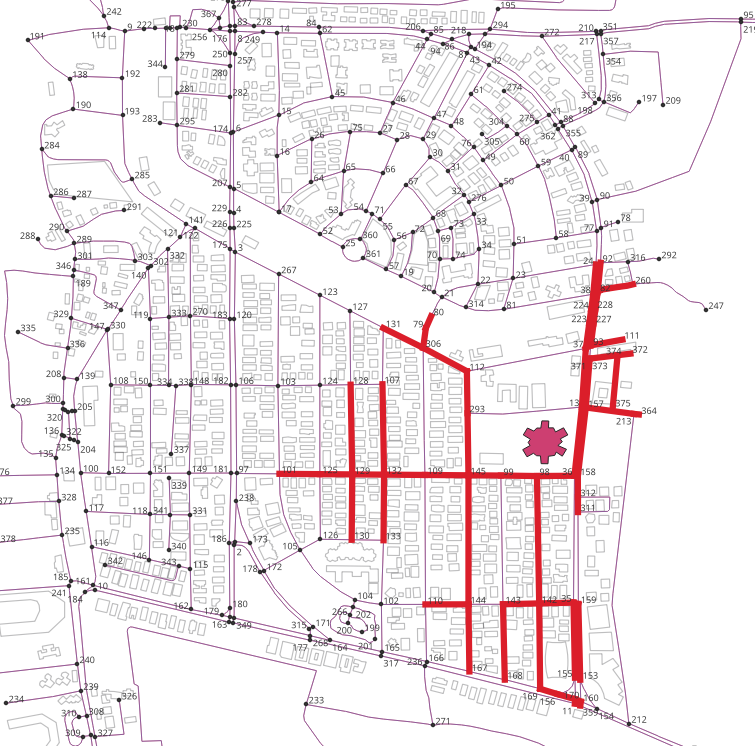

..
  ****************************************************************************
  pgRouting Workshop Manual
  Copyright(c) pgRouting Contributors

  This documentation is licensed under a Creative Commons Attribution-Share
  Alike 3.0 License: http://creativecommons.org/licenses/by-sa/3.0/
  ****************************************************************************

Good Health and Well Being
###############################################################################

`Good Health and Well Being` is the 3rd Sustainable Development Goal which aspires
to ensure health and well-being for all, including a bold commitment to end the
epidemics like AIDS, tuberculosis, malaria and other communicable diseases by 2030.
It also aims to achieve universal health coverage, and provide access to safe and
effective medicines and vaccines for all. Supporting research and development for
vaccines is an essential part of this process as well as expanding access to
affordable medicines. Hospitals are a very important part of a well functioning
health infrastructure. An appropriate planning is required for optimal distribution
of the population of an area to its hospitals. Hence, it is very important to estimate
the number of dependant people living near the hospital for better planning which
would ultimately help in achieving universal coverage of health services. This chapter
will focus on solving one such problem.

.. image:: images/sdg3/un_sdg3.png
  :align: center
  :alt: Sustainable Development Goal 3: Good Health and Well Being

`Image Source <https://sdgs.un.org/goals/goal3>`__

.. contents:: Chapter Contents

Problem: Estimation of Population Served by Hospitals
================================================================================

**Problem Statement**

To determine the population served by a hospital based on travel time

**Core Idea**

Population residing along the roads which reach to a hospital within a particular
time is dependant on that hospital.

**Approach**

* To prepare a dataset with:

  - Edges: Roads
  - Polygons: Buildings with population

* Find the travel-time based the roads served
* Estimate the population of the buildings
* Find the nearest road to the buildings
* Store the sum of population of nearest buildings in roads table
* Find the sum of population on all the roads in the roads served

PostreSQL basics
================================================================================

Preparing work area
-------------------------------------------------------------------------------

The ``search_path`` is a variable that determines the order in which database
schemas are searched for objects.

By setting the ``search_path`` to appropriate values, prepending the schema name
to tables can be avoided.

Exercise 1: Inspecting schemas
...............................................................................

Inspect the schemas by displaying all the present schemas using the following
command

.. literalinclude:: ../scripts/un_sdg/sdg3/all_exercises_sdg3.sql
   :start-after: show_schemas.txt
   :end-before:  show_path1.txt

.. collapse:: Command output

  .. literalinclude:: ../scripts/un_sdg/sdg3/show_schemas.txt

The schema names are ``buildings``, ``roads`` and ``public``. The owner depends
on who has the rights to the database.

Exercise 2: Inspecting the search path
...............................................................................

Display the current search path using the following query.

.. literalinclude:: ../scripts/un_sdg/sdg3/all_exercises_sdg3.sql
   :start-after: show_path1.txt
   :end-before:  set_path.txt
   :language: sql

.. collapse:: Command output

  .. literalinclude:: ../scripts/un_sdg/sdg3/show_path1.txt

This is the current search path. Tables in other schemas cannot be accessed with
this path.

Exercise 3: Fixing the search path
...............................................................................

In this case, the search path needs to include ``roads`` and
``buildings`` schemas. The following query is used to adjust the search path.

.. literalinclude:: ../scripts/un_sdg/sdg3/all_exercises_sdg3.sql
   :start-after: set_path.txt
   :end-before: show_path2.txt

.. collapse:: Command output

  .. literalinclude:: ../scripts/un_sdg/sdg3/set_path.txt

Checking the search path again

.. literalinclude:: ../scripts/un_sdg/sdg3/all_exercises_sdg3.sql
    :start-after: show_path2.txt
    :end-before: enumerate_tables.txt

.. collapse:: Command output

  .. literalinclude:: ../scripts/un_sdg/sdg3/show_path2.txt

Exercise 4: Enumerating tables
...............................................................................

With ``\dt`` the tables are listed showing the schema and the owner

.. literalinclude:: ../scripts/un_sdg/sdg3/all_exercises_sdg3.sql
   :start-after: enumerate_tables.txt
   :end-before: count1.txt

.. collapse:: Command output

  .. literalinclude:: ../scripts/un_sdg/sdg3/enumerate_tables.txt

Preparing roads and buildings data
================================================================================

First step is to prepare the data obtained from :doc:`data`.

This section will work the graph and data that is going to be used for processing.
While building the graph, the data has to be inspected to determine if there is any
invalid data.
This is a very important step to make sure that the data is of
required quality.
pgRouting can also be used to do some Data Adjustments.

Exercise 5: Counting the number of roads and buildings
--------------------------------------------------------------------------------

The importance of counting the information on this workshop is to make sure that
the same data is used and consequently the results are same.
Also, some of the rows can be seen to understand the structure of the table and
how the data is stored in it.

.. literalinclude:: ../scripts/un_sdg/sdg3/all_exercises_sdg3.sql
   :start-after: count1.txt
   :end-before: count2.txt
   :language: sql

.. collapse:: Command output

  .. literalinclude:: ../scripts/un_sdg/sdg3/count1.txt

.. literalinclude:: ../scripts/un_sdg/sdg3/all_exercises_sdg3.sql
   :start-after: count2.txt
   :end-before: clean_buildings.txt
   :language: sql

.. collapse:: Command output

  .. literalinclude:: ../scripts/un_sdg/sdg3/count2.txt

Following image shows the roads and buildings visualised.

.. image:: images/sdg3/roads_and_buildings.png
  :align: center
  :scale: 50%

Preprocessing Buildings
--------------------------------------------------------------------------------

The table ``buildings_ways`` contains the buildings in ``LINGSTING`` type.
They have to be converted into polygons to get the area, as the area is going to
be used to get an estimate of the population living in the building.

Exercise 6: Removing columns
...............................................................................

Columns can be deleted from a table. In this case instead of creating a view,
columns that are not related to a **buidling** concept are dropped from
``buildings_ways``.

.. literalinclude:: ../scripts/un_sdg/sdg3/all_exercises_sdg3.sql
   :start-after: clean_buildings.txt
   :end-before: exercise_6.txt
   :language: sql

.. collapse:: Command output

  .. literalinclude:: ../scripts/un_sdg/sdg3/clean_buildings.txt

Exercise 7: Add a spatial column to the table
...............................................................................

Add a spatial column named ``poly_geom`` to the table ``buildings_ways`` to store
the Polygon Geometry

.. literalinclude:: ../scripts/un_sdg/sdg3/all_exercises_sdg3.sql
   :start-after: exercise_6.txt
   :end-before:  buildings_description.txt
   :language: sql

.. collapse:: Query Results

  .. literalinclude:: ../scripts/un_sdg/sdg3/exercise_6.txt

Inspecting the table:

.. literalinclude:: ../scripts/un_sdg/sdg3/all_exercises_sdg3.sql
   :start-after: buildings_description.txt
   :end-before: exercise_7.txt

.. collapse:: Table structure

  .. literalinclude:: ../scripts/un_sdg/sdg3/buildings_description.txt

Exercise 8: Removing the polygons with less than 4 points
...............................................................................

``ST_NumPoints`` is used to find the number of points on a geometry. Also, polygons
with less than 3 points/vertices are not considered valid polygons in PostgreSQL.
Hence, the buildings having less than 3 vertices need to be cleaned up. Follow
the steps given below to complete this task.

.. literalinclude:: ../scripts/un_sdg/sdg3/all_exercises_sdg3.sql
   :start-after: exercise_7.txt
   :end-before: exercise_8.txt
   :language: sql

.. collapse:: Query Results

  .. literalinclude:: ../scripts/un_sdg/sdg3/exercise_7.txt

Exercise 9: Creating the polygons
...............................................................................

``ST_MakePolygons`` is used to make the polygons. This step stores the geometry of
polygons in the ``poly_geom`` column which was created earlier.

.. literalinclude:: ../scripts/un_sdg/sdg3/all_exercises_sdg3.sql
   :start-after: exercise_8.txt
   :end-before: add_area_col.txt
   :language: sql
   :linenos:

.. collapse:: Query Results

  .. literalinclude:: ../scripts/un_sdg/sdg3/exercise_8.txt

Exercise 10: Calculating the area
...............................................................................

After getting the polygon geometry, next step is to find the area of the polygons.
Follow the steps given below to complete this task.

1. Adding a column for storing the area

.. literalinclude:: ../scripts/un_sdg/sdg3/all_exercises_sdg3.sql
    :start-after: add_area_col.txt
    :end-before: get_area.txt
    :language: sql

2. Storing the area in the new column

``ST_Area`` is used to calculate area of polygons. Area is stored in the
new column

.. literalinclude:: ../scripts/un_sdg/sdg3/all_exercises_sdg3.sql
    :start-after: get_area.txt
    :end-before: kind_of_buildings.txt
    :language: sql

.. collapse:: Query Results

  .. literalinclude:: ../scripts/un_sdg/sdg3/get_area.txt

Exercise 11: Estimating the population
...............................................................................

Due to the lack of census data, this exercise will fill up and estimate of the
population living on the buildings, based on the area of the building and the
kind of use the building gets.

Buildings of OpenStreetMap data are classified into various categories.

.. literalinclude:: ../scripts/un_sdg/sdg3/all_exercises_sdg3.sql
    :start-after: kind_of_buildings.txt
    :end-before: population_function.txt
    :language: sql

.. collapse:: Query Results

  .. literalinclude:: ../scripts/un_sdg/sdg3/kind_of_buildings.txt

For this exercise, the population will be set as follows:

- Negligible:

  - People do not live in these places.
  - Population: 1 person

    - There may be people guarding the place.

- Very Sparse:

  - ``retail``, ``commercial``, ``school``
  - People do not live in these places.
  - Population: At least 2 persons.

    - Because there may be people guarding the place.

- Sparse:

  - Buildings with low population density, like ``university``.
  - Population: At least 3 persons.

    - Because there may be people guarding the place.
    - Students might live there.

- Moderate:

  - Location where people might be living temporarly, like ``hotel`` and
    ``hospital``.
  - Population: At least 5 persons.

- Dense:

  - A medium sized residential building.
  - Population: At least 7 persons.

- Very Dense:

  - A large sized residential building, like ``apartments``.
  - Population: At least 10 persons.

Reference: :ref:`un_sdg/data:Appendix`

This class-specific factor is multiplied with the area of each building to get
the population. Follow the steps given below to complete this task.

1. Create a function to find population using class-specific factor and area.

.. literalinclude:: ../scripts/un_sdg/sdg3/all_exercises_sdg3.sql
    :start-after: population_function.txt
    :end-before: add_population_col.txt
    :language: sql
    :force:

.. collapse:: Query Results

  .. literalinclude:: ../scripts/un_sdg/sdg3/population_function.txt

.. note:: All these are estimations based on this particular area. More complicated
          functions can be done that consider height of the apartments but the
          design of a function is going to depend on the availability of the data.
          For example, using census data can achieve more accurate estimation.

2. Add a column for storing the population in the ``buildings_ways``

.. literalinclude:: ../scripts/un_sdg/sdg3/all_exercises_sdg3.sql
    :start-after:  add_population_col.txt
    :end-before: get_population.txt
    :language: sql

.. collapse:: Query Results

  .. literalinclude:: ../scripts/un_sdg/sdg3/add_population_col.txt

3. Use the ``population`` function to store the population in the new column created
in the ``building_ways``.

.. literalinclude:: ../scripts/un_sdg/sdg3/all_exercises_sdg3.sql
    :start-after: get_population.txt
    :end-before: only_connected1.txt
    :language: sql

.. collapse:: Query Results

  .. literalinclude:: ../scripts/un_sdg/sdg3/get_population.txt

Preprocessing Roads
--------------------------------------------------------------------------------
pgRouting algorithms are only useful when the road network belongs to a single
graph (or all the roads are connected to each other). Hence, the disconnected
roads have to be removed from their network to get appropriate results.
This image gives an example of the disconnected edges.

.. image:: images/sdg3/remove_disconnected_roads.png
  :align: center
  :scale: 60%

For example, in the above figure roads with label ``119`` are disconnected from
the network. Hence they will have same connected component number. But the count
of this number will be less count of fully connected network. All the edges
with the component number with count less than maximum count will be removed

Follow the steps given below to complete this task.

Exercise 12: Remove disconnected components
...............................................................................

To remove the disconnected components on the road network, the following
pgRouting functions, discussed on :doc:`../basic/graphs`, will be used:

* ``pgr_extractVertices``
* ``pgr_connectedComponents``

.. rubric:: Create a vertices table.

.. literalinclude:: ../scripts/un_sdg/sdg3/all_exercises_sdg3.sql
    :start-after: only_connected1.txt
    :end-before: only_connected2.txt
    :language: sql

.. collapse:: Query Results

  .. literalinclude:: ../scripts/un_sdg/sdg3/only_connected1.txt

.. rubric:: Fill up the ``x``, ``y`` and ``geom`` columns.

.. literalinclude:: ../scripts/un_sdg/sdg3/all_exercises_sdg3.sql
    :start-after: only_connected2.txt
    :end-before: only_connected3.txt
    :language: sql

.. collapse:: Query Results

  .. literalinclude:: ../scripts/un_sdg/sdg3/only_connected2.txt

.. rubric:: Add a ``component`` column on the edges and vertices tables.

.. literalinclude:: ../scripts/un_sdg/sdg3/all_exercises_sdg3.sql
    :start-after: only_connected3.txt
    :end-before: only_connected4.txt
    :language: sql

.. collapse:: Query Results

  .. literalinclude:: ../scripts/un_sdg/sdg3/only_connected3.txt

.. rubric:: Fill up the ``component`` column on the vertices table.

.. literalinclude:: ../scripts/un_sdg/sdg3/all_exercises_sdg3.sql
    :start-after: only_connected4.txt
    :end-before: only_connected5.txt
    :language: sql

.. collapse:: Query Results

  .. literalinclude:: ../scripts/un_sdg/sdg3/only_connected4.txt

.. rubric:: Fill up the ``component`` column on the edges table.

.. literalinclude:: ../scripts/un_sdg/sdg3/all_exercises_sdg3.sql
    :start-after: only_connected5.txt
    :end-before: only_connected6.txt
    :language: sql

.. collapse:: Query Results

  .. literalinclude:: ../scripts/un_sdg/sdg3/only_connected5.txt

.. rubric:: Get the component number with the most number of edges.

.. literalinclude:: ../scripts/un_sdg/sdg3/all_exercises_sdg3.sql
    :start-after: only_connected6.txt
    :end-before: only_connected7.txt
    :language: sql

.. collapse:: Query Results

  .. literalinclude:: ../scripts/un_sdg/sdg3/only_connected6.txt

.. rubric:: Delete edges not belonging to the most connected component.

.. literalinclude:: ../scripts/un_sdg/sdg3/all_exercises_sdg3.sql
    :start-after: only_connected7.txt
    :end-before: only_connected8.txt
    :language: sql

.. collapse:: Query Results

  .. literalinclude:: ../scripts/un_sdg/sdg3/only_connected7.txt

.. rubric:: Delete vertices not belonging to the most connected component.

.. literalinclude:: ../scripts/un_sdg/sdg3/all_exercises_sdg3.sql
    :start-after: only_connected8.txt
    :end-before: nearest_vertex1.txt
    :language: sql

.. collapse:: Query Results

  .. literalinclude:: ../scripts/un_sdg/sdg3/only_connected8.txt

Find the roads served by the hospitals
================================================================================
After pre-processing the data, next step is to find the area served by the
hospital. This area can be computed from the entrance of the hospital or from any
point on road near the hospital. In this exercise it is computed from closest
road vertex. ``pgr_drivingDistance`` will be used to find the roads served. The
steps to be followed are:

* Finding the closest road vertex
* Finding the roads served
* Generalising the roads served

pgr_drivingDistance
--------------------------------------------------------------------------------
For the next step ``pgr_drivingDistance`` will be used. This returns the driving
distance from a start node. It uses the Dijkstra algorithm to extract all the nodes
that have costs less than or equal to the value distance. The edges that are extracted
conform to the corresponding spanning tree.

.. rubric:: Signatures

.. code-block:: sql

    pgr_drivingDistance(edges_sql, start_vid,  distance [, directed])
    pgr_drivingDistance(edges_sql, start_vids, distance [, directed] [, equicost])
    RETURNS SET OF (seq, [start_vid,] node, edge, cost, agg_cost)

`pgr_drivingDistance Documentation <https://docs.pgrouting.org/3.1/en/pgr_drivingDistance>`__
can be found at this link for more information.

Exercise 13: Find the closest road vertex
--------------------------------------------------------------------------------
There are multiple road vertices near the hospital. Create a function to find
the geographically closest road vertex. ``closest_vertex`` function takes geometry
of other table as input and gives the gid of the closest vertex as output by
comparing ``geom`` of both the tables.

.. image:: images/sdg3/finding_closest_vertex.png
  :align: center
  :scale: 50%

The following query creates a function to find the closest road vertex.

.. literalinclude:: ../scripts/un_sdg/sdg3/all_exercises_sdg3.sql
    :start-after: nearest_vertex1.txt
    :end-before:  nearest_vertex2.txt
    :language: sql
    :force:

.. collapse:: Query Results

  .. literalinclude:: ../scripts/un_sdg/sdg3/nearest_vertex1.txt

Testing the function

.. literalinclude:: ../scripts/un_sdg/sdg3/all_exercises_sdg3.sql
    :start-after: nearest_vertex2.txt
    :end-before: prepare_edges.txt
    :language: sql

.. collapse:: Query Results

  .. literalinclude:: ../scripts/un_sdg/sdg3/nearest_vertex2.txt

Exercise 14: Finding the served roads using pgr_drivingDistance
--------------------------------------------------------------------------------

.. rubric:: Problem

Find the roads within 10 minutes walking distance from the hospitals. Use ``1
m/s`` as walking speed.

.. rubric:: Solution

In this exercise, the roads served are calculated based on a walking time of ``1
m/s``, by using ``pgrdrivingDistance`` function from pgRouting extension.

- Time in minutes is considered as ``cost``.
- the graph is undirected.

Preparing a query

.. literalinclude:: ../scripts/un_sdg/sdg3/all_exercises_sdg3.sql
    :start-after: prepare_edges.txt
    :end-before:  exercise_16.txt
    :language: sql
    :force:

.. collapse:: Query Results

  .. literalinclude:: ../scripts/un_sdg/sdg3/prepare_edges.txt

For the following query,

- The prepared statement is used.
- Pedestrian speed is set to be ``1 m/s``.

  - As ``time`` = ``distance/speed``, ``length_m`` / ``1 m/s`` / ``60`` gives
    the time in minutes.

- ``tag_id = '318'`` as 318 is the value for hospital in the configuration
  table of the buildings.

- ``10`` for 10 minutes, which is a threshold for ``agg_cost``

.. literalinclude:: ../scripts/un_sdg/sdg3/all_exercises_sdg3.sql
    :start-after: exercise_15.txt
    :end-before:  exercise_16.txt
    :language: sql

.. collapse:: Query Results

  .. literalinclude:: ../scripts/un_sdg/sdg3/exercise_15.txt

Following figure shows the visualised output of the above query. The lines
highlighted by red colour show the area from where the hospital can be reached
within 10 minutes of walking at the speed of ``1 m/s``.

It is noticable from the output figure that some of the roads which are near to
the hospital are not highlighted. For example, to roads in the north of the
hospital. This is because the only one edge per road vertex was selected by the
query.

Exercise 15: Generalising the served roads
--------------------------------------------------------------------------------

The edges which are near to to hospital should also be selected in the roads served
as the hospital also serves those buildings. The following query takes the query
from previous section as a ``subquery`` and selects all the edges from ``roads_ways``
that have the same ``source`` and ``target`` to that of ``subquery`` (Line 14).

.. literalinclude:: ../scripts/un_sdg/sdg3/all_exercises_sdg3.sql
    :start-after: exercise_16.txt
    :end-before: closest_edge1.txt
    :language: sql

.. collapse:: Query Results

  .. literalinclude:: ../scripts/un_sdg/sdg3/exercise_16.txt

Following figure shows the visualised output of the above query. Lines
highlighted in ``yellow`` show the `generalised the roads served`. This gives a better
estimate of the areas from where the hospital can be reached by a particular speed.

.. image:: images/sdg3/generalised_service_area.png
  :align: center
  :scale: 50%

Calculating the total population served by the hospital
================================================================================

Now the next step is to estimate the dependant population. Official source of
population is Census conducted by the government. But for this exercise, population
will be estimated from the ``area`` as well as the ``category`` of the building.
This area will be stored in the nearest roads. Following steps explain this
process in detail.

Exercise 16: Finding the nearest roads of the buildings
--------------------------------------------------------------------------------

To store the population of buildings in the roads, nearest road to a building
is to be found. Follow the steps given below to complete this task.

1. Create Function for finding the closest edge.

.. literalinclude:: ../scripts/un_sdg/sdg3/all_exercises_sdg3.sql
    :start-after: closest_edge1.txt
    :end-before: closest_edge2.txt
    :linenos:

.. collapse:: Query Results

  .. literalinclude:: ../scripts/un_sdg/sdg3/closest_edge1.txt

2. Add a column in ``buildings_ways`` for storing the id of closest edge

.. literalinclude:: ../scripts/un_sdg/sdg3/all_exercises_sdg3.sql
    :start-after: closest_edge2.txt
    :end-before:  closest_edge3.txt
    :language: sql
    :linenos:

.. collapse:: Query Results

  .. literalinclude:: ../scripts/un_sdg/sdg3/closest_edge2.txt

3. Store the edge id of the closest edge in the new column of ``buildings_ways``

.. literalinclude:: ../scripts/un_sdg/sdg3/all_exercises_sdg3.sql
    :start-after: closest_edge3.txt
    :end-before: add_road_population1.txt
    :language: sql
    :linenos:

.. collapse:: Query Results

  .. literalinclude:: ../scripts/un_sdg/sdg3/closest_edge3.txt

Exercise 17: Storing the population in the roads
--------------------------------------------------------------------------------
After finding the nearest road, the sum of population of all the nearest
buildings is stored in the population column of the roads table. Following image
shows the visualised output where the blue colour labels shows the population
stored in roads.

.. image:: images/sdg3/road_population.png
  :align: center
  :scale: 50%

Follow the steps given below to complete this task.

1. Add a column in ``roads_ways`` for storing population

.. literalinclude:: ../scripts/un_sdg/sdg3/all_exercises_sdg3.sql
    :start-after: add_road_population1.txt
    :end-before: add_road_population2.txt
    :language: sql

.. collapse:: Query Results

  .. literalinclude:: ../scripts/un_sdg/sdg3/add_road_population1.txt

2. Update the roads with the sum of population of buildings closest to it

.. literalinclude:: ../scripts/un_sdg/sdg3/all_exercises_sdg3.sql
    :start-after: add_road_population2.txt
    :end-before: add_road_population3.txt
    :language: sql
    :linenos:

.. collapse:: Query Results

  .. literalinclude:: ../scripts/un_sdg/sdg3/add_road_population2.txt

3. Verify is the population is stored using the following query.

.. literalinclude:: ../scripts/un_sdg/sdg3/all_exercises_sdg3.sql
    :start-after: add_road_population3.txt
    :end-before: exercise_20.txt
    :language: sql
    :linenos:

.. collapse:: Query Results

  .. literalinclude:: ../scripts/un_sdg/sdg3/add_road_population3.txt

Exercise 18: Find total population served by the hospital
--------------------------------------------------------------------------------

Final step is to find the total population served by the hospital based on
travel time.

.. literalinclude:: ../scripts/un_sdg/sdg3/all_exercises_sdg3.sql
    :start-after: exercise_20.txt
    :end-before: \o
    :language: sql

.. collapse:: Query Results

  .. literalinclude:: ../scripts/un_sdg/sdg3/exercise_20.txt
