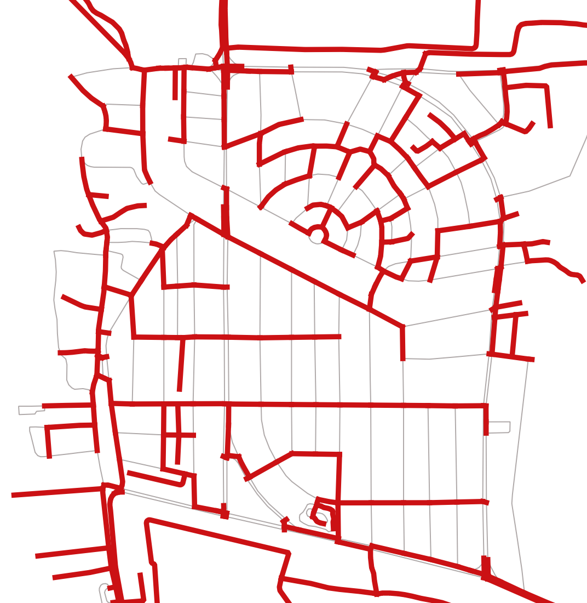

..
  ****************************************************************************
  pgRouting Workshop Manual
  Copyright(c) pgRouting Contributors

  This documentation is licensed under a Creative Commons Attribution-Share
  Alike 3.0 License: http://creativecommons.org/licenses/by-sa/3.0/
  ****************************************************************************

Affordable and Clean Energy
###############################################################################

`Affordable and Clean Energy` is the 7th Sustainable Development Goal 11. It aspires
to ensure access to `affordable, reliable, sustainable` and `modern` energy for all.
Today renewable energy is making impressive gains in the electricity sector. As 
more and more new settlements are built, there would be new electricity distribution
network developed. Electricity Distribution is very expensive infrastructure. Finding the 
optimal path for laying this infrastructure is very crucial to maintain the 
affordability of electricity for everyone. This exercise focusses on finding this
optimal path/network for laying the electricity distribution equipment.

`Image Source <https://sdgs.un.org/goals/goal7>`__

.. contents:: Chapter Contents

Problem: Optimising the Electricity Distribution Network
================================================================================

**Problem Statement**

To determine the least length of the path for laying the electricity 
distribution equipment such that every building is served

**Core Idea**

Electricity lines may not be there on every road of the city. In a complex 
road network of a city, the network can be optimised for less length such that
Electricity lines reach every locality of the city. Less length leads to 
enhanced cost-effectiveness resulting in affordable electricity.

**Approach**

* Extract connected components of roads
* Use pgRouting to find the minimum spanning tree
* Compare the total length of roads and minimum spanning tree

Pre-processing roads data
================================================================================
First step is to pre-process the data obtained from :ref:`Data for Sustainable Development Goals`.
This section will work the graph that is going to be used for processing. While 
building the graph, the data has to be inspected to determine if there is any 
invalid data. This is a very important step to make sure that the data is of 
required quality. pgRouting can also be used to do some Data Adjustments. 
This will be discussed in further sections.

Setting the Search Path of Roads
--------------------------------------------------------------------------------
First step in pre processing is to set the search path for ``Roads`` data.
Search path is a list of schemas helps the system determine how a particular table 
is to be imported.

Exercise 1: Inspecting the current schemas
...............................................................................
Inspect the schemas by displaying all the present schemas using the following 
command

.. code-block:: bash

        \dn

.. code-block:: bash

           List of schemas
           Name    |  Owner   
        -----------+----------
         public    | postgres
         roads     | <user-name>
        (2 rows)

The schema names are ``roads``  and ``public``. The owner depends on who has the rights to the database. 

Exercise 2: Inspecting the current search path
...............................................................................
Display the current search path using the following query.

.. code-block:: bash

        SHOW search_path;

.. code-block:: bash

           search_path   
        -----------------
         "$user", public
        (1 row)

This is the current search path. Tables cannot be accessed using this.

Exercise 3: Fixing the current search path
...............................................................................
In this case, search path of roads table is set to ``roads`` schema. Following query
is used to fix the search path 

.. code-block:: sql

        SET search_path TO roads,public;
        SHOW search_path;

.. code-block:: bash

            search_path    
        -------------------
         roads, public
        (1 row)

Exercise 4: Enumerating the tables 
--------------------------------------------------------------------------------
Finally, ``\dt`` is used to verify if the Schema have bees changed correctly.

.. code-block:: bash

        \dt

.. code-block:: bash

                             List of relations
          Schema   |            Name             | Type  |  Owner  
        -----------+-----------------------------+-------+---------
         public    | spatial_ref_sys             | table | <user-name>
         roads     | configuration               | table | user
         roads     | roads_pointsofinterest      | table | user
         roads     | roads_ways                  | table | user
         roads     | roads_ways_vertices_pgr     | table | user
        (5 rows)

Exercise 5: Counting the number of Roads
--------------------------------------------------------------------------------
The importance of counting the information on this workshop is to make sure that 
the same data is used and consequently the results are same. Also, some of the 
rows can be seen to understand the structure of the table and how the data is 
stored in it.

.. literalinclude:: ../scripts/un_sdg/sdg7/all_exercises_sdg7.sql
    :start-after: exercise_5.txt
    :end-before:  exercise_6.txt
    :language: sql
    :linenos:

:ref:`**Exercise:** 5 (**Chapter:** SDG 7)`

pgr_connectedComponents for preprocessing roads
================================================================================
For the next step ``pgr_connectedComponents`` will be used. It is used to find the 
connected components of an undirected graph using a Depth First Search-based approach.

**Signatures**

.. index::
    single: connectedComponents

.. code-block:: none

    pgr_connectedComponents(edges_sql)

    RETURNS SET OF (seq, component, node)
    OR EMPTY SET

`pgr_connectedComponents Documentation <https://docs.pgrouting.org/3.1/en/pgr_connectedComponents.html>`__ 
can be found at this link for more information.

Extract connected components of roads
================================================================================
Similar to Chapter 3 :ref:`Good Health and Well Being`, the disconnected roads 
have to be removed from their network to get appropriate results.

Follow the steps given below to complete this task.
 
Exercise 6: Find the Component ID for Road vertices
--------------------------------------------------------------------------------
First step in Preprocessing Roads is to find the connected component ID for Road
vertices. Follow the steps given below to complete this task.

1. Add a column named ``component`` to store component number.

.. literalinclude:: ../scripts/un_sdg/sdg7/all_exercises_sdg7.sql
    :start-after: -- Add a column for storing the component
    :end-before:  -- Update the vertices with the component number
    :language: sql
    :linenos:

2. Update the ``component`` column in ``roads_ways_vertices_pgr`` ith the component number

.. literalinclude:: ../scripts/un_sdg/sdg7/all_exercises_sdg7.sql
    :start-after: -- Update the vertices with the component number
    :end-before:  exercise_7.txt
    :language: sql
    :linenos:

This will store the component number of each edge in the table. Now, the completely 
connected network of roads should have the maximum count in the ``component`` table.

|

if done before: :ref:`**Exercise:** 10 (**Chapter:** SDG 3)`
if not done before: :ref:`**Exercise:** 6 (**Chapter:** SDG 7)`

Exercise 7: Finding the components which are to be removed
--------------------------------------------------------------------------------

This query selects all the components which are not equal to the component number
with maximum count using a subquery which groups the rows in ``roads_ways_vertices_pgr`` 
by the component.

.. literalinclude:: ../scripts/un_sdg/sdg7/all_exercises_sdg7.sql
    :start-after: exercise_7.txt
    :end-before:  exercise_8.txt
    :language: sql
    :linenos:

|

if done before: :ref:`**Exercise:** 11 (**Chapter:** SDG 3)`
if not done before: :ref:`**Exercise:** 7 (**Chapter:** SDG 7)`

Exercise 8: Finding the road vertices of these components
--------------------------------------------------------------------------------

Find the road vertices if these components which belong to those components which
are to be removed. The following query selects all the road vertices which have 
the component number from Exercise 7.

.. literalinclude:: ../scripts/un_sdg/sdg7/all_exercises_sdg7.sql
    :start-after: exercise_8.txt
    :end-before:  exercise_9.txt
    :language: sql
    :linenos:

|

if done before: :ref:`**Exercise:** 12 (**Chapter:** SDG 3)`
if not done before: :ref:`**Exercise:** 8 (**Chapter:** SDG 7)`

Exercise 9: Removing the unwanted edges and vertices
--------------------------------------------------------------------------------

1. Removing the unwanted edges

In ``roads_ways`` table (edge table) ``source`` and ``target`` have the ``id`` of
the vertices from where the edge starts and ends. To delete all the disconnected 
edges the following query takes the output from the query of Step 4 and deletes
all the edges having the same ``source`` as the ``id``.

.. literalinclude:: ../scripts/un_sdg/sdg7/all_exercises_sdg7.sql
    :start-after: exercise_9.txt
    :end-before:  -- Removing unused vertices
    :language: sql
    :linenos:

2. Removing unused vertices

The following query uses the output of Step 4 to remove the vertices of the disconnected
edges.

.. literalinclude:: ../scripts/un_sdg/sdg7/all_exercises_sdg7.sql
    :start-after: -- Removing unused vertices
    :end-before:  exercise_10.txt
    :language: sql
    :linenos:

|

if done before: :ref:`**Exercise:** 13 (**Chapter:** SDG 3)`
if not done before: :ref:`**Exercise:** 9 (**Chapter:** SDG 7)`

pgr_kruskalDFS
================================================================================
For the next step ``pgr_kruskalDFS`` will be used. Kruskal algorithm is used for
getting the Minimum Spanning Tree with Depth First Search ordering. A minimum spanning 
tree (MST) is a subset of edges of a connected undirected graph that connects all
the vertices together, without any cycles such that sum of edge weights is as small
as possible.

.. rubric:: Signatures

.. code-block:: none

    pgr_kruskalDFS(Edges SQL, Root vid [, max_depth])
    pgr_kruskalDFS(Edges SQL, Root vids [, max_depth])

    RETURNS SET OF (seq, depth, start_vid, node, edge, cost, agg_cost)

.. index::
    single: kruskalDFS(Single vertex)

.. rubric:: Single vertex

.. code-block:: none

    pgr_kruskalDFS(Edges SQL, Root vid [, max_depth])

    RETURNS SET OF (seq, depth, start_vid, node, edge, cost, agg_cost)

.. rubric:: Multiple vertices

.. code-block:: none

    pgr_kruskalDFS(Edges SQL, Root vids [, max_depth])

    RETURNS SET OF (seq, depth, start_vid, node, edge, cost, agg_cost)

`pgr_kruskalDFS Documentation <https://docs.pgrouting.org/3.1/en/pgr_kruskalDFS.html>`__
can be found at this link for more information.

Exercise 10: Find the minimum spanning tree
================================================================================
The road network has a minimum spanning forest which is a union of the minimum 
spanning trees for its connected components. This minimum spanning forest is the 
optimal network of electricity distribution components.

To complete this task, execute the query below.

.. literalinclude:: ../scripts/un_sdg/sdg7/all_exercises_sdg7.sql
    :start-after: exercise_10.txt
    :end-before:  -- list_of_edges_with_costs
    :language: sql
    :linenos:

The following query will give the results with the source vertex, target vertex, 
edge id, aggregate cost.

.. literalinclude:: ../scripts/un_sdg/sdg7/all_exercises_sdg7.sql
    :start-after: -- list_of_edges_with_costs
    :end-before:  exercise_11.txt
    :language: sql
    :linenos:

.. note:: ``LIMIT 10`` displays the first 10 rows of the output.

|

:ref:`**Exercise:** 10 (**Chapter:** SDG 7)`

Comparison between Total and Optimal lengths
================================================================================
Total lengths of the network and the minimum spanning tree can be compared to see
the difference between both. To do the same, follow the steps below:

Exercise 11: Compute total length of material required in km
--------------------------------------------------------------------------------
Compute the total length of the minimum spanning tree which is an estimate of the
total length of material required. 

.. literalinclude:: ../scripts/un_sdg/sdg7/all_exercises_sdg7.sql
    :start-after: exercise_11.txt
    :end-before:  exercise_12.txt
    :language: sql
    :linenos:

.. note:: ``(length_m)/1000`` is used to fine the length in kilometres 

|

:ref:`**Exercise:** 11 (**Chapter:** SDG 7)`

Exercise 12: Compute total length of roads
--------------------------------------------------------------------------------
Compute the total length of the road network of the given area..

.. literalinclude:: ../scripts/un_sdg/sdg7/all_exercises_sdg7.sql
    :start-after: -- Compute total length of roads in km
    :end-before:  \o
    :language: sql
    :linenos:

.. note:: ``(length_m)/1000`` is used to fine the length in kilometres 

For this area we are getting following outputs:

* Total Road Length: ``55.68 km``
* Optimal Network Length: ``29.89 km``

Length of minimum spanning tree is about half of the length of total road network.

|

:ref:`**Exercise:** 12 (**Chapter:** SDG 7)`

Further possible extensions to the exercise
================================================================================
* Finding the optimal network of roads such that it reaches every building
* Finding the optimal number and locations of Electricity Transformers
